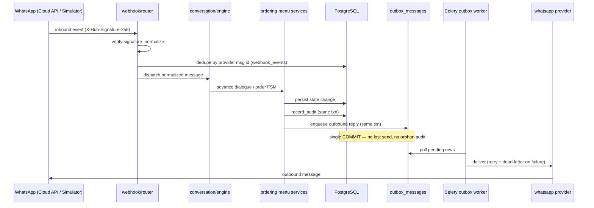
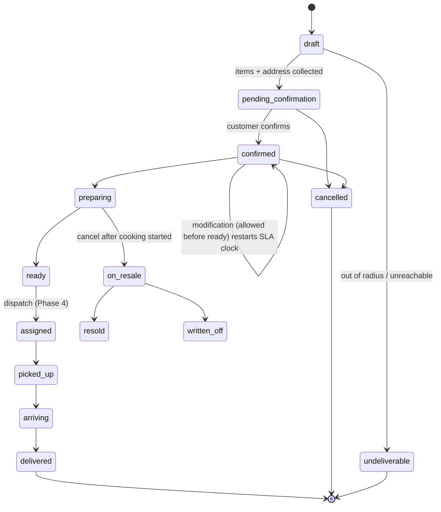

# Architecture

Deeper reference for the Restaurant WhatsApp Platform. The business rules are owned by the spec (`docs/superpowers/specs/2026-06-06-whatsapp-restaurant-platform-design.md`); this document describes how the code is organized and wired. Current per-phase state lives in `understanding.txt`.

The system is a **modular monolith**: one FastAPI deployable, one Celery worker fleet, one PostgreSQL+PostGIS database, Redis for broker/cache/hot geo. Bounded contexts live under `src/app/<module>/` and are import-isolated. Within a module:

- `models.py` — SQLAlchemy 2 (async) ORM models
- `schemas.py` — Pydantic v2 request/response I/O
- `service.py` — business logic (owns transactions, calls audit + outbox)
- `router.py` — HTTP only; calls services, never touches another module's models

External integrations are reached only through **ports** (`port.py` + `factory.py`), each with a fake and a real adapter selected by an `APP_*_PROVIDER` setting.

## Bounded contexts

| Module | Key models | Responsibility | Phase |
|---|---|---|---|
| `identity` | `restaurants`, `riders` (and later `manager_users`) | Restaurant signup, argon2 password hashing, JWT issue/verify, riders CRUD, settings patch, tenant resolution (`deps.py:current_restaurant`). The restaurant row is the manager account. | 1 |
| `menu` | `menus`, `dishes` | Menu upload (multipart → LLM extractor → draft dishes), diff vs active menu on re-upload, per-dish availability toggle, activation completeness gate (every dish needs a number + price), supersede previous active menu. | 1 |
| `llm` | — (port) | Vision menu extraction + (later) match arbitration / descriptions. Port with `FakeExtractor` and `ClaudeExtractor`. Error contract: `ValueError` = caller/input fault → HTTP 422; `RuntimeError` = extraction/model fault → HTTP 502 + manager alert. | 1 |
| `whatsapp` | — (adapter) | Outbound send + inbound signature verification. `MockProvider` (in-memory send log + inject endpoint) and `CloudAPIProvider` (Meta Graph API, `X-Hub-Signature-256`). | 2 |
| `webhook` | `webhook_events` | `POST /webhooks/whatsapp`: normalize inbound provider events, drop duplicates by provider message ID (idempotency), hand off to the conversation engine. | 2 |
| `conversation` | `conversations`, `messages` | Dialogue state machine (`engine.py`), message persistence, menu rendering, manual takeover by manager. | 2 |
| `ordering` | `orders`, `order_items` (+ `fsm.py`, `matching.py`, `fees.py`) | Fuzzy dish matching, multi-turn item collection, address capture/confirm, order FSM transitions (transactional + audited), modification with SLA-clock restart, cancellation + resale, fee tier calculation. | 3 |
| `outbox` | `outbox_messages` | Transactional outbox: services enqueue outbound messages in-transaction; `worker.py` delivers via the WhatsApp provider with retry + dead-letter. | 2 |
| `audit` | `audit_log` | `record_audit(...)` — append-only entry (actor, entity, before/after diff) written in the caller's transaction. Composite index `(restaurant_id, entity, entity_id)`. | 0 |
| `geo` | — (port) | Distance / routing. `haversine` fallback + `google_maps`. Extended in Phase 4. | scaffolded 3 |
| `weather` | — (port) | Weather lookup for weather-delay disclosure (no-coupon rule). `fake` + real. | scaffolded |
| `dispatch` / `sla` / `cod` | `batches`, `rider_locations`, `assignments`, `sla_events`, `coupons`, `cod_collections` | Nearest-rider dispatch, batching, delivery FSM, SLA monitor, late coupons, COD ledger. | 4 (planned) |
| `predictions` / `marketing` | forecasts, segments, campaigns, templates | numpy demand baseline behind a `ForecastModel` port; segments + Meta template lifecycle + send-window/cap/STOP enforcement. | 6 (planned) |

`apps/workers/celery_app.py` is the Celery app; `apps/simulator/` is a zero-build web chat (mounted at `/simulator/` only when the WhatsApp provider is `mock`).

## Data flow: inbound message → outbound reply

The outbox commit is atomic with the state change: either the order advances, its audit row is written, and the reply is enqueued together, or nothing happens. Delivery is decoupled and retried by the worker.

## Order dialogue FSM

Order statuses are fixed strings (see spec §3); illegal transitions raise and every transition is audited.

## Tenancy model

- Every tenant table carries a `restaurant_id` FK with composite indexes.
- Routes resolve the tenant from the JWT bearer token via `identity/deps.py:current_restaurant`; services scope all queries by that `restaurant_id`.
- The `restaurants` row **is** the manager account today (password hash + settings JSONB: delivery fee tiers, `max_orders_per_batch`, `max_items_per_order`, `radius_km=10`). A separate `manager_users` table arrives in a later phase, at which point JWT `aud`/`iss` claims and rider principals are added.
- No cross-tenant query path exists: routers never read another module's models, and services always filter by the resolved tenant.

## Ports & adapters inventory

Each port is an interface with a fake (default in tests/dev) and a real adapter, chosen by an `APP_*_PROVIDER` env var via a `factory.py` (cached). Tests override the FastAPI dependency to inject the fake — real APIs are never called in tests.

| Port | Env var | Fake / default | Real adapter | Notes |
|---|---|---|---|---|
| `llm` | `APP_LLM_PROVIDER` | `FakeExtractor` | `ClaudeExtractor` | Vision menu extraction; `max_tokens=16384` + truncation guard, image MIME allowlist; unknown provider → `ValueError`. |
| `whatsapp` | `APP_WHATSAPP_PROVIDER` | `MockProvider` (`mock`) | `CloudAPIProvider` (`cloud`) | Mock exposes in-memory send log + inject endpoint; `mock` also mounts `/simulator/`. Cloud verifies `X-Hub-Signature-256`. |
| `geo` | `APP_GEO_PROVIDER` | `haversine` / `fake` | `google_maps` | `google_maps` requires `APP_GOOGLE_MAPS_API_KEY` (else `ValueError`); haversine is the graceful-degradation fallback. |
| `weather` | `APP_WEATHER_PROVIDER` | `fake` | real | Used for the weather-delay disclosure rule (disclosed delay → no late coupon). |

Graceful degradation is a design rule: LLM down → dish-number-only matching + manager alert; Maps down → haversine + static speed; rejected template → pre-approved fallback.

## Migration conventions

- Alembic autogenerate: `.venv/bin/alembic revision --autogenerate -m "name"` then `alembic upgrade head`. The repo keeps a single head.
- **Model registration:** a new model module must be imported in **both** `alembic/env.py` and `tests/conftest.py` so its metadata is registered for autogenerate and for the test schema.
- **PostGIS filter:** `alembic/env.py` defines `include_object(...)` that excludes PostGIS-managed system tables (`spatial_ref_sys`, topology `state`/`edges`, etc.). Without it, autogenerate tries to drop those tables — the filter is wired into `context.configure(..., include_object=include_object)`.
- **`updated_at` trigger:** any new table using `TimestampMixin` must add a `BEFORE UPDATE` trigger `trg_<table>_updated_at` in its migration (the original `onupdate` was client-side; the trigger makes it server-side). See the `updated_at_triggers` migration for the pattern.

## Test architecture

- **Two databases:** tests run against `restaurant_test` (created once via `docker compose exec db psql ... CREATE DATABASE restaurant_test`). A second worker may use `restaurant_test2` for parallel runs — `conftest.py` uses `os.environ.setdefault("APP_DATABASE_URL", ...)` so the URL can be overridden per worker.
- **Savepoint isolation:** the schema is created once per session (session-scoped engine). Each test runs inside a transaction with `join_transaction_mode="create_savepoint"` and is rolled back at teardown — fast, no per-test `drop_all`/`create_all`. A service-level `session.commit()` lands on the savepoint rather than the outer transaction, so committing services stay isolated.
- **Event loop scope:** both `asyncio_default_fixture_loop_scope` and `asyncio_default_test_loop_scope` are set to `"session"` in `pyproject.toml`; both are required or asyncpg raises cross-loop errors.
- **`get_settings()` is cached** — tests must set `APP_*` env vars *before* importing app modules (see the top of `tests/conftest.py`).
- **Port overrides:** ports are swapped via FastAPI dependency overrides (e.g. `get_menu_extractor → FakeExtractor`, `get_session → savepoint session`). Tests never reach real WhatsApp/Claude/Maps endpoints.
- **Fixture rule — never hardcode a primary key.** Tests must read the ID off the created object/response, not assume `id == 1`. Savepoint isolation rolls back but does not reset sequences, so PKs are not stable across tests; hardcoding them produces flaky cross-test failures.
- After committing inside a service under savepoints, expire/refresh as needed (`expire_all()` after a delete) to avoid a stale identity-map row.

Run: `.venv/bin/pytest` (full), single file/test with the usual `-v` / `::test_name` selectors, and `.venv/bin/ruff check src apps tests` for lint.
