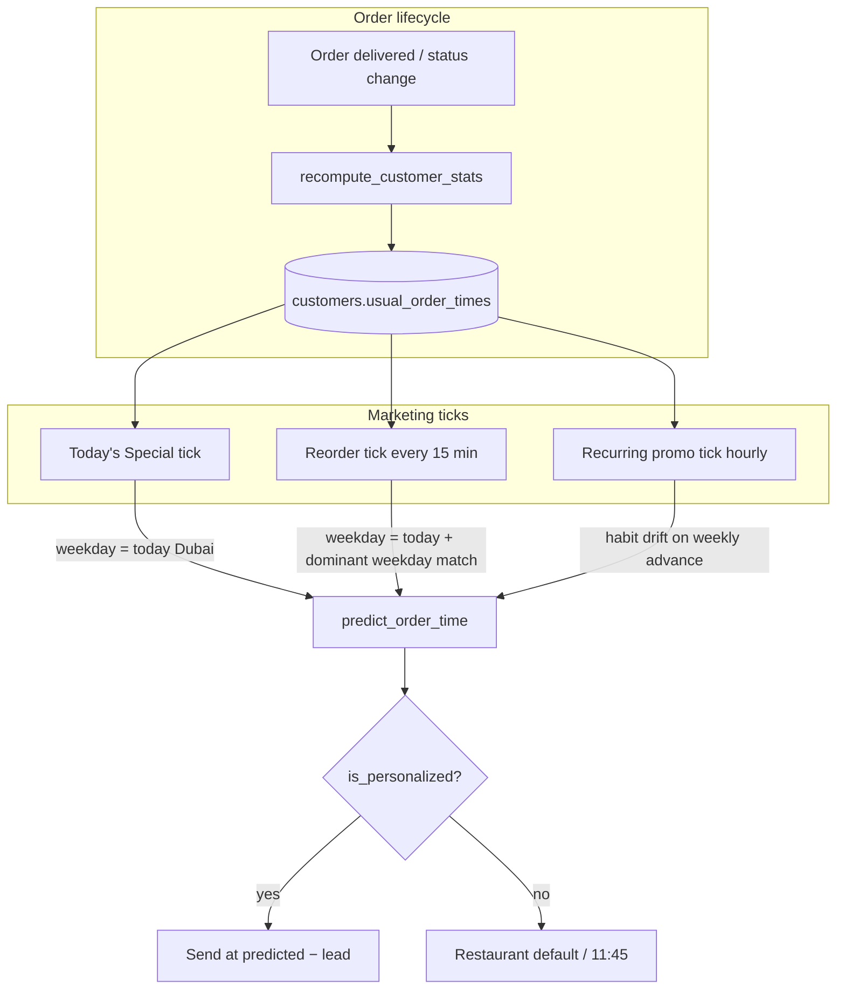

# Customer order habits — per-weekday timing for marketing

Marketing automations (Today's Special, reorder reminders, recurring promos) need to know **when each customer usually orders** so messages land a few minutes *before* that moment — not at a single restaurant-wide average.

This document describes how the platform learns, stores, and uses per-customer ordering habits.

**Related specs:** [Platform design §4.7](superpowers/specs/2026-06-06-whatsapp-restaurant-platform-design.md), [Marketing Studio §4.4.5](superpowers/specs/2026-07-02-marketing-studio-full-design.md)

---

## Problem this solves

A restaurant's customers do not share one clock:

| Customer | Pattern |
|----------|---------|
| A | Friday lunch ~12:00 |
| B | Saturday dinner ~20:00 |
| C | Weekday evenings, drifting later over time |

A **global average** across all orders for a customer blends Friday lunch with Saturday dinner and produces a meaningless send time (e.g. 16:00). Marketing messages then miss the real ordering window.

The habit system instead:

1. **Splits habits by weekday** (Monday–Sunday, Dubai local).
2. **Weights recent orders more** so schedules adapt when behaviour changes.
3. **Stores denormalized habits** on the customer row for fast reads and habit drift.
4. **Gates trust** — only personalizes when history is clustered enough.

---

## Data model

### `customers.usual_order_times` (JSONB)

Written on every `recompute_customer_stats()` call (order FSM transitions and delivery). Keys are weekday strings `"0"`–`"6"` (`0` = Monday, Python `weekday()` convention, **Asia/Dubai**).

```json
{
  "4": {
    "minute": 720,
    "order_count": 3,
    "concentration": 0.92
  },
  "5": {
    "minute": 1200,
    "order_count": 4,
    "concentration": 0.88
  }
}
```

| Field | Meaning |
|-------|---------|
| `minute` | Circular-mean order time as minute-of-day in Dubai (0–1439). `720` = 12:00. |
| `order_count` | Non-draft orders on that weekday used in the estimate. |
| `concentration` | Resultant length **R** ∈ [0, 1] of the circular mean. `1.0` = identical times; low = scattered. |

### `customers.usual_order_time` (string, nullable)

Human-readable label for the manager dashboard, e.g. `Evenings (~8:20 PM)`. Derived from the **global** (all-weekday) circular mean — display only, not used for automation timing.

---

## How habits are computed

### Source data

All non-draft orders for the customer. Each order contributes an **order stamp**:

- Local hour (float, Dubai)
- Weekday (0–6)
- Age in days (for recency weighting)

Timestamps are taken from `orders.created_at`, converted to **Asia/Dubai**.

### Circular mean (clock-aware average)

Order times are treated as points on a 24-hour circle so midnight wrap-around works correctly (23:30 + 00:30 → ~00:00, not noon).

For each weekday bucket, the system computes a **weighted circular mean**:

```
weight(order) = 0.5 ^ (age_days / 60)
```

The **60-day half-life** means an order from 60 days ago counts half as much as today's order. Recent behaviour pulls the predicted time when habits drift (e.g. customer shifts from 12:00 to 13:00 lunches).

### Prediction API

```python
# Live query from orders table (recency-weighted)
pred = await predict_order_time(session, customer_id, weekday=4)  # Friday only

# Read stored habit without scanning orders
pred = habit_for_weekday(customer.usual_order_times, weekday=4)
```

`OrderTimePrediction` fields: `minute_of_day`, `order_count`, `concentration`.

### Code map

| Module | Role |
|--------|------|
| `src/app/ordering/habits.py` | Stamps, recency weights, circular stats, JSONB builder |
| `src/app/ordering/service.py` | `predict_order_time`, `recompute_customer_stats` |
| `src/app/marketing/todays_special.py` | Trust gates, lead time, due window (pure helpers) |
| `src/app/marketing/automations.py` | Recurring state, habit drift on weekly advance |
| `src/app/marketing/service.py` | Today's Special tick, reorder automation tick |

---

## Trust gates — when we personalize

A prediction is **trusted** only when `is_personalized()` passes:

| Scope | Min orders | Min concentration (R) |
|-------|------------|------------------------|
| Weekday-specific (marketing ticks) | **2** (`MIN_ORDERS_WEEKDAY`) | **0.5** |
| Global / display fallback | **3** (`MIN_ORDERS`) | **0.5** |

If not trusted, automations fall back to:

1. Restaurant default time (Today's Special config), or
2. Parsed `customers.usual_order_time` string, or
3. Hard default `11:45` Dubai (recurring / reorder).

---

## Send-time formula

All timed marketing uses the same core logic in `todays_special.py`:

```
desired_send_minute = predicted_minute − lead_minutes
```

Defaults:

| Knob | Default |
|------|---------|
| `lead_minutes` | 15 |
| `max_late_minutes` (catch-up window) | 90 |

**Due check:** send when `desired_minute ≤ now_minute < desired_minute + 90`.

Example: customer usually orders Friday 12:00 Dubai, lead 15 min → message targets **11:45**. A cron tick at 11:50 is due; a tick at 13:00 is not (stale).

Optional UAE send window (09:00–18:00) applies to Today's Special when `APP_MARKETING_SEND_WINDOW_ENABLED` is on.

---

## How each automation uses habits



### Today's Special

- **Trigger:** External cron → `POST /api/v1/marketing/tick` (see [todays-special-cron.md](todays-special-cron.md)).
- **Weekday:** Uses **today's** Dubai weekday — Monday tick only considers Monday orders.
- **Audience:** All opted-in customers for the restaurant.

### Reorder reminder

- **Trigger:** Celery `automation_tick` every 15 minutes.
- **Weekday:** Customer's **dominant order weekday** must match **today**; prediction uses today's weekday bucket.
- **Audience:** Habitual customers only (`is_personalized` with weekday threshold).

### Recurring promo

Two phases after each delivered order:

| Phase | When | Send time |
|-------|------|-----------|
| `day3` | Delivery date + 3 days | Usual time for **delivery weekday** − lead |
| `weekly` | Same weekday each week | Refreshed usual time − lead |

**Habit drift:** On each successful send in `weekly` phase, `advance_recurring_state` re-reads `usual_order_times` for `state.weekday` and updates `usual_send_local_time` before scheduling the next `+7 days` send. A customer who moves lunch from 12:00 to 13:00 will see promos shift without manual config.

**Seed:** `on_order_delivered` → `upsert_recurring_state` uses the delivery day's weekday and `predict_order_time(..., weekday=)`.

---

## Worked example

**Customer Layla** — three Friday orders at 12:00 Dubai, one Saturday order at 20:00.

After `recompute_customer_stats`:

```json
{
  "4": { "minute": 720, "order_count": 3, "concentration": 1.0 },
  "5": { "minute": 1200, "order_count": 1, "concentration": 1.0 }
}
```

| Automation | Friday 11:50 tick | Saturday 11:50 tick |
|------------|-------------------|---------------------|
| Today's Special | Sends at 11:45 (trusted Friday habit) | Falls back to default (only 1 Saturday order) |
| Reorder | Sends if Friday is dominant weekday | Skipped (weekday mismatch) |
| Recurring (weekly, weekday=4) | N/A | Next Friday send uses minute 720 − 15 = **11:45** |

Layla then places two more Friday orders at 13:00. After the next delivery stats refresh, `usual_order_times["4"].minute` moves toward ~780. The next weekly recurring advance picks up **12:30 usual → 12:15 send** automatically.

---

## Operational notes

### Granularity

- **Minute-of-day** resolution (not 30-minute buckets). Cron cadence is the practical floor: a 15-minute Celery tick means sends land within ~15 minutes of target.
- All logic uses **Asia/Dubai** local time; DB stores UTC.

### When habits refresh

`recompute_customer_stats` runs from:

- `ordering/fsm.py` — order status transitions
- `dispatch/delivery.py` — `advance_delivery` when status becomes `delivered`

Marketing hooks (`on_order_delivered`) run **after** stats refresh so `total_orders` and habits are current.

### Manager dashboard

Customer profile shows `usual_order_time` (friendly string). The per-weekday JSON is internal — exposed indirectly through automation timing accuracy.

---

## Testing

| Test file | Coverage |
|-----------|----------|
| `tests/ordering/test_habits.py` | Weekday isolation, recency weighting, JSONB shape, `recompute_customer_stats` |
| `tests/marketing/test_habit_drift.py` | Weekly recurring refresh of `usual_send_local_time` |
| `tests/marketing/test_todays_special_tick.py` | End-to-end tick with Monday lunch habit |
| `tests/marketing/test_todays_special.py` | Pure helpers: `is_personalized`, `desired_send_minute`, `is_due` |

Run:

```bash
.venv/bin/pytest tests/ordering/test_habits.py tests/marketing/test_habit_drift.py tests/marketing/test_todays_special.py -v
```

---

## Design decisions (summary)

| Decision | Rationale |
|----------|-----------|
| Per-weekday buckets | Friday lunch ≠ Saturday dinner; matches how people actually order |
| Recency half-life 60 days | Smooth habit drift without overreacting to one outlier order |
| Lower threshold for weekday (2 vs 3) | Weekday filter already narrows the sample; two consistent Friday lunches is a real signal |
| Denormalized JSONB | Fast habit drift reads in recurring tick; no full order scan on every weekly advance |
| Circular mean | Correct statistics for time-of-day; handles late-night wrap |
| Lead time subtracted before send | Message arrives *before* the customer would normally order |

---

## Future extensions (not implemented)

- **30-minute buckets** — only needed if cron cost or DB volume becomes an issue; minute-of-day is sufficient at current tick rates.
- **Segment-level habits** — e.g. VIPs vs lapsed; today habits are per-customer only.
- **Expose per-weekday habits in dashboard** — managers currently see the single `usual_order_time` label.