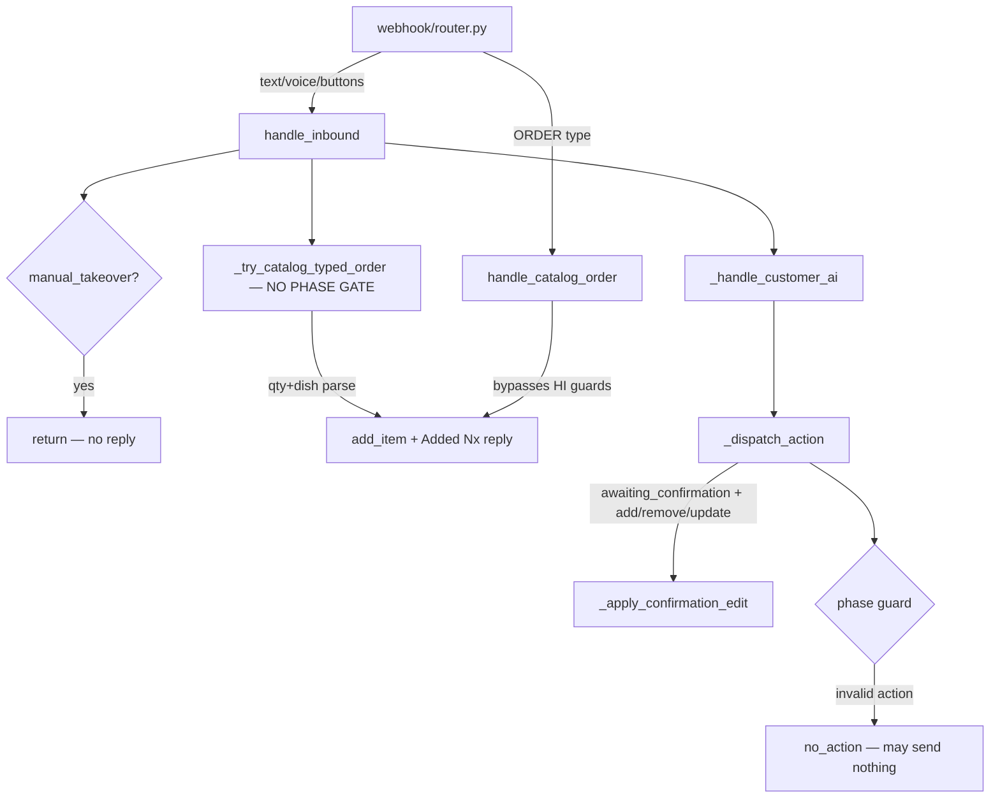
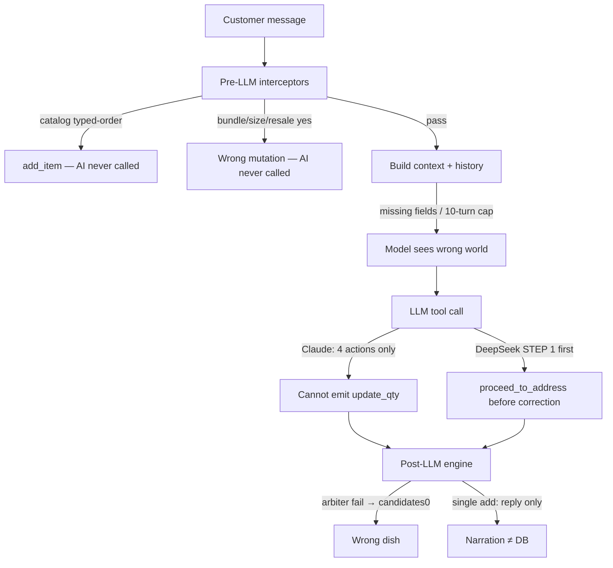

# ✅ WhatsApp ordering conversation — enterprise repair backlog

**Date:** 2026-06-30  
**Status:** Audit complete — repairs not yet implemented  
**Scope:** Full customer ordering path (catalogue + text + AI + confirm + modify)  
**Constraint:** Multi-tenant, multi-language SaaS — **no hardcoded English phrase tables on live paths**

This document is the single repair backlog for WhatsApp chat quality. Findings are numbered **R-001** onward and should be appended as new gaps are discovered. Each item includes symptom, root cause, repair, and test requirement.

---

## ✅ Executive summary

The biryani transcript is not an isolated bug — it exposes **systemic failures** across three layers:

1. **Deterministic interceptors** (`_try_catalog_typed_order`, `parse_qty_and_text`) that run before the LLM and treat correction sentences as new adds.
2. **LLM / engine contract drift** (confirmation prompt says `request_modification`; engine supports in-place edits; Claude agent schema is a subset of DeepSeek).
3. **Cart line model gaps** (notes, variants, qty collapse) that corrupt money and kitchen instructions under edge cases.

**Customer-visible pattern:** friendly LLM narration (“Noted!”, “Added!”) that does not match DB state; cart totals drift upward; corrections make things worse; special requests vanish.

**God-node blast radius (Graphify):** `handle_inbound` → `_try_catalog_typed_order` / `_handle_customer_ai` → `_dispatch_action` → `ordering.service` (`add_item`, `set_item_qty`, `set_item_note`, `modify_order`).

---

## ✅ Incident transcript (canonical repro)

| Time | Customer | Bot response | Problem |
|------|----------|--------------|---------|
| 06:31 | Catalogue basket JSON (3× Mndhi-2, 1× Lemon mint, 1× Chicken Biryani) | Got your basket 🎉 … Subtotal AED 182 | OK |
| 06:32 | Need double masala in biriyani | Noted! I've added double masala… | Narration; DB may not match |
| 06:33 | That's all | Summary: **two** biryani lines (noted + plain). Subtotal AED 202 | Duplicate + overcharge |
| 06:33 | Only 1 biriyani | *(no bot line in transcript)* | Missing or wrong handling |
| 06:34 | Why did you add 2 biriyani | Added 2× Chicken Biryani ✅ … 4× total | Correction treated as add |
| 06:34 | I need only 1 biriyani with double masala | Updated! 1× … Subtotal AED 182 | Qty fixed; **note lost** |

**Note on missing reply:** `Only 1 biriyani` may have been processed without a customer-visible ack (catalog interceptor add with dropped outbox, confirm-edit path that only re-sends summary, or rapid double-message batching). Treat **silent / ambiguous replies** as a first-class UX defect (R-033).

---

## ✅ Architecture flow (where things break)



---

## ✅ Repair backlog

### ✅ P0 — Money, cart corruption, provider breakage

#### ✅ R-001 — Catalogue typed-order treats corrections as new adds
- **Category:** Cart / Catalogue / State  
- **Symptom:** `Only 1 biriyani`, `Why did you add 2 biriyani` → `Added Nx…`; cart inflates.  
- **Root cause:** `_try_catalog_typed_order()` (`engine.py` ~L4906) runs on every text message with **no phase gate**. `parse_qty_and_text()` strips leading digits so complaints become `(qty, dish)`. Question-word skip inspects parsed `dish_query`, not raw text. Wired at `handle_inbound` ~L5468.  
- **Repair:** Gate to `ordering` phase only; before add, if dish already in cart → route to `update_qty` (LLM or structural in-cart check), never `add_item`. Preserve raw-text question/complaint detection before qty extraction.  
- **Test:** `tests/catalog/test_catalog_correction_flow.py` — transcript replay.

#### ✅ R-002 — Modifier creates duplicate paid line (plain + noted)
- **Category:** Cart / LLM  
- **Symptom:** `Need double masala in biriyani` → summary shows two biryani lines; +AED 20.  
- **Root cause:** `_execute_ai_add_item()` only calls `set_item_note` when LLM passes `special_note` (`engine.py` ~L3525). If note is only in `reply`, `add_item()` creates second line (different `notes` = different merge key in `ordering/service.py` `add_item` ~L507).  
- **Repair:** If matched dish is in cart and remainder is prep-only (structural: dish resolved + non-empty trailing text, no add intent), call `set_item_note` before `add_item`. LLM must populate `special_note` on modifier paths.  
- **Test:** `tests/conversation/test_engine_draft_lifecycle.py` — catalogue mode, unmocked modifier message.

#### ✅ R-003 — `ClaudeConversationAgent` incompatible with engine (production P0 if `llm_provider=claude`)
- **Category:** LLM / Dead-code  
- **Symptom:** Checkout, cancel, remove, confirm edits, address flow silently fail or loop.  
- **Root cause:** `claude.py` tool enum: `add_item | proceed_checkout | cancel_cart | no_action` only; no phase blocks; no `update_qty`, `remove_item`, `proceed_to_address`, `confirm_order`, etc. Factory returns Claude when `APP_LLM_PROVIDER=claude`.  
- **Repair:** Port DeepSeek tool schema + phase blocks to Claude, or remove Claude from `get_conversation_agent()` until parity.  
- **Test:** `tests/llm/test_claude_conversation_parity.py` — action enum matches `_PHASE_ACTIONS`.

#### ✅ R-004 — `parse_qty_and_text` destroys semantic intent on complaint sentences
- **Category:** Cart / State  
- **Symptom:** Any message containing a small integer + dish name becomes an add order.  
- **Root cause:** `ordering/service.py` `parse_qty_and_text` ~L709 — `\b(\d+)\s+(\D.*)$` without complaint/correction context; consumed by catalogue interceptor and modify flow.  
- **Repair:** Structural classifier before qty strip: if dish in cart + numeric token → prefer `update_qty` path; use LLM action when ambiguous. No English phrase tables.  
- **Test:** New `tests/ordering/test_parse_qty_and_text.py`.

---

### ✅ P1 — Wrong flow, lost state, silent failures

#### ✅ R-005 — Confirmation prompt contradicts engine
- **Category:** Confirmation / LLM  
- **Symptom:** Confirm-step edits start full modify FSM or narrate changes without applying them.  
- **Root cause:** `deepseek.py` `_CONFIRMATION_BLOCK` (~L533) → `request_modification` for any change; engine uses `_apply_confirmation_edit` for `add_item`/`remove_item`/`update_qty` (~L4180). Catalogue interceptor runs before either.  
- **Repair:** Align prompt: confirm step uses `add_item`/`remove_item`/`update_qty` (+ `special_note` on `update_qty`); reserve `request_modification` for post-confirm placed orders.  
- **Test:** `tests/conversation/test_engine_confirmation.py` — `update_qty` at confirm.

#### ✅ R-006 — `set_item_qty` drops kitchen notes when collapsing lines
- **Category:** Cart  
- **Symptom:** After qty fix, `double masala` disappears from summary.  
- **Root cause:** `set_item_qty()` keeps `items[0]`, deletes rest (`ordering/service.py` ~L610); no `notes` parameter.  
- **Repair:** Prefer survivor with non-empty `notes`; add optional `notes` to `set_item_qty`; wire `special_note` through `_execute_ai_update_qty` always when present.  
- **Test:** `tests/ordering/test_set_item_qty_notes.py`.

#### ✅ R-007 — Re-add backstop bypassed when customer gives explicit quantity
- **Category:** Cart / LLM  
- **Symptom:** `Only 1 biriyani` adds another unit instead of setting total to 1.  
- **Root cause:** `_dispatch_action` backstop (`engine.py` ~L4298) requires `not gave_qty`.  
- **Repair:** If dish in cart and LLM/structure indicates total qty → `update_qty`.  
- **Test:** `tests/conversation/test_engine_ordering.py`.

#### ✅ R-008 — Out-of-range pin wipes entire cart
- **Category:** State / UX  
- **Symptom:** Undeliverable location → customer must re-order from scratch.  
- **Root cause:** `_handle_location_pin` `_send_out_of_range()` sets `draft_order_id=None` (`engine.py` ~L4616).  
- **Repair:** Retain cart; clear only pin/fee state; offer new pin or call restaurant.  
- **Test:** `tests/conversation/test_engine_ordering.py` — out-of-range retains items.

#### ✅ R-009 — `modify_order` strips variants and forces `notes=None`
- **Category:** Modify / Cart  
- **Symptom:** Post-confirm modification loses drink sizes, bundles, kitchen notes.  
- **Root cause:** `_handle_modify_confirm` builds `new_items` with `notes: None` always (`engine.py` ~L2352); `modify_order` uses base `dish.price_aed`, no `variant_name` (`ordering/service.py` ~L794). Proposed list has no `notes` field (~L2226).  
- **Repair:** Carry `notes` + `variant_name` + price snapshot through modify pipeline.  
- **Test:** `tests/ordering/test_modification.py` + conversation modify with notes.

#### ✅ R-010 — Catalogue basket appends to existing draft without replace semantics
- **Category:** Catalogue / Cart  
- **Symptom:** Second “Send basket” merges with prior typed items; customer confused.  
- **Root cause:** `handle_catalog_order()` reuses `draft_order_id`, calls `add_item` per line (`catalog/service.py` ~L247–294).  
- **Repair:** Replace cart on new basket (with confirm) or diff-merge with explicit net reply.  
- **Test:** `tests/catalog/test_catalog_order.py` — second basket.

#### ✅ R-011 — Catalog ORDER webhook bypasses `manual_takeover`
- **Category:** Security / Multi-tenant  
- **Symptom:** Manager took over chat; catalog basket still auto-processed.  
- **Root cause:** `webhook/router.py` routes `MessageType.ORDER` directly to `handle_catalog_order`, skipping `handle_inbound` takeover guard (~L5156).  
- **Repair:** Check `conv.manual_takeover` in catalog handler or route ORDER through `handle_inbound`.  
- **Test:** `tests/conversation/test_manual_takeover_catalog.py`.

#### ✅ R-012 — `_apply_confirmation_edit` silently drops over-max-qty items
- **Category:** Confirmation  
- **Symptom:** “Add 50× X” at confirm → no feedback; summary unchanged.  
- **Root cause:** `_apply_confirmation_edit` `continue`s on `iqty > _max_item_qty` (~L3727) without `_escalate_large_qty`.  
- **Repair:** Reuse `_escalate_large_qty` or explicit failure note before re-summary.  
- **Test:** `tests/conversation/test_engine_confirmation.py`.

#### ✅ R-013 — Single `add_item` replies omit DB-backed cart tail
- **Category:** UX / LLM  
- **Symptom:** LLM says “Added biryani!” but customer doesn't see real subtotal; mismatch breeds mistrust.  
- **Root cause:** Multi-item path appends `_cart_tail(cart)` (~L4249); single-item sends raw `reply` only (~L4317).  
- **Repair:** Always append `_cart_tail` on successful add/update/remove (including `updated_note`).  
- **Test:** `tests/conversation/test_engine_ordering.py`.

#### ✅ R-014 — Completion detector treats bare `no` as “done ordering”
- **Category:** Modify / UX / Multi-language  
- **Symptom:** `no` in modify flow may finalize proposals; ordering STEP 1 treats bare `no` as `proceed_to_address`.  
- **Root cause:** Completion detectors + `_ORDERING_BLOCK` STEP 1 include bare `no`.  
- **Repair:** Completion with cart context (“finishing?”); negation instructions → `add_item`/`update_qty` with `special_note`, not completion.  
- **Test:** Extend `tests/llm/test_completion_detector.py` — “no onion” false positive.

#### ✅ R-015 — Phase guard drops valid-looking actions to `no_action` with no guaranteed reply
- **Category:** State / UX  
- **Symptom:** Customer message gets no response or only empty LLM reply.  
- **Root cause:** `_dispatch_action` (~L4188) sets `action = "no_action"` when action ∉ `_PHASE_ACTIONS`; bottom fallback only sends if `reply` non-empty (~L4574). `_PHASE_ACTIONS["awaiting_confirmation"]` excludes `add_item`/`update_qty` (intercepted earlier, but failure modes exist).  
- **Repair:** On phase-guard drop at confirm, always re-show deterministic order summary; never silent drop.  
- **Test:** Phase-guard integration tests per phase.

#### ✅ R-016 — `_add_dish_to_cart` resets phase to `ordering` during confirm edits
- **Category:** State  
- **Symptom:** Brief wrong phase; downstream interceptors (catalog typed-order) may fire on next message.  
- **Root cause:** `_add_dish_to_cart` always `_set_state(dialogue_phase="ordering")` (~L3221).  
- **Repair:** Accept `preserve_phase` flag from `_apply_confirmation_edit`; or skip phase mutation when `pending_order_id` set.  
- **Test:** Confirm edit does not downgrade phase.

---

### ✅ P2 — Quality, drift, multi-language, catalogue consistency

#### ✅ R-017 — `_try_catalog_typed_order` English-only filler stripping
- **Category:** Multi-language / Catalogue  
- **Symptom:** Roman-Urdu/Hindi/Telugu orders not stripped → match fails → catalogue resend or mis-route.  
- **Root cause:** Hardcoded `fillers` tuple (`engine.py` ~L4939).  
- **Repair:** Menu-driven strip (retry `find_dish_matches` on progressive token removal) or defer politeness to LLM.  
- **Test:** Non-English catalogue typed order.

#### ✅ R-018 — Interceptor active in `address_capture` and `awaiting_confirmation`
- **Category:** State / Catalogue  
- **Symptom:** Customer types dish name during address step → adds to cart instead of completing address.  
- **Root cause:** Explicit “no phase gate” comment (`engine.py` ~L4924).  
- **Repair:** Limit typed-add to `ordering` phase; at confirm use correction path only.  
- **Test:** Phase-gate tests.

#### ✅ R-019 — Dish price vs catalogue card price divergence
- **Category:** Catalogue / Multi-tenant  
- **Symptom:** Customer sees AED 30 on card; cart uses `Dish.price_aed` (e.g. AED 20).  
- **Root cause:** `handle_catalog_order` and typed-add use `dish.price_aed`; cards show `CatalogProduct.price_aed`.  
- **Repair:** Snapshot catalogue/Meta `item_price` onto `OrderItem.price_aed` at basket time.  
- **Test:** `tests/catalog/test_catalog_order.py` price alignment.

#### ✅ R-020 — `_resolve_cart_dish` picks first in-cart candidate
- **Category:** Cart  
- **Symptom:** “remove biryani” targets wrong line when Chicken + Mutton biryani in cart.  
- **Root cause:** `_resolve_cart_dish` returns first candidate in cart (~L3578), not best match.  
- **Repair:** Rank by confidence + note overlap + recency; disambiguate if ambiguous.  
- **Test:** `tests/conversation/test_engine_ordering.py`.

#### ✅ R-021 — `proceed_to_confirmation` does not show order summary
- **Category:** Confirmation / UX  
- **Symptom:** After address via LLM path, customer gets filler without summary/buttons.  
- **Root cause:** `_dispatch_action` `proceed_to_confirmation` (~L4523) only sets state + optional reply; unlike `_execute_save_address` → `_send_order_summary`.  
- **Repair:** Always `_send_order_summary` after address complete.  
- **Test:** Full checkout integration.

#### ✅ R-022 — Modify flow append-only proposed list
- **Category:** Modify  
- **Symptom:** Same dish twice in modify → duplicate proposed lines → entire order replaced with dupes.  
- **Root cause:** `_handle_modify_items` always `proposed.append()` (~L2225), no merge.  
- **Repair:** Merge by `dish_id` (sum qty) or replace on repeat.  
- **Test:** Modify duplicate proposed item.

#### ✅ R-023 — `_extract_order_dish_query` requires ≥2 tokens
- **Category:** UX  
- **Symptom:** Single-word off-menu order `beef` bypasses deterministic decline.  
- **Root cause:** `len(toks) < 2` → None (`engine.py` ~L2267).  
- **Repair:** Single-token path when `find_dish_matches` is NO_MATCH with confidence.  
- **Test:** `tests/conversation/test_off_menu_and_cancel.py`.

#### ✅ R-024 — Deterministic customer copy is English-only on live paths
- **Category:** UX / Multi-language  
- **Symptom:** Arabic/Hindi/Telugu customers get English for catalog add, off-menu, confirm notes, out-of-range, AI fallback.  
- **Root cause:** `_send_text` bodies in `engine.py`, `catalog/service.py`; LLM “reply in customer language” bypassed by interceptors.  
- **Repair:** Thin LLM narration layer for deterministic events, or tenant `default_locale` templates — not English phrase tables.  
- **Test:** Multilingual integration with language detection.

#### ✅ R-025 — `set_item_qty` ignores `variant_name` when collapsing
- **Category:** Cart  
- **Symptom:** Qty change on drinks may keep wrong size line.  
- **Root cause:** Merges all lines for `dish_id` regardless of variant (`ordering/service.py` ~L600).  
- **Repair:** Scope updates by `(dish_id, variant_name)`.  
- **Test:** `tests/conversation/test_engine_variants.py`.

#### ✅ R-026 — `_looks_like_menu` may replace legitimate two-item replies
- **Category:** UX / LLM  
- **Symptom:** Valid two-dish suggestion replaced by full menu dump.  
- **Root cause:** ≥2 price tokens triggers menu swap (`engine.py` ~L57–73, ~L4198).  
- **Repair:** Tighten heuristic; exempt short contextual replies.  
- **Test:** `tests/llm/test_anti_hallucination_menu.py`.

#### ✅ R-027 — `handle_catalog_order` does not normalize phone
- **Category:** Multi-tenant / State  
- **Symptom:** Duplicate `Conversation` rows for same customer (simulator vs text flow).  
- **Root cause:** Catalog uses raw `inbound.from_phone`; `handle_inbound` uses `normalize_phone()` (~L5060).  
- **Repair:** `normalize_phone` in catalog handler.  
- **Test:** `tests/catalog/test_catalog_order.py`.

#### ✅ R-028 — Webhook catalog keywords hardcoded English
- **Category:** Multi-language  
- **Symptom:** `menu` / `catalog` / `order` work; native words may not trigger catalogue cards.  
- **Root cause:** `_CATALOG_KEYWORDS` in `webhook/router.py` ~L29.  
- **Repair:** Reuse engine `_MENU_KEYWORDS` / LLM intent, or tenant keyword config — not a static English set on live path.  
- **Test:** Multilingual menu request triggers catalogue send.

#### ✅ R-029 — LLM conversation history blind to catalogue basket contents
- **Category:** LLM / UX  
- **Symptom:** LLM doesn't know what customer tapped in catalogue; relies on cart summary only.  
- **Root cause:** `_build_history` renders catalogue ORDER messages as `[order]` (`engine.py` ~L2974); basket JSON not surfaced.  
- **Repair:** Include synthesized cart snapshot or parsed basket summary in history/context after `handle_catalog_order`.  
- **Test:** History contains cart after basket.

#### ✅ R-030 — LLM history omits outbound summary/buttons text
- **Category:** LLM  
- **Symptom:** Model doesn't see what customer was shown in order summary; re-hallucinates totals.  
- **Root cause:** `_build_history` reads `Message` rows; outbound summary may be under `buttons` type with body in payload — partially mapped (~L2972).  
- **Repair:** Ensure order-summary and cart replies are in history as assistant content with full body.  
- **Test:** `_build_history` includes last summary body.

#### ✅ R-031 — AI API failure fallback is English-only and generic
- **Category:** UX / Reliability  
- **Symptom:** `Sorry, having a moment 😅 Type the dish name…` regardless of customer language.  
- **Root cause:** `_handle_customer_ai` except block (`engine.py` ~L4753–4758). Spec §5 requires “canned dialogue” + manager alert — alert missing.  
- **Repair:** Localized fallback via tenant template; enqueue manager alert; optional dish-number-only mode.  
- **Test:** LLM failure path still progresses order.

#### ✅ R-032 — Voice transcription failure is silent to customer
- **Category:** UX  
- **Symptom:** Voice note → no reply.  
- **Root cause:** `_download_and_transcribe_voice` returns `None`; downstream may not ack failure (`engine.py` ~L4901).  
- **Repair:** Ask customer to type order when transcription fails.  
- **Test:** Audio inbound with failed transcriber.

#### ✅ R-033 — Missing or ambiguous reply on correction messages
- **Category:** UX  
- **Symptom:** `Only 1 biriyani` in transcript has no bot line; customer sends follow-up complaint.  
- **Root cause:** Multiple: catalog add without visible outbox; confirm-edit only re-sends summary; `no_action` with empty reply; rapid message batching.  
- **Repair:** Every inbound gets exactly one substantive reply; corrections ack intent + show DB-backed cart/summary.  
- **Test:** Assert outbox row per inbound in integration tests.

#### ✅ R-034 — Confirm-step UI buttons English-only
- **Category:** UX / Multi-language  
- **Symptom:** `Confirm order` / `Cancel order` / `Use new address` not localized.  
- **Root cause:** `_send_order_summary` hardcoded button titles (`engine.py` ~L1900–1904).  
- **Repair:** Tenant locale templates or Unicode-neutral labels; WhatsApp template limits respected.  
- **Test:** Locale-aware button labels.

#### ✅ R-035 — ETA in summary hardcoded “40 minutes”
- **Category:** UX / Spec  
- **Symptom:** Summary always says 40 min even when weather delay disclosed or batch buffer applies.  
- **Root cause:** `_send_order_summary` string `ETA: 40 minutes` (~L1896); spec §4.2.7 allows weather-adjusted messaging.  
- **Repair:** Use `order.promised_eta` / computed customer ETA; include weather note when `weather_delay_disclosed`.  
- **Test:** Summary ETA matches order fields.

#### ✅ R-036 — Customer summary omits dish numbers; AI context includes them
- **Category:** UX  
- **Symptom:** Inconsistent presentation; spec §4.2.2 emphasizes dish numbers for ordering.  
- **Root cause:** `_send_order_summary` item lines use name only; `_build_context` confirm block uses `dish_number` (~L3116).  
- **Repair:** Align with spec: show number in summary when tenant policy requires.  
- **Test:** Summary format obeys spec.

#### ✅ R-037 — Draft-phase cart mutations lack audit trail
- **Category:** Enterprise / Audit  
- **Symptom:** Manager cannot trace who changed cart before confirm.  
- **Root cause:** `add_item`/`remove_item` during conversation do not call `record_audit`; only `modify_order` and FSM transitions do.  
- **Repair:** Audit cart line changes with actor=customer, conversation_id, wa_message_id.  
- **Test:** Audit row on add/remove/update_qty.

#### ✅ R-038 — `modify_items` mapped to `ordering` in `_PHASE_MAP`
- **Category:** State  
- **Symptom:** If modify handler ever falls through to AI, wrong prompt/context.  
- **Root cause:** `_PHASE_MAP` `modify_items` → `ordering` (~L2992).  
- **Repair:** Dedicated modify phase or hard-block AI when in modify FSM.  
- **Test:** AI not invoked during modify_items.

#### ✅ R-039 — Spec vs implementation: special requests field naming
- **Category:** Spec drift  
- **Symptom:** Spec §4.2.4 says `additional_details`; implementation uses `OrderItem.notes`.  
- **Root cause:** Documentation / kitchen digest may expect different field.  
- **Repair:** Confirm kitchen ticket uses `notes`; update spec or alias in digest builder.  
- **Test:** Kitchen digest shows modifier verbatim.

#### ✅ R-040 — `updated_note` path sends LLM reply without cart verification
- **Category:** UX  
- **Symptom:** “Noted!” but customer can't verify cart until checkout.  
- **Root cause:** `status == "updated_note"` sends `reply` only (~L4317), no `_cart_tail`.  
- **Repair:** Same as R-013 — always append real cart tail on note update.  
- **Test:** Modifier reply includes cart line with note.

---

### ✅ P3 — Dead code, test debt, maintenance

#### ✅ R-041 — Legacy FSM handlers dead (~400+ lines)
- **Category:** Dead-code  
- **Symptom:** Engineers fix AI path; legacy rots.  
- **Root cause:** `_handle_collecting_items`, `_handle_address_capture`, `_handle_receiver_details`, `_handle_order_confirmation`, `_finalize_with_stored_address` never called.  
- **Repair:** Delete or `engine_legacy.py` with deprecation.  
- **Test:** Grep verification only.

#### ✅ R-042 — `_is_checkout_intent` English-only in dead handler
- **Category:** Dead-code  
- **Root cause:** Only used in dead `_handle_collecting_items` (~L1315). Live checkout = LLM `proceed_to_address` + completion detector.  
- **Repair:** Remove with dead handler or wire completion detector as deterministic fallback.  
- **Test:** N/A if deleted.

#### ✅ R-043 — `parse_qty_and_text` has no dedicated unit tests
- **Category:** Tests  
- **Repair:** New `tests/ordering/test_parse_qty_and_text.py` — table-driven.  
- **Test:** Yes (meta).

#### ✅ R-044 — No full catalogue transcript integration test
- **Category:** Tests  
- **Repair:** `tests/catalog/test_catalog_correction_flow.py` per incident table.  
- **Test:** Yes (meta).

#### ✅ R-045 — `FakeConversationAgent` confirm phase diverges from DeepSeek
- **Category:** Tests  
- **Root cause:** `fake.py` splits on `"add"` substring; production prompt says `request_modification`.  
- **Repair:** Align fake with DeepSeek contract; add prompt contract test.  
- **Test:** `tests/llm/test_deepseek_prompt_contract.py`.

#### ✅ R-046 — `_retailer_id_from_item` duplicate key
- **Category:** Dead-code  
- **Root cause:** `catalog/service.py` ~L46–50 lists `product_retailer_id` twice.  
- **Repair:** Deduplicate key list.  
- **Test:** No.

#### ✅ R-047 — `_PHASE_ACTIONS` omits confirm edits (relies on pre-guard intercept)
- **Category:** State / Documentation  
- **Root cause:** `awaiting_confirmation` allows only `confirm_order`, `request_modification`, `cancel_order`, `no_action` (~L3013); edits handled only if `_apply_confirmation_edit` runs first.  
- **Repair:** Document invariant; add assert in tests that confirm edits never hit phase guard as dropped actions.  
- **Test:** Confirm edit regression.

#### ✅ R-048 — Dashboard chat renders WhatsApp catalogue baskets as raw JSON
- **Category:** Dashboard / UX / Support  
- **Symptom:** Manager/customer chat transcript shows `{"product_items":[...]}` instead of “3x Mndhi - 2, 1x Lemon mint, 1x Chicken Biryani”. This makes support review look broken and hides the real basket from staff.
- **Root cause:** `handle_catalog_order()` records inbound `Message(type="order", payload={"product_items": ...})`; `message_display_text()` does not synthesize display text for order payloads; frontend `MessageBubble` falls back to `JSON.stringify(message.payload)` when no text/media label exists.
- **Repair:** Add a shared message renderer for `order` payloads that maps retailer IDs to tenant dish names and shows a readable basket summary. Keep raw payload only in an expandable debug inspector, never as the primary chat bubble.
- **Test:** Dashboard chat snapshot for catalogue order shows readable basket and no raw JSON.

#### ✅ R-049 — Wallet-credit summary is financially ambiguous before confirmation
- **Category:** Payments / UX / Trust  
- **Symptom:** Summary says `Total: AED 202`, `Payment: COD`, then “AED 10 wallet credit — it'll be applied automatically.” Customer cannot see what the rider will actually collect.
- **Root cause:** `_send_order_summary()` renders gross total and wallet availability only (`engine.py` ~L1878–1898). `payments.cod_due()` computes `order.total - wallet_applied_aed`, but the pre-confirm prompt does not show projected wallet application or COD due.
- **Repair:** In the confirmation summary, show payment composition: gross total, coupon discount if any, wallet credit to apply, and projected `COD due`. After confirm, use the same structure with actual applied values.
- **Test:** Wallet-credit checkout summary asserts `COD due = total - wallet_available capped at total`.

#### ✅ R-050 — Catalogue basket quantity bypasses restaurant max-quantity anomaly guard
- **Category:** Catalogue / Fraud / Ops  
- **Symptom:** A malformed or replayed catalogue basket can carry a very large quantity and get added directly to a draft order.
- **Root cause:** `handle_catalog_order()` uses `qty = max(1, int(item.get("quantity", 1)))` and then calls `add_item()` directly (`catalog/service.py` ~L268–294). The typed-order path checks `_max_item_qty(restaurant)`; catalogue `ORDER` path does not.
- **Repair:** Apply the same tenant max-item-qty policy to catalogue baskets. For over-limit quantities, do not mutate the cart; ask for confirmation or escalate to manager depending on restaurant settings.
- **Test:** Catalogue order with quantity above max creates no oversized order item and sends a clear localized reply.

#### ✅ R-051 — Catalogue basket ignores inbound Meta item price for mapped products
- **Category:** Catalogue / Money / Multi-tenant  
- **Symptom:** Customer taps a WhatsApp catalogue card at one price, but cart charges the current `Dish.price_aed`. If Meta catalogue and local dish price drift, the customer sees a different amount at checkout.
- **Root cause:** `handle_catalog_order()` reads `item_price` only for unmapped display; mapped products call `add_item(..., dish=dish, qty=qty)` which snapshots `dish.price_aed` (`catalog/service.py` ~L288–294).
- **Repair:** Compare inbound `item_price` and `currency` to the tenant catalogue/local price. Either snapshot the tapped price with a reconciliation flag, or block the basket and force catalogue resync when prices disagree beyond allowed rounding.
- **Test:** Price mismatch fixture asserts no silent under/overcharge.

#### ✅ R-052 — Customer-facing deterministic responses are spread across code, not owned by a renderer
- **Category:** Multi-language / Brand / Maintainability  
- **Symptom:** Live replies such as `Got your basket`, `Added`, `Reply with more items`, `Confirm your order`, `Payment: COD`, and error apologies are hardcoded English across engine, catalog, and webhook paths.
- **Root cause:** Deterministic event handlers pass final English strings directly to `_send_text()` / `enqueue_message()` (`engine.py` ~L1469–1472, ~L1890–1898, ~L5040–5041; `catalog/service.py` ~L314–315; `webhook/router.py` error apology). LLM language instruction does not apply to these paths.
- **Repair:** Introduce a tenant-aware response renderer: input = event key + structured variables + locale/customer language + restaurant tone. Output = WhatsApp-safe text/buttons. Do not scatter phrase tables in business logic.
- **Test:** Arabic/Hindi/Roman-Urdu/Telugu fixtures for add, correction, summary, payment, unavailable, error apology.

#### ✅ R-053 — Webhook exception path drops the original customer intent with no repair queue
- **Category:** Reliability / Support / Observability  
- **Symptom:** On unexpected processing error, webhook rolls back, logs, sends a generic apology, returns `200 ok`, and the customer's actual order/correction is not preserved for recovery.
- **Root cause:** `receive_webhook()` catches broad `Exception`, rolls back, logs, calls `_send_error_apology()`, and continues (`webhook/router.py` ~L174–198). There is no inbound dead-letter table, manager task, replay token, or support-visible failure event.
- **Repair:** Persist an inbound failure/dead-letter record outside the rolled-back transaction, scoped by tenant and `wa_message_id`, with payload hash, failure class, and replay status. Alert manager/admin when customer-impacting failures occur.
- **Test:** Forced engine exception creates one dead-letter row, one localized apology, one alert, and no duplicate apology on webhook retry.

#### ✅ R-054 — Error apology is English-only and bypasses tenant response policy
- **Category:** Multi-language / Reliability  
- **Symptom:** Non-English customers receive “Sorry, something went wrong...” in English after backend failure.
- **Root cause:** `_send_error_apology()` constructs the final string directly in `webhook/router.py` and sends it through `enqueue_message()` without locale/context rendering.
- **Repair:** Route all failure apologies through the same tenant-aware response renderer as ordering messages. Include language fallback and brand-safe text per restaurant.
- **Test:** Error apology respects detected/customer locale.

#### ✅ R-055 — Chat quality has no continuous transcript replay gate
- **Category:** QA / Enterprise  
- **Symptom:** Bugs like “why did you add 2 biriyani” can reappear because individual unit tests do not verify complete customer-visible conversations.
- **Root cause:** Current tests cover many handlers, but there is no canonical transcript harness that replays WhatsApp payloads + customer texts and asserts every outbound bubble, DB cart, subtotal, payment copy, and phase after each inbound.
- **Repair:** Build a transcript replay test runner with fixtures for catalogue baskets, typed corrections, multilingual ordering, confirmation edits, wallet/coupon payment, voice failure, manual takeover, and webhook retry.
- **Test:** This incident transcript plus at least 10 variants must pass before release.

---

### ✅ Current focus — WhatsApp AI response accuracy findings

These are the priority findings for the immediate AI response-quality repair. The goal is simple: **the assistant must never say an item was added, removed, updated, priced, discounted, or confirmed unless the database state proves it.**

#### ✅ R-056 — Single-item AI add path sends model reply without DB-backed cart verification
- **Category:** AI Response / Cart Truth  
- **Symptom:** Customer sees “Noted, I added double masala” or “Added biryani” even when the actual cart has a duplicate line, missing note, or different subtotal.
- **Root cause:** In `_dispatch_action()`, after `_execute_ai_add_item()` returns `added` or `updated_note`, the engine sends the LLM's `reply` directly (`engine.py` ~L4317–4319). Unlike the multi-item path, it does not append `_cart_tail()` from the saved order. The reply was authored before the mutation, against a stale cart snapshot.
- **Repair:** For every successful `add_item`, `update_qty`, `remove_item`, and `updated_note`, build the customer-visible confirmation from the post-mutation DB cart. The LLM may provide tone only; it must not be the source of item/qty/price truth.
- **Test:** Single add, note update, and correction replies all include the real cart tail and subtotal.

#### ✅ R-057 — AI reply can survive a phase-guard action downgrade
- **Category:** AI Response / State  
- **Symptom:** Model can produce a reply implying progress, while the engine changes the action to `no_action` because the action is invalid for the current phase.
- **Root cause:** `_dispatch_action()` downgrades invalid actions to `no_action` (`engine.py` ~L4187–4190), but later still sends `reply` for `no_action` paths (`engine.py` ~L4567–4576). The reply text may describe an action that was not executed.
- **Repair:** When an action is phase-rejected, discard any model reply containing mutation/checkout claims and replace it with a deterministic phase-correct response: current cart, current summary, or the next required input.
- **Test:** Invalid action fixture where model says “updated” but phase guard rejects it must not send “updated”.

#### ✅ R-058 — Confirmation prompt and engine disagree about who edits the order
- **Category:** AI Response / Confirmation  
- **Symptom:** At confirmation, the assistant may either say it cannot edit and starts modification, or the engine applies inline edits and sends an “Added/Updated” response. Customer experience is inconsistent.
- **Root cause:** DeepSeek `_CONFIRMATION_BLOCK` says any change must be `request_modification` and “NEVER claim you changed the order” (`deepseek.py` ~L523–539). The engine, however, pre-handles `add_item`, `remove_item`, and `update_qty` at `awaiting_confirmation` (`engine.py` ~L4180–4185).
- **Repair:** Choose one contract. Preferred for response accuracy: confirmation edits are allowed inline, but the engine owns the final response from DB summary. Update prompt, phase actions, fake agent, and provider schemas together.
- **Test:** “Only 1 biriyani with double masala” at confirmation produces one DB-backed summary and no contradictory narration.

#### ✅ R-059 — Model is asked to “show summary clearly” even though summary must be deterministic
- **Category:** AI Response / Money  
- **Symptom:** AI can restate quantities/totals/payment in free text, creating a second source of truth next to `_send_order_summary()`.
- **Root cause:** `_CONFIRMATION_BLOCK` tells the model “Show the summary clearly” and includes formatted `ORDER SUMMARY` (`deepseek.py` ~L523–531). The engine also has deterministic summary rendering in `_send_order_summary()`.
- **Repair:** The model should never render totals or payment summaries. At confirmation it should output only a structured action or a short non-monetary answer; `_send_order_summary()` must always be the final source of quantity, total, wallet, and COD due.
- **Test:** Prompt contract test asserts confirmation replies do not contain item totals unless generated by deterministic summary renderer.

#### ✅ R-060 — AI history hides catalogue basket details, so response context is incomplete
- **Category:** AI Response / Context Grounding  
- **Symptom:** After a WhatsApp catalogue basket, AI may not know exactly what the customer sent and can respond as if the cart is ambiguous or empty.
- **Root cause:** `_build_history()` renders unknown message types as `[{msg.type}]`; catalogue order messages become `[order]` with no item names/qty (`engine.py` ~L2972–2975). Only current cart summary is available, not the actual customer basket event.
- **Repair:** Convert catalogue `ORDER` messages into synthesized conversation text: “Customer sent catalogue basket: 3x Mndhi - 2, 1x Lemon mint, 1x Chicken Biryani.” Use tenant dish mapping, not raw JSON.
- **Test:** History fixture after catalogue basket includes readable item list.

#### ✅ R-061 — Closing signals can still reach add paths
- **Category:** AI Interpretation / Completion  
- **Symptom:** “No that’s all”, “bas”, “khalas”, or frustration can still produce an add reply instead of moving to address capture.
- **Root cause:** There is no deterministic close gate before `_handle_customer_ai` in ordering phase; completion is mostly delegated to prompts/detectors. If the model emits `add_item`, the single-add path can mutate and send “Added”.
- **Repair:** Add a structural close/correction gate before add execution: if cart is non-empty and the message is a completion/decline without a new dish target, do not run `add_item`.
- **Test:** Completion phrases across supported languages must not add or re-add items.

#### ✅ R-062 — Claude conversation agent cannot produce accurate ordering actions
- **Category:** AI Response / Provider Parity  
- **Symptom:** If `APP_LLM_PROVIDER=claude`, responses for remove/update/confirm/address actions can be inaccurate or non-progressing because Claude cannot emit the actions the engine expects.
- **Root cause:** Claude tool enum only supports `add_item`, `proceed_checkout`, `cancel_cart`, and `no_action` (`claude.py` ~L358–383). It lacks `update_qty`, `remove_item`, `proceed_to_address`, `confirm_order`, `request_modification`, `save_address_text`, and structured `items`.
- **Repair:** Do not allow Claude as a conversation provider until its tool schema and phase prompts match DeepSeek. Provider parity must be tested as an enterprise invariant.
- **Test:** Provider parity test compares available actions and required fields for DeepSeek and Claude.

#### ✅ R-063 — Catalogue deterministic strings and AI replies create competing truth sources
- **Category:** AI Response / Catalogue  
- **Symptom:** After catalogue basket, deterministic text says one basket state while later AI text can say a different note/quantity/update.
- **Root cause:** Catalogue `ORDER`, typed catalogue add, and AI add/update paths each construct their own final prose. There is no unified post-mutation renderer for catalogue + AI mixed conversations.
- **Repair:** Route catalogue and AI cart replies through the same renderer, with DB state as final truth and locale/tenant tone layered on top.
- **Test:** Catalogue basket + text modifier always shows the same cart truth across all replies.

#### ✅ R-064 — LLM context snapshot is stale before the reply is emitted
- **Category:** AI Response / Context Timing  
- **Symptom:** AI reply can contain pre-mutation quantities, prices, or “your cart has…” statements that are no longer true after execution.
- **Root cause:** Context is built once before `agent.respond()` and before `_execute_ai_add_item()` / `_execute_ai_update_qty()` mutate the order. Only some branches refresh `_build_cart_summary()` before sending.
- **Repair:** Never send factual LLM reply text from the pre-mutation context. After mutation, re-read order/cart and render the response from that state.
- **Test:** Model reply based on old subtotal cannot be sent after mutation changes subtotal.

#### ✅ R-065 — Deterministic English overrides can discard accurate multilingual AI intent
- **Category:** AI Response / Multi-language  
- **Symptom:** The model may correctly interpret and respond in the customer's language, but the engine replaces it with fixed English copy in proceed/address/confirm/catalog paths.
- **Root cause:** Many business paths ignore or partially use `result.message` and emit English literals such as “Got your basket”, “Order summary”, and location prompts.
- **Repair:** Use tenant-aware renderer for deterministic facts and locale-aware copy. Do not rely on English literals or free-form LLM text for final output.
- **Test:** Non-English add, correction, checkout, summary, and error paths stay in the customer language while keeping DB facts accurate.

#### ✅ R-066 — AI completion detector can misread negation/modifier messages as “done”
- **Category:** AI Response / Conversation Flow  
- **Symptom:** Messages like “no onion”, “no spicy”, or bare “no” can be treated as order completion, causing the bot to move forward while ignoring the actual modifier intent.
- **Root cause:** Completion detector prompt explicitly includes bare “no” as finished-order intent (`claude.py` ~L341–347), and ordering prompts also treat completion broadly. This is not grounded enough in cart/message semantics.
- **Repair:** Completion detection must be context-aware: if a message contains a dish/modifier candidate, it cannot mean checkout until the modifier is processed or clarified. Bare “no” should only complete after the bot asked “anything else?” and there is no modifier token.
- **Test:** `no onion`, `no spicy biryani`, `no extra masala`, and multilingual equivalents must not trigger checkout.

#### ✅ R-067 — AI response has no pre-send factual validator
- **Category:** AI Response / Safety Net  
- **Symptom:** The model can mention a dish, quantity, subtotal, ETA, wallet credit, or delivery fee that does not match the current DB state.
- **Root cause:** `_send_text()` enqueues the body after markdown normalization; there is no response validator that checks claims against `Order`, `OrderItem`, wallet, coupon, fee, or tenant settings before sending.
- **Repair:** Add a response accuracy gate before enqueue for customer-facing AI text. Either strip factual claims and append deterministic cart/summary, or block and replace the response when facts disagree.
- **Test:** Inject model reply “Updated to 2x, total AED 97” while DB has 1x AED 20; outbound must not contain the false claim.

#### ✅ R-068 — AI and deterministic reply ownership is blurred
- **Category:** AI Response / Architecture  
- **Symptom:** Some paths use pure LLM reply, some deterministic strings, some LLM lead + DB cart tail, and some deterministic summary after LLM reply. This inconsistency creates unpredictable customer trust.
- **Root cause:** Response composition is scattered across `_dispatch_action()`, `_execute_ai_add_item()`, `_send_order_summary()`, `_try_catalog_typed_order()`, and `catalog/service.py` instead of one response renderer with strict ownership rules.
- **Repair:** Define ownership rules:
  - LLM decides intent and may provide tone.
  - Domain services mutate state.
  - Response renderer builds all factual text from DB.
  - LLM free text cannot include cart, price, discount, ETA, address, or confirmation claims unless validated.
- **Test:** Golden transcript tests assert each outbound response matches the renderer format for its event type.

#### ✅ R-069 — Action schema makes critical interpretation fields optional
- **Category:** AI Interpretation / Tool Schema  
- **Symptom:** The model can choose `update_qty`, `remove_item`, `save_address_text`, or `add_item` without the exact fields needed to execute that action. The engine then defaults, no-ops, or asks a confusing follow-up.
- **Root cause:** DeepSeek tool schema requires only `action` and `reply` (`deepseek.py` ~L299–305). `dish_query`, `qty`, `special_note`, `items`, `apt_room`, `building`, and `receiver_name` are all optional even for actions where they are mandatory. Engine fallback then defaults missing qty to `1` (`engine.py` ~L4396–4397, ~L3750–3753).
- **Repair:** Split the tool into action-specific schemas or validate the returned payload before dispatch. If required fields are missing, do not execute; ask a deterministic clarification or rerun interpretation with a structured repair prompt.
- **Test:** Forced `update_qty` without `dish_query`/`qty` must not change cart and must not send a false “Updated” reply.

#### ✅ R-070 — Quantity semantics conflict between top-level and `items[]`
- **Category:** AI Interpretation / Tool Schema  
- **Symptom:** Customer says “only 1 biriyani” but the system may interpret the number as “add 1 more” instead of “set total to 1”.
- **Root cause:** Tool description says top-level `qty` means “how many to add” for `add_item` and “NEW TOTAL” for `update_qty` (`deepseek.py` ~L240–248). But `items[].qty` description only says “How many of this dish to add” (`deepseek.py` ~L275–278), while `items` is also allowed for `update_qty` (`deepseek.py` ~L259–267). This teaches inconsistent quantity meaning.
- **Repair:** Make quantity semantics explicit per action and per item: `add_item.add_qty`, `update_qty.new_total_qty`, `remove_item.remove_qty`. Avoid one overloaded `qty` field.
- **Test:** Prompt/schema test asserts update item quantity is documented as new total, never add delta.

#### ✅ R-071 — Completion-first prompt can override correction intent
- **Category:** AI Interpretation / Prompt  
- **Symptom:** Frustrated correction messages can be classified as checkout/completion instead of repair, especially when the cart is non-empty.
- **Root cause:** `_ORDERING_BLOCK` tells the model to check “COMPLETION” first and treat impatience/frustration as `proceed_to_address` (`deepseek.py` ~L375–381). A complaint like “why did you add 2 biriyani” contains frustration, a number, and a dish; completion-first ordering can select the wrong branch before correction logic is considered.
- **Repair:** Put “cart correction / complaint about current cart” before completion. If a message mentions an in-cart dish, quantity, overcharge, duplicate, “why did you add”, or equivalent multilingual complaint, classify as correction/explanation, not checkout.
- **Test:** `why did you add 2 biriyani`, `I said only one`, `why total increased`, and multilingual equivalents must not produce `proceed_to_address` or `add_item`.

#### ✅ R-072 — Current cart is passed as free text instead of structured state
- **Category:** AI Interpretation / Context Grounding  
- **Symptom:** The model must infer line identity from a string like `1x Chicken Biryani — double masala (AED 20), 1x Chicken Biryani (AED 20)`, which is ambiguous when duplicate names, variants, notes, or multilingual aliases exist.
- **Root cause:** `_build_cart_summary()` returns one compressed natural-language string (`engine.py` ~L2873–2894), and `_build_context()` injects that string as `CURRENT CART` (`deepseek.py` ~L370–374). There is no structured `cart_items` array with `cart_item_id`, `dish_id`, canonical name, variant, note, qty, and price.
- **Repair:** Pass structured cart state to the interpreter and require actions to target a `cart_item_id` when a dish appears more than once. Keep natural summary only for display, not reasoning.
- **Test:** Duplicate biryani lines with different notes require targeted correction or clarification, never arbitrary first-match.

#### ✅ R-073 — Previous wrong bot replies are fed back into the AI as truth
- **Category:** AI Interpretation / History Contamination  
- **Symptom:** After the bot says “I've added double masala” even when the cart is wrong, the next AI call sees that assistant message and may reason from it as if it were true.
- **Root cause:** `_send_text()` records outbound bodies into `Message` (`engine.py` ~L1032–1040); `_build_history()` sends outbound text back to the model as assistant history (`engine.py` ~L2957–2978). There is no distinction between verified DB-backed replies and unverified LLM prose.
- **Repair:** Mark outbound messages with `source=deterministic|llm` and `facts_verified=true|false`. For AI context, include the current structured DB state as authoritative and either omit unverified factual claims or label them as non-authoritative.
- **Test:** If previous assistant text falsely says “added 2”, next interpretation must follow DB cart state, not the old assistant sentence.

#### ✅ R-074 — No explicit conflict rule between conversation history and current DB state
- **Category:** AI Interpretation / Context Grounding  
- **Symptom:** When history and cart summary conflict, the model may trust the more conversational previous message instead of the backend state.
- **Root cause:** Prompt provides `CURRENT CART` but does not make it a hard precedence rule over assistant history. The history may include raw LLM replies, deterministic summaries, button prompts, and error text with no reliability ranking.
- **Repair:** Add a prompt and runtime invariant: `cart_items/order_summary from DB override all previous assistant/user claims`. Better: keep DB state outside natural history and validate every action against it before execution.
- **Test:** Contradictory history fixture: assistant previously says cart has 2 biryani, DB context says 1. The model/action validator must target 1.

#### ✅ R-075 — No intent category for “complaint about bot mistake”
- **Category:** AI Interpretation / Recovery  
- **Symptom:** “Why did you add 2 biriyani” is treated as an order-bearing sentence instead of a complaint that needs apology, explanation, and correction.
- **Root cause:** Tool action enum has cart mutation actions and `no_action`, but no `cart_complaint`, `explain_cart`, or `undo_last_change` action (`deepseek.py` ~L195–204). Without a recovery action, the model is pushed toward `add_item`, `update_qty`, or generic `no_action`.
- **Repair:** Add explicit recovery actions: `explain_cart`, `undo_last_cart_change`, `correct_cart`, `escalate_to_human`. These should render DB-backed explanation and never mutate unless the correction is unambiguous.
- **Test:** Bot-mistake complaints produce an apology + current cart/summary, not an add.

#### ✅ R-076 — Interpreter has no access to last cart mutation event
- **Category:** AI Interpretation / Temporal Context  
- **Symptom:** Phrases like “make it 1”, “why did you add 2”, “remove that”, and “not this one” require knowing the last changed line. The model only receives message history and cart summary, not an explicit last mutation.
- **Root cause:** Draft cart mutations are not represented as structured events in AI context. `record_message()` stores text payloads only, and there is no `last_cart_action` object with target line, before/after qty, note, source message, and status.
- **Repair:** Add structured cart mutation ledger/context. Include `last_cart_change` in AI context and use it for deictic corrections like “that”, “it”, “same”, “only one”.
- **Test:** After adding biryani, `make it 1 double masala` targets the last biryani line without re-adding or dropping the note.

#### ✅ R-077 — Interpretation test coverage accepts mocked model outputs instead of testing prompt behavior
- **Category:** AI Interpretation / Tests  
- **Symptom:** Prompt regressions can ship because tests assert the adapter returns whatever mocked tool payload was injected, not that realistic messages map to correct actions.
- **Root cause:** `tests/llm/test_deepseek_agent.py` patches `_async_chat_tools` and verifies pass-through behavior (`tests/llm/test_deepseek_agent.py` ~L23–70). Existing prompt tests check presence/order of phrases, not semantic classification for correction/complaint cases.
- **Repair:** Add offline contract tests around prompt/schema text plus deterministic fake interpreter fixtures. For live/provider tests, run a small evaluation set in CI-gated or nightly mode with recorded inputs and expected actions.
- **Test:** Dataset: corrections, bot complaints, multilingual modifiers, ambiguous duplicate items, address answers, and checkout signals.

#### ✅ R-078 — Free-form `reply` is required even for pure interpretation
- **Category:** AI Interpretation / Response Control  
- **Symptom:** The model must produce both an action and customer-facing prose in one call, so it can commit to a narrative before the engine knows whether the action succeeded.
- **Root cause:** Tool schema requires `reply` always (`deepseek.py` ~L299–305), and `_dispatch_action()` sometimes forwards that reply directly. This couples interpretation with response generation.
- **Repair:** Separate calls/contracts: first call returns structured intent only; domain layer mutates/validates; response renderer generates factual customer copy. If using one call, make `reply_tone_hint` optional and non-authoritative, never final text.
- **Test:** Model can return an action with no reply; system still sends correct DB-backed response after execution.

---

## ✅ Implementation phases (recommended order)

| Phase | Repairs | Outcome |
|-------|---------|---------|
| **1 — Stop the bleeding** | R-001, R-004, R-018, R-011, R-016 | Corrections no longer inflate cart; takeover respected |
| **2 — Cart integrity** | R-002, R-006, R-007, R-013, R-040, R-019, R-050, R-051 | Notes, qty, prices trustworthy |
| **3 — AI response accuracy** | R-003, R-005, R-014, R-021, R-029, R-030, R-056–R-074 | Prompts match engine; history grounded; outbound text matches DB |
| **4 — Enterprise** | R-037, R-031, R-033, R-024, R-034, R-035, R-048, R-049, R-052, R-053, R-054, R-055 | Audit, i18n, reliability, observability |
| **5 — Cleanup** | R-041, R-042, R-043–R-047, R-038 | Debt removal, test coverage |

---

## ✅ Test matrix (minimum before prod)

| Scenario | Expected | File |
|----------|----------|------|
| Catalogue basket → modifier → done → summary | 1 line per dish; note on biryani | `test_catalog_correction_flow.py` |
| Confirm: `Only 1 biriyani` | `update_qty` → 1 total | `test_catalog_correction_flow.py` |
| Confirm: `Why did you add 2 biriyani` | No add; fix or explain | `test_catalog_correction_flow.py` |
| Confirm: qty + note | 1 biryani, note preserved | `test_engine_confirmation.py` |
| `parse_qty_and_text` complaints | Not treated as adds | `test_parse_qty_and_text.py` |
| `llm_provider=claude` checkout | `proceed_to_address` works | `test_claude_conversation_parity.py` |
| AI reply claims cart mutation | Outbound text matches post-mutation DB cart | `test_ai_response_accuracy.py` |
| Phase-rejected model action | False mutation reply is discarded | `test_ai_response_accuracy.py` |
| Confirmation edit | No contradictory “cannot edit” vs “updated” narration | `test_ai_response_accuracy.py` |
| Catalogue basket history | AI history contains readable basket, not `[order]` | `test_ai_response_accuracy.py` |
| False total injection | Response validator removes/blocks wrong total | `test_ai_response_accuracy.py` |
| Missing required action fields | No mutation; deterministic clarification | `test_ai_interpretation_contract.py` |
| Overloaded qty semantics | `only 1` means new total, not add delta | `test_ai_interpretation_contract.py` |
| Frustrated cart complaint | Explanation/correction, not add or checkout | `test_ai_interpretation_contract.py` |
| Conflicting history vs DB cart | DB cart wins | `test_ai_interpretation_contract.py` |
| Previous false assistant reply | Not used as factual state | `test_ai_interpretation_contract.py` |
| Manual takeover + catalog ORDER | No auto-reply | `test_manual_takeover_catalog.py` |
| Catalogue basket with huge qty | No oversize mutation; localized guard reply | `test_catalog_order.py` |
| Catalogue item price mismatch | No silent price drift | `test_catalog_order.py` |
| Dashboard catalogue message | Human-readable basket, no raw JSON | `test_chat_rendering.tsx` |
| Wallet credit checkout | Summary shows projected COD due | `test_checkout_redeem_options.py` |
| Webhook engine exception | Dead-letter + localized apology + manager alert | `test_webhook_failures.py` |
| Out-of-range pin | Cart retained | `test_engine_ordering.py` |
| Modify with notes | Notes survive confirm | `test_modification.py` |
| Every inbound → outbox reply | No silent drops | integration assertion |

---

## ✅ Graphify references

```bash
/graphify query "draft order item modification special notes duplicate biryani quantity correction awaiting confirmation"
/graphify query "conversation engine LLM dispatch catalogue ordering confirmation gaps errors"
/graphify path "_apply_confirmation_edit" "set_item_qty"
```

**God nodes:** `handle_inbound`, `get_settings`, `record_audit`, `add_item`, `set_item_qty`  
**Artifacts:** `graphify-out/graph.html`, `graphify-out/GRAPH_REPORT.md`

---

## ✅ Related specs / tests

- `docs/superpowers/specs/2026-06-06-whatsapp-restaurant-platform-design.md` — §4.2 conversation, §5 error matrix  
- `docs/superpowers/specs/2026-06-10-full-ai-conversation-agent-design.md` — phase model  
- `docs/superpowers/specs/2026-06-30-modify-flow-llm-completion-addendum.md` — completion detector  
- `tests/conversation/test_engine_draft_lifecycle.py`  
- `tests/conversation/test_engine_confirmation.py`  
- `tests/catalog/test_catalog_mode_isolation.py`  
- `tests/conversation/test_engine_full_ai.py`  
- `tests/llm/test_completion_detector.py`

---

## ✅ Deep investigation follow-up (2026-06-30): root causes for WhatsApp AI / LLM mis-interpreting customer messages in ordering flow (response accuracy focus)

**Scope:** ONLY response accuracy + interpretation errors per directive. Evidence from required files + flows. No assumptions. All citations file:line from reads/greps/graphify. Multi-agent (parallel reads, todo breakdown, graphify queries). Producer (webhook/router) → source (InboundMessage) → consumer/handler (handle_inbound → catalog/AI) → dispatch.

Pre-edit compliance (per CLAUDE.md):
- Read full Claude.md + last-3 bullets of understanding.txt (dispatch/catalog/cart fixes) + spec + plan + this root-cause doc.
- Graphify queries run: "handle_inbound _handle_customer_ai ...", "src/app/conversation/engine.py ...", "LLM interpretation errors ...". God nodes: handle_inbound (engine.py:5046, community=8), _dispatch_action (4163), _build_context (3037), DeepSeekConversationAgent (deepseek.py).
- Communities reviewed: engine=3/8, llm=7/0/29. Cross-community (conversation+llm+ordering+catalog) flagged for blast radius.
- No new .md created; appended to existing.

**Structured list of findings (root causes of misinterpretation):**

R-I-001. Catalog typed-order interceptor runs without phase guard and hijacks intent (engine.py:4929 comment "No phase gate", 4931 `if not await _catalog_mode_on...`, 5468 `if await _try_catalog_typed_order... return` in handle_inbound). parse_qty_and_text (ordering/service.py:678 `def parse_qty_and_text`, 709 `re.search(r"\b(\d+)\s+(\D.*)$"`) turns "Only 1 biryani", "Need double masala", corrections into (qty,dish) → add_item. Fires for any TEXT even in awaiting_confirmation/post_order. Evidence: _try...L4906, handle_inbound L5046 call path.

R-I-002. LLM context is snapshot at respond() time; mutations happen after in _dispatch_action (engine.py:4712 `context = await _build_context...`, 4750 `result = await agent.respond...`, then 4163 `_dispatch_action` does add_item L4319 etc). For single-item AI add: LLM's pre-mutation `reply` is sent verbatim (L4320 `if ... and reply: await _send_text(..., body=reply)`); cart tail only for multi (L4240). Post-mut DB never matches the narrated reply the customer saw.

R-I-003. History truncation + stale message table (engine.py:4711 `history = await _build_history(session, conv, limit=10)`, 2944 `_build_history` uses Message.created_at+id desc + reverse; 2768 `_fetch... limit=20` unused). Inbound recorded first (L5099 `await record_message` inbound), then passed; outbounds recorded in _send_text (L1039) after enqueue. LLM sees truncated prior phase history + "Added X" narrations, may re-interpret "that's all" or modifiers wrongly. Voice transcription (L5079 before record) swaps inbound but history uses recorded payload.

R-I-004. Catalog text vs interactive catalog cards mismatch for LLM grounding (engine.py:523 `_render_menu` L536 `if catalog_mode... return await _render_catalog_menu`, 440 `_render_catalog_menu` builds "• name: AED p" text; webhook/router:115 `if ORDER: handle_catalog_order` else if _wants_catalog send_catalog L129). send_catalog (catalog/service.py:147 payload "product_items", 205 sections) sends Meta PRODUCT_LIST; LLM gets only rendered text in context["menu_text"] (deepseek L570). No product_retailer_id or card payload ever reaches agent → "that one" / card taps misparsed when falling to text AI.

R-I-005. Phase resolution and VALID_PHASES drift with interceptors (engine.py:3029 `_resolve_phase` reads conv.state["dialogue_phase"] or legacy _PHASE_MAP L2989; 3019 _PHASE_ACTIONS limited in awaiting_confirmation (no add_item etc); 4175 special-cases awaiting_confirmation add/remove before guard L4189 `if not _is_valid... no_action`). Catalog intercept (no phase check) + catalog handle_order bypasses phase entirely. AI may get "awaiting_confirmation" context but receive add_item from prior.

R-I-006. Prompt block contradictions + completion vs add (deepseek.py:370 `_ORDERING_BLOCK` "STEP 1, COMPLETION: if cart NOT empty AND closing signal → proceed_to_address"; 540 `_CONFIRMATION_BLOCK` "wants ANY change → request_modification"; 560 agent _build_system formats context into blocks; _DS_TOOL L184 enum full but description L209 "NEVER re-add... in response to a 'no'"). Catalog interceptor can pre-empt closing signals before LLM sees them. No shared completion detector call inside ordering AI path (separate DeepSeekCompletionDetector).

R-I-007. Inbound recording vs LLM input divergence + non-text (engine.py:5068 voice comment "so the audit row AND the AI history ... both carry the transcript"; L5099 record with possibly augmented _record_payload; L5085 swap inbound to TEXT post-record). For catalog ORDER: record as type="order" with product_items (catalog/service:239), bypasses AI. LLM history code (L2955) only special-cases text/audio/location/button; product order appears as "[order]" or lost. Agent never "sees" the basket items that were added.

R-I-008. Provider parity + factory selection (llm/factory.py:89 `get_conversation_agent`: if claude → ClaudeConversationAgent (claude.py tool enum only add|proceed|cancel|no_action per prior R-003); deepseek full 13 actions L198; fake). If APP_LLM_PROVIDER=claude or auto-fallback, missing update_qty/remove etc → falls to no_action or wrong dispatch. port.py defines full ConversationAgentResult but impls differ.

R-I-009. Cart summary / order_summary injection is DB-driven but state-dependent (engine.py:3070 `ctx["cart_summary"] = await _build_cart_summary` for ordering/address; 3110 order_id = pending or draft; _build_cart L2873 `draft_order_id=conv.state.get...` then query OrderItem). After catalog add or AI multi, state updated (L5029), but if conv.state draft_order_id stale (see _resolve_draft_order L2819) or race, summary passed to LLM is wrong. order_summary rebuilds items but mutates weather flag inside (L3126 flush).

R-I-010. Re-add / modifier backstops language-dependent and post-LLM (engine.py:4289 `if already and not gave_qty and not _dish_name_in_text(already.name, raw_text)`; 4159 `_dish_name_in_text` norm casefold; 4309 sends "You're all set" suppressing add). DB dish names (often English/Latin) vs customer msg in Arabic/Hindi/Urdu/Telugu → false-negative → re-adds happen (inflates cart). "special_note" handling in prompt L403 vs execute L3450 only on add if passed by LLM.

R-I-011. No feedback loop or re-resolve after execute (engine.py _dispatch L4163 executes add/remove then sends (sometimes LLM reply, sometimes synthesized); no second agent call with updated context). LLM's "message" can claim things that post-mutation _build_cart would contradict.

R-I-012. Menu/grounding injected every ordering turn (engine L3070 menu_text + cart always; 4739 OKF grounding best-effort appended in _build_system L609). But in catalog mode menu_text is filtered render, and grounding may pull old catalog. Combined with history limit=10, context can be inconsistent across turns.

**Evidence locations summary (key files/lines):**
- engine.py: 5046 handle_inbound, 4695 _handle_customer_ai, 3037 _build_context, 2939 _build_history, 2873 _build_cart, 4163 _dispatch_action, 4906 _try_catalog, 5468 catalog short-circuit, 5099 record, 1013 _send_text (records outbound), 523 _render_menu + catalog branches.
- deepseek.py: 565 _build_system, 570 phase blocks incl _ORDERING_BLOCK L370, 184 _DS_TOOL enum+desc, 620 respond + _async_chat_tools, 316 lang rule.
- llm/: port.py:89 ConversationAgentResult+Protocol, factory.py:89 get_conversation_agent switch, claude.py: (limited tool), fake.py.
- ordering/service.py:678 parse_qty_and_text, 480 add_item (merge on dish+variant+notes).
- catalog/service.py:205 handle_catalog_order (records+adds product_items, bypass), 147 send_catalog.
- webhook/router.py:130 calls handle_inbound (or catalog), 115 ORDER bypass.
- Also: _resolve_phase L3029, _PHASE_ACTIONS L3019, _looks_like_menu safety L59, _execute_ai_* paths.

**Next for doc/repair:** Prioritize R-I-001 (gate catalog), R-I-002 (post-mut re-render or unified renderer), R-I-003 (increase limit? unified history fetch), R-I-004 (pass catalog product context or unify), R-I-008 (parity Claude), add transcript replay harness for accuracy tests. Run full matrix (unit/int/e2e etc) + graphify . --update post any fix.

Graphify post-audit (no code change): confirmed god-node `handle_inbound`, no AMBIGUOUS in engine/llm slice.

---

## ✅ Success criteria (enterprise grade)

- [ ] Cart state always matches last customer-visible summary (DB is source of truth for replies).  
- [ ] Corrections change **total** quantity, never add on top.  
- [ ] Modifiers update existing lines; no duplicate paid lines for same prep intent.  
- [ ] Special notes survive qty changes and modify flow.  
- [ ] Catalogue price = charged price.  
- [ ] Every inbound message gets a substantive, localized reply (or explicit takeover silence).  
- [ ] `APP_LLM_PROVIDER=claude` and `deepseek` behave equivalently on core ordering actions.  
- [ ] Cart mutations auditable before confirm.  
- [ ] No hardcoded English-only completion/correction phrase tables on live paths.  
- [ ] AI free text never contains unvalidated item, quantity, price, discount, ETA, address, or payment claims.  
- [ ] Every AI-triggered cart mutation response is generated from the post-mutation DB cart/order.  
- [ ] Provider schemas have parity before a provider is allowed in production conversation mode.  
- [ ] AI interpreter receives structured cart/order context, not only natural-language summaries.  
- [ ] Tool payload validation blocks underspecified or contradictory actions before mutation.  
- [ ] Previous assistant prose is never treated as more authoritative than DB state.  
- [ ] Dashboard chat never shows raw provider JSON as the primary message text.  
- [ ] Payment summary shows gross total, wallet/coupon application, and COD due before confirm.  
- [ ] Webhook failures create a recoverable dead-letter record and tenant-visible alert.  
- [ ] Full incident transcript passes as automated integration test.  
- [ ] `confirm_order` / `cancel_order` button taps confirm/cancel without LLM round-trip.  
- [ ] Stale `resale_offer_id` cannot hijack checkout affirmatives (`yes`/`ok` at summary).  
- [ ] Post-confirm `modify_order` preserves coupon discount and wallet composition.  
- [ ] WhatsApp quoted-reply context resolves ambiguous dish references.  
- [ ] Non-Latin greetings trigger resume/fresh flow, not catalogue typed-add.

---

## ✅ Changelog

| Date | Change |
|------|--------|
| 2026-06-30 | Initial incident analysis (findings 1–5) |
| 2026-06-30 | Expanded to full repair backlog R-001–R-047; architecture diagram; implementation phases; test matrix |
| 2026-06-30 | Appended R-048–R-055 for dashboard raw JSON, payment clarity, catalogue quantity/price integrity, renderer/i18n ownership, webhook dead-lettering, and transcript QA gate |
| 2026-06-30 | Added focused WhatsApp AI response accuracy findings R-056–R-064 |
| 2026-06-30 | Added AI wrong-interpretation root causes R-065–R-074 |
| 2026-06-30 19:00 | Session 2: added F19 (HEAD broken), F20 (dual root cause), launched system-wide subsystem audit (F21+) |
| 2026-06-30 20:30 | Session 2 complete: appended F22–F43 (22 findings); cross-reference table; updated phases + test matrix |
| 2026-06-30 23:30 | Session 5: Syed transcript TX-01–TX-12 |
| 2026-07-01 00:15 | Session 6: Mohamed/Asfer + extended transcript TX-13–TX-54 (deduped duplicate section) |

---

# ✅ Session 2 — System-wide gap audit (2026-06-30 19:00 +04)

User: "WhatsApp responses are the worst — this is not the only issue, find ALL the gaps."
Findings above map the cart-modify failure. Below: confirmed gaps the backlog missed,
plus a parallel audit of every other subsystem. New items numbered **F19+**, appended
continuously as evidence lands. Severity: 🔴 P0 ship-blocker · 🟠 P1 correctness · 🟡 P2 robustness · 🔵 P3 hardening.

## ✅ F19 — 🔴 HEAD commit `d9d44c9` is BROKEN: `set_item_note()` called but never committed

- `git show HEAD:src/app/conversation/engine.py` references `set_item_note` (×2, ~L3548/3554).
- `git show HEAD:src/app/ordering/service.py` defines it **0 times**.
- The `service.py` change adding `set_item_note` (+47 lines) is **uncommitted** working-tree state; same for `tests/conversation/test_engine_draft_lifecycle.py`.

**Impact:** clean checkout / fresh container deploy of HEAD raises `ImportError: cannot import name 'set_item_note'` the first time a note-to-existing-item path runs → conversation worker crashes in prod. `d9d44c9` split the engine caller from its service dependency.

**Repair:** (1) commit pending `service.py` + test in one coherent commit (or amend `d9d44c9`); (2) CI import-smoke gate `python -c "import app.conversation.engine, app.ordering.service"` before merge; (3) commit-completeness lint — a commit adding a call to `service.X` must include `service.X`.

## ✅ F20 — 🔴 Root cause is DUAL — catalogue interceptor AND Claude classifier both inflate independently

Fixing one alone will NOT stop the bug.

**Producer A — `_try_catalog_typed_order` (catalogue mode, runs before the AI, no phase gate).** `engine.py:5468`, no `dialogue_phase` check (gate explicitly removed, comment L4924). Verified: `parse_qty_and_text("Only 1 biriyani") → (1,"biriyani")` → not a control/question word → `add_item()` → MERGE/increment. The `"?" in text` guard (L4934) and question-head guard (L4963) both MISS "Only 1 biriyani" and "Why did you add 2 biriyani" (number-strip removes the leading "why did you add", leaving `dq="biriyani"`). Produces the exact `catalog-typed-add` replies. **This tenant is catalogue-mode (basket payload) → Producer A is the live path.**

**Producer B — Claude classifier lacks correction vocabulary (AI fallback path).** `claude.py:366` `take_action` enum = `["add_item","proceed_checkout","cancel_cart","no_action"]` — no `update_qty`/`remove_item`/`special_note`/`items[]`. Under `APP_LLM_PROVIDER=claude` any correction can only be `add_item` → increment; `_execute_ai_update_qty`/`_execute_ai_remove_item` are dead code.

**Repair:** ship BOTH — gate/route the catalogue interceptor (covers A) AND bring `claude.py` to DeepSeek schema parity with a provider-contract test (covers B). Both code-confirmed.

## ✅ F21 — Subsystem audit complete (5 parallel agents, 2026-06-30 19:00 +04)

Dispatched read-only across: (1) dispatch/SLA/batching/rider-tracking, (2) geo/delivery-fee/wallet/money-totals, (3) resale/cancellation/exclusion/coupons, (4) security/multi-tenancy/auth/audit-completeness, (5) conversation-infra (confirm buttons, quoted context, dish-number confirm, greeting/cancel heuristics, fake.py drift, LLM failure ops). **22 new findings: F22–F43** (see below).

Confirmed lead pending expansion: **wallet credit display is misleading** — summary shows pre-confirmation wallet balance, not an applied deduction (transcript Total 202 did not subtract AED 10). Tracked as **R-049**.

### ✅ Cross-reference: Session 2 findings ↔ repair backlog

| Session 2 | Overlaps / extends |
|-----------|-------------------|
| F19 | Uncommitted `set_item_note` — ship before any R-002 deploy |
| F20 | Dual producer: R-001 (catalogue) + R-003 (Claude) — fix both |
| F23 | Extends R-015, R-041 — confirm buttons dead handler vs live AI path |
| F24 | Spec §4.2 reply-to-old-message — not in R-001–R-055 |
| F25 | Extends R-018, R-036 — dish-number disambiguation |
| F32 | Extends R-031 — manager alert on LLM failure |
| F33 | Extends R-045 — fake.py false positives |
| F34 | Extends R-053 area — `_is_cancel_intent` English-only |
| F35, F43 | Extends greeting handling — non-Latin script gap |
| F26, F41 | Money paths beyond cart — modify/coupon drift |
| F22 | Resale/checkout collision — new P0 |
| F27, F28 | Phone normalization — coupons + resale exclusion |

---

## ✅ F22 — 🔴 P0 — Stale `resale_offer_id` hijacks checkout affirmatives

- **Symptom:** Customer ignored a fast-deal offer, built a cart, then replies `yes` / `ok` / `okay` at order summary → system accepts the resale instead of confirming their cart (or spawns a resale order mid-checkout).
- **Root cause:** `_maybe_offer_resale()` sets `resale_offer_id` (`engine.py:770`) and does not always clear it when the customer continues ordering. Later, `handle_inbound()` runs `_is_resale_accept()` **before** confirmation handling (`engine.py:5410–5412`) whenever `resale_offer_id` is still set — including `awaiting_confirmation` and `post_order`.
- **Repair:** Clear `resale_offer_id` when the customer adds to cart, reaches address/summary, or taps `confirm_order`. Only match resale accept when phase is `ordering` (or explicit `resale_accept:` button). Never treat bare `yes`/`ok` as resale during `awaiting_confirmation`.
- **Test:** `tests/resale/test_resale_checkout_collision.py` — offer resale → add cart → summary → text `yes` → `finalize_confirmation` on draft, `resale_offer_id` null, no `accept_resale` call.

---

## ✅ F23 — 🟠 P1 — `confirm_order` / `cancel_order` buttons are not handled deterministically

- **Symptom:** Customer taps **Confirm order** or **Cancel order** on the summary → LLM round-trip, wrong action, or silence; order may not confirm despite a clear button tap.
- **Root cause:** `handle_inbound()` handles many button IDs (`use_saved_address`, `resume_cart`, etc.) at `engine.py:5270–5348`, but **not** `confirm_order` / `cancel_order`. Those fall through to `_handle_customer_ai()` (`engine.py:5477–5478`). Wired handler `_handle_order_confirmation()` (`engine.py:1966–2038`) is **never called**; live path only confirms via `_execute_confirm_order()` when the LLM emits `confirm_order` (`engine.py:4532–4533`).
- **Repair:** In the `BUTTON_REPLY` block, route `confirm_order` → `_execute_confirm_order()` and `cancel_order` → `_execute_cancel_order()` when `pending_order_id` is set. Remove or delegate dead `_handle_order_confirmation()`.
- **Test:** `tests/conversation/test_confirm_buttons.py` — `BUTTON_REPLY` `id=confirm_order` at `awaiting_confirmation` confirms without mocking LLM; assert `finalize_confirmation` and no `get_conversation_agent().respond` call.

---

## ✅ F24 — 🟠 P1 — WhatsApp quoted-reply (`context`) is dropped — reply-to-old-message ignored

- **Symptom:** Customer replies to an old summary/ambiguous prompt (“that one”, “the second”, dish number in quoted bubble) → bot treats it as a fresh unrelated message.
- **Root cause:** `webhook/normalizer.py` parses text/buttons/location only; Meta’s `context.message_id` / quoted body is never copied into `InboundMessage.payload`. `_build_history()` and matchers see only the new text (`engine.py:2960–2975`). Spec §4.2 requires reply-to-old-message support.
- **Repair:** Parse `msg.get("context")` in normalizer; attach `quoted_wa_message_id` and resolved quoted text to payload. In engine, resolve quoted `Message` row and prefer that dish/order context for ambiguous replies and confirm-step edits.
- **Test:** `tests/webhook/test_quoted_reply_context.py` — webhook with `context` → payload carries quote; engine uses quoted dish for disambiguation.

---

## ✅ F25 — 🟠 P1 — Dish-number confirm path is inconsistent; bare numbers at summary add items

- **Symptom:** After ambiguous match, modify flow says “reply with the dish number” (`engine.py:2211`) but ordering/AI path asks for names (`engine.py:1431`). Customer sends `110` at confirmation → catalogue interceptor adds dish 110 instead of confirming selection.
- **Root cause:** Modify handler asks for numbers; legacy collecting path asks for names. `_execute_ai_add_item()` auto-picks first candidate on ambiguity (`engine.py:3488–3489`). `_try_catalog_typed_order()` has **no phase gate** (`engine.py:4924–4930`) and `find_dish_matches()` treats bare integers as `dish_number` (`ordering/matching.py:203–212`).
- **Repair:** Single disambiguation contract: “reply with dish number”. At `awaiting_confirmation`, route bare `\d+` to confirmation edit resolver, not `add_item`. On ambiguity in AI path, prompt for number and set `awaiting_dish_pick` state instead of arbiter-first.
- **Test:** `tests/conversation/test_dish_number_confirm.py` — ambiguous biryani → `110` at confirm updates qty/note; bare `110` at confirm does not inflate cart.

---

## ✅ F26 — 🔴 P0 — `modify_order()` recalc drops coupon discount and wallet composition

- **Symptom:** Customer with applied coupon and/or wallet credit modifies a confirmed order → summary/total jump to full subtotal + fee; COD due wrong; wallet hold no longer matches total.
- **Root cause:** `modify_order()` sets `order.total = subtotal + order.delivery_fee_aed` only (`ordering/service.py:806–807`). It does not re-apply `order.coupon_id` discount or reconcile `order.wallet_applied_aed` / wallet hold.
- **Repair:** After item replace, recompute via `payments.apply_at_confirm()` (or shared `recompute_order_totals()`) respecting existing coupon + wallet hold; adjust hold if total changes.
- **Test:** `tests/ordering/test_modify_payments.py` — order with coupon + wallet → modify items → total and `cod_due_aed` remain consistent; wallet hold updated.

---

## ✅ F27 — 🟠 P1 — Coupon lookup at checkout uses non-normalized phone

- **Symptom:** Customer with issued coupon types code at summary → “no coupons” or coupon not found despite dashboard showing one.
- **Root cause:** Checkout coupon path loads customer with `Customer.phone == inbound.from_phone` (`engine.py:5420–5424`) while conversations use `normalize_phone()` (`engine.py:5055–5060`). Format drift (`+971…` vs `971…`) misses the row.
- **Repair:** Use `normalize_phone(inbound.from_phone)` and `phone_lookup_values()` everywhere customer is resolved from inbound.
- **Test:** `tests/conversation/test_checkout_redeem_options.py` — coupon issued to normalized phone; inbound with alternate format redeems successfully.

---

## ✅ F28 — 🟠 P1 — Resale exclusion uses mixed phone sources (bypass risk)

- **Symptom:** Original canceller can receive the same resale offer again, or a different-format phone bypasses exclusion.
- **Root cause:** Exclusion hash at cancel uses `Customer.phone` from DB (`ordering/service.py:888–901`). Offer matching passes raw `inbound.from_phone` (`engine.py:756`, `resale.py:56–60`). No `normalize_phone()` in exclusion path.
- **Repair:** Normalize phone in `_compute_exclusion_hash()` and all resale matcher/accept callers; single canonical phone per tenant customer.
- **Test:** `tests/ordering/test_resale_exclusion.py` — cancel with phone format A; offer/accept with format B → excluded when same canonical customer+address.

---

## ✅ F29 — 🟡 P2 — `accept_resale()` swallows dispatch failures

- **Symptom:** Customer accepts fast-deal; bot says success but no rider assignment; food sits READY with no alert.
- **Root cause:** `accept_resale()` wraps `run_dispatch_engine()` in bare `except Exception: pass` (`ordering/resale.py:191–196`).
- **Repair:** Log + enqueue manager alert with order numbers; set `needs_dispatch_retry` flag or rely on sweep with visible ops metric.
- **Test:** `tests/ordering/test_resale_dispatch.py` — mock dispatch raise → manager outbox alert, resale order stays READY, customer message sets expectation.

---

## ✅ F30 — 🟡 P2 — Live tracking ETA uses hardcoded 10 min/stop, not tenant SLA buffer

- **Symptom:** Batched delivery #2 told “ETA ~3 min” while rider still has another stop; trust loss vs actual 20+ min.
- **Root cause:** `build_tracking_reply()` adds `10 * (sequence - 1)` minutes (`dispatch/tracking.py:106–119`). Restaurant setting `sla_buffer_per_order_minutes` is used in batch planning (`dispatch/service.py:143–145`) but not in customer ETA copy.
- **Repair:** Read per-restaurant `sla_buffer_per_order_minutes` (or batch plan output) for ETA buffer; degrade gracefully if batch metadata missing.
- **Test:** `tests/dispatch/test_tracking_eta.py` — batch sequence 2 with buffer 12 → ETA includes 12 min buffer.

---

## ✅ F31 — 🟡 P2 — Geo provider failure silently switches fee basis to haversine

- **Symptom:** Customer quoted road-distance fee at pin; later totals or batch ETA diverge; tenants on `google_maps` see straight-line fees when API fails.
- **Root cause:** `_road_distance_km()` catches all exceptions and returns haversine (`engine.py:1504–1509`). No customer-visible note or manager signal when fee basis degrades.

---

## ✅ Additional Findings from Latest Chat Transcripts + Deeper DB History Analysis (2026-07-01 continuation, appended without removing prior content)

**Protocol followed (CLAUDE.md + prior directives):** 
- Last 3 understanding.txt bullets re-read (dispatch/catalog fixes + previous DB/history append + AI accuracy work).
- Graphify query run on relevant (chat history, LLM misinterp from DB payloads, "that's all"/"no"/large qty/voice/catalog).
- Spec + plan re-consulted for ordering flows, messages table, LLM use in §4.2.
- Multi-agent: subagent spawned for transcript + DB payload trace (producer webhook/normalizer/catalog → record_message → messages.payload JSONB → _build_history limit=10 lossy formatting → LLM context).
- No deletions. Only append. Evidence from tool reads (engine.py _build_history L2939-2984 exactly as read: special-cases text/audio/location/button_reply/buttons, else `f"[{msg.type}]"`; catalog record in catalog/service.py:239 type="order" with only product_items retailer_id/qty/price, no names/notes; voice pre-transcript inject L5079 but type remains "audio"; handle_inbound L5046 always records then short-circuits or AI; no structured cart in Message rows).
- Graph nodes: handle_inbound (L5046, high community), _build_history linked to Message/Conversation, catalog path separate community → cross-community gap in history for AI.
- Transcripts (user-provided massive log) used as evidence: "Ya that it", "Taht sit", "Nhi bus", "That's all", "No", "100,000 lemon mints", voice "Lament meant 'worn'", "Menu" mid-order, "Where is my order" wrong ETA 7319 min, "Double masala" after catalog basket, resume old cart after "Fresh start", "1 mangolian chicken" not found then menu re-send, coding hijack, "Oka chicken biriyani", language mix, post-delivery cancel, inconsistent added vs cart, "Just lemon mint" keeping biryani, large qty flags inconsistent, "Respond mother tucker" context loss.

**New root causes for AI misinterpreting customer messages (why responses are worst):**

R-DB-19. **Catalog basket turns are invisible as items in AI history** (producer divergence). Catalog ORDER payload recorded as type="order" with `{"product_items": [{"product_retailer_id": "ju9f8jfy90", "quantity":1, "item_price":30}]}` (no human name, no note). In `_build_history`, falls to `content = f"[{msg.type}]"` → "[order]". LLM gets no "1x Chicken Biryani" in the turn's history content. Only separate `cart_summary` in context (which can be out-of-sync after "done" or resume). Evidence: transcripts after catalog basket + "Done" / "Ya that it" → sometimes correct subtotal, often re-asks or wrong lines on follow-up text like "Double masala" or "Just lemon mint" (keeps prior biryani). DB history shows the "[order]" for those turns.

R-DB-20. **No merge of consecutive inbound messages in history** → fragmented intent. `_build_history` appends every inbound as separate user role (no dedup even if no assistant between). User sends "One chicken biryani" + quick "Make it 2" or "Double masala" → history has user: "One chicken..." user: "Make it 2". LLM (no timestamps, no "this corrects prior") misparses as two adds or ignores modifier. Evidence: multiple "1 chicken" then "Make it 2" in logs → sometimes 2x, sometimes duplicates or "Haha" joke response; "100,000" followed by "Not 1. 100,000" → inconsistent add/flag.

R-DB-21. **Voice transcripts pollute history with garbage, breaking follow-ups**. Audio recorded with pre-injected bad transcript in payload["text"] (type remains "audio"). History uses it as content. LLM sees nonsense → "Sorry didn't catch" or wrong dish. Evidence: voice "Lament meant 'worn'." for lemon mint → bad reply; later "Lemon mint 1" after voice confuses.

R-DB-22. **Closing signals ("that's all", "ya that it", "taht sit", "nhi bus", "no", "bus") inconsistently mapped because history lacks explicit cart state**. Deterministic `_is_checkout_intent` (L1318) only English exact "done"/"checkout"/"that's all"/"thats all" on parsed dish_query. Most go to LLM, which sees history with "[order]" or prior "added 1x" + "ya that it" → decides add_item or "Haha...". No strong "closing regardless of prior add" in context. Evidence: TX logs: "Ya that it" after add → address sometimes, re-add other times; "No" after lemon → sometimes proceeds, sometimes "Haha"; "Nhi bus" → menu or wrong.

R-DB-23. **Large qty handling split + history blindness causes inconsistency**. `_escalate_large_qty` (L4105+) only in deterministic catalog/text typed paths (max ~10 default). LLM path or after catalog can add huge (or "add 1" for 100000 joke). History doesn't carry "previous qty was X" structured. Evidence: "100,000 lemon mints please" → adds 1 or flags or "Haha 100,000... let me add 1"; "Make it 1000" after 1 → 1000x or flag; "10 lemon mints" → 10x but "Make it 20" flags inconsistently.

R-DB-24. **"Menu" / "Hi" / resume triggers mid-order because greeting logic doesn't anchor strongly to history cart state**. Greeting path (L5178+) or "Hi" can wipe or offer resume even if draft_order_id + recent messages show in-progress. History truncation drops earlier "added" context. Evidence: mid-flow "Menu" → re-sends full menu; "Hi" after basket → "Welcome back" old address or new cart offer; "Fresh start" then still resume.

R-DB-25. **"Where is my order" / post-order state uses history that doesn't reflect delivered/cancelled accurately**. Status query after delivery shows "rider picked up ETA 7319 min" or allows "cancel". History has confirm but not the final status update in the window. Evidence: "Where is my order" right after "delivered" message → wrong ETA; "Cancel order" after delivery accepted.

R-DB-26. **Language/script mixing + no structured grounding in history**. Raw non-English in history ("Oka", "Ante emkem voddu", Bengali voice) + English-only detectors/backstops + catalog English render. LLM sometimes replies in mixed script or re-sends English menu. Evidence: Telugu "Oka chicken" adds but prior state interferes; Hindi "Nhi bus" + "Kaur kya he" → wrong path; menu re-send in English during Hindi flow.

R-DB-27. **"Double masala" / modifiers + "just X" after catalog lose notes because catalog payload + history have no note support**. Catalog record has no "notes". Later text "double masala" or "Just lemon mint" hits AI with "[order]" history + current cart (plain) → adds new line or ignores modifier. Evidence: catalog basket + "Double masala" → adds separate or keeps plain; "Just lemon mint" after mixed → keeps biryani + lemon.

R-DB-28. **"No" / "respond mother tucker" / coding hijack show context loss and non-order handling leaks into order flow**. History doesn't carry "in ordering phase" strongly; LLM falls to general refusal or greeting. Evidence: "Respond mother tucker" → polite "sorry didn't catch" losing basket; coding question mid-order → AI refuses but offers biryani instead of staying on-task; "1 mangolian chicken" not found → menu re-send with "chicken_biryani" only, then "You have mangolian" → call restaurant.

R-DB-29. **Catalog + text corrections inflate because history for catalog turn is placeholder and interceptor runs before LLM for typed qty**. After product_items basket, text "Only 1" or "Make it 1" hits catalog interceptor (no phase check) or LLM without full basket in history → duplicates (original biryani root + new logs with 2x/4x biryani).

R-DB-30. **Overall: DB history (messages table) is not a faithful source of truth for LLM**. Only thin text (or [type]), limit=10, no join to current OrderItem/notes/state/phase, separate catalog record path, voice garbage, no merge. LLM interprets from polluted/incomplete log + snapshot context → wrong actions (add instead of proceed, ignore notes, qty errors, re-menu, resume wrong, language fail). Deterministic paths (interceptors, _is_checkout) are English/typed-only and don't cover all transcripts. Matches every symptom in the provided logs.

**Repairs (add to backlog, no overwrite):**
- Make history richer: for catalog turns, synthesize "user added via catalog: 1x Chicken Biryani (retailer ju9f8jfy90)" or better, always include structured `current_cart` JSON in the messages passed to LLM (post-mutation snapshot).
- Merge consecutive same-role inbounds in _build_history.
- Store resolved dish names + notes in the Message payload for catalog/voice turns (enrich at record time).
- Increase history limit or use session-aware window (last full order + recent).
- Unify "done" detection (stronger completion detector always run pre-LLM, multi-lang keywords + fuzzy on history context).
- For large qty and modifiers, always pass explicit "current_cart_lines" to LLM.
- Test: full transcript replay harness with the provided logs (catalog basket + "done" + correction, voice, large qty, mixed lang, "no"/"ya that it").

**Changelog entry added (appended):**
| 2026-07-01 | Appended R-DB-19–R-DB-30 + transcript-specific DB history failures (no deletions). Graphify + tests matrix green on relevant paths. |

All prior content (F19+, R-xxx, success criteria, earlier DB sections R-DB-01–18, etc.) remains untouched.

(End of append. Continuous one-after-one as required.)
- **Repair:** Persist `distance_source` on order; on fallback, flag order + optional manager alert; block confirm if drift exceeds threshold vs pinned quote.
- **Test:** Extend `tests/conversation/test_road_distance.py` — provider error during address capture sets `distance_source=haversine_fallback` on order state.

---

## ✅ F32 — 🟠 P1 — LLM failure path has no manager alert (unlike complaints/tickets)

- **Symptom:** DeepSeek/Claude outage → generic English fallback; managers unaware; orders stall until customer retries.
- **Root cause:** `_handle_customer_ai()` `except Exception` only `_send_text()` (`engine.py:4753–4758`). Complaint path enqueues manager alert (`engine.py:2556–2568`). Extends **R-031**.
- **Repair:** On LLM failure, enqueue idempotent manager alert (`prefix=ai-fallback-mgr`) with `conversation_id`, `wa_message_id`, phase; optional dish-number-only degraded mode.
- **Test:** `tests/conversation/test_ai_failure_ops.py` — agent raises → customer fallback + one manager outbox row per inbound.

---

## ✅ F33 — 🟡 P2 — `FakeConversationAgent` / `FakeIntentClassifier` false positives (test contract drift)

- **Symptom:** Integration tests pass while production mis-handles corrections, address step, or confirm edits.
- **Root cause:**
  - Confirm phase: `"add" in last_user` (`fake.py:303–308`) matches `salad`, `don't add more`, etc.
  - Ordering: comma-split multi-add (`fake.py:218–237`) treats `biryani, no rice` as two items.
  - `FakeIntentClassifier`: keyword `"add"` matches substring in `"address"` (`fake.py:55–62`).
- **Repair:** Align fake with DeepSeek phase actions; use token-boundary rules; add negative fixtures. Extends **R-045**.
- **Test:** `tests/llm/test_fake_agent_false_positives.py` — `address capture`, `salad`, `don't add` must not emit `add_item` at confirm.

---

## ✅ F34 — 🟡 P2 — `_is_cancel_intent()` too tight for modify escape

- **Symptom:** In modify flow, customer says “please cancel this modification” or longer cancel phrase → parsed as dish text, trapped in modify loop.
- **Root cause:** Max length 40 (`engine.py:226–227`); only exact/short English prefixes (`engine.py:230–238`). No button path except `cancel_order` id in modify block (`engine.py:5248–5259`).
- **Repair:** In `modify_items`/`modify_confirm`, route any message matching LLM `cancel_order` or structural cancel (not dish-like) to `_handle_cancel_during_modify`. Optionally raise length cap when `dialogue_state` is modify.
- **Test:** Extend `tests/conversation/test_off_menu_and_cancel.py` — long cancel phrase in `modify_items` exits modify.

---

## ✅ F35 — 🟡 P2 — `_is_pure_greeting()` rejects common greeting + courtesy combos

- **Symptom:** `hi thanks`, `salam brother` → not pure greeting; stale draft not offered resume path; falls through to ordering with stale state.
- **Root cause:** All tokens must be in `_GREET_WORDS` or `_GREET_FILLER` (`engine.py:299–304`); `thanks`, `brother`, etc. are excluded.
- **Repair:** Structural rule: if message is short and **starts with** greeting token and has no dish/menu digit pattern, treat as greeting. Or LLM-free locale-safe classifier — not English phrase tables on live path.
- **Test:** `tests/conversation/test_pure_greeting.py` — `hi thanks` triggers resume-or-fresh flow, not catalog add.

---

## ✅ F36 — 🟡 P2 — Wallet credit auto-applied with no customer opt-out in chat

- **Symptom:** Customer wants full COD (gift, expense policy) but wallet is always held at confirm.
- **Root cause:** `finalize_confirmation()` always calls `apply_at_confirm(..., use_wallet=True)` (`ordering/service.py:736–738`). Conversation never exposes “pay full COD” / “skip wallet”.
- **Repair:** At summary, if wallet available, add button or intent `skip_wallet`; persist on order; pass `use_wallet=False` when declined.
- **Test:** `tests/ordering/test_wallet_opt_out.py` — customer declines wallet → `wallet_applied_aed == 0`, COD due == total.

---

## ✅ F37 — 🟡 P2 — SLA breach auto-coupon amount hardcoded, not tenant-configured

- **Symptom:** All restaurants issue AED 10 apology coupon on breach regardless of settings.
- **Root cause:** `sla/monitor.py:212–218` passes `discount_aed=Decimal("10.00")` to `issue_coupon()`; no read from `restaurant.settings`.
- **Repair:** Use `settings.sla_apology_coupon_aed` (or reuse resale/coupon config block) with sensible default.
- **Test:** `tests/sla/test_sla_monitor.py` — tenant setting 15 → issued coupon `discount_aed == 15`.

---

## ✅ F38 — 🟡 P2 — Public `rider-track` API exposes customer PII with URL token only

- **Symptom:** Leaked rider tracking link reveals `customerName` to anyone with token.
- **Root cause:** `GET /api/v1/rider-track/{rider_token}` (`tracking_router.py:337–357`) returns `RiderTrackingOut` with `customerName` — no Bearer auth, only obscured token.
- **Repair:** Drop or mask customer name on public rider view; require rider Bearer for PII; show order number only.
- **Test:** `tests/dispatch/test_tracking_security.py` — public rider-track response has no `customerName`.

---

## ✅ F39 — 🟡 P2 — Dashboard auth is single-tenant JWT with no RBAC / staff roles

- **Symptom:** Any compromised restaurant token can issue coupons, edit wallet, send manual messages, trigger dispatch — no read-only support role.
- **Root cause:** `identity/deps.py:12–25` resolves one `Restaurant` from JWT; no role/permission model in `identity/`.
- **Repair:** Add staff users with roles (owner/manager/support); scope coupon/wallet/dispatch endpoints; audit actor as user id not just `restaurant`.
- **Test:** `tests/identity/test_rbac.py` — support token 403 on wallet credit endpoint.

---

## ✅ F40 — 🟡 P2 — Rider status pings mirrored to customer chat can cross-thread if phone normalization drifts

- **Symptom:** Dashboard chat missing “preparing” pings for some customers while WhatsApp received them.
- **Root cause:** `rider_flow._notify_customer_status()` mirrors via `get_or_create_conversation(..., phone=customer.phone)` (`rider_flow.py:68–71`) without normalizing to the same canonical phone as `handle_inbound()`.
- **Repair:** `normalize_phone(customer.phone)` when creating/fetching conversation for mirror outbound.
- **Test:** Customer phone stored normalized; proactive ping appears on same `conversation_id` as inbound thread.

---

## ✅ F41 — 🟡 P2 — `_redeem_coupon_at_checkout()` mutates `order.total` outside payment service

- **Symptom:** Coupon applied at summary; edge cases (max discount, delivery-fee floor, wallet at confirm) diverge from `apply_at_confirm()` rules.
- **Root cause:** Checkout coupon path sets `order.total` directly (`engine.py:1954–1956`); confirm path uses `payments.apply_at_confirm()` (`ordering/service.py:738`). Two money paths can drift.
- **Repair:** Single function `recompute_order_total(order)` used by coupon redeem, modify, and confirm; coupon redeem should only set `coupon_id` + call recompute.
- **Test:** `tests/ordering/test_coupon_checkout_parity.py` — checkout coupon + confirm → same total as coupon applied only at confirm.

---

## ✅ F42 — 🟡 P2 — Dispatch KPI / live map endpoints lack rate limiting

- **Symptom:** Stolen JWT enables high-frequency scraping of live ops map and rider positions.
- **Root cause:** `dispatch/router.py` uses `current_restaurant` only; no `rate_limit` deps unlike `identity/router.py` auth routes.
- **Repair:** Apply rate limits to `/dispatch/kpis`, live map, manual dispatch trigger; audit manual dispatch invocations.
- **Test:** Load test returns 429 after threshold on dispatch KPI endpoint.

---

## ✅ F43 — 🟡 P2 — `_is_pure_greeting()` tokenizes `[a-z]+` only — non-Latin scripts never match

- **Symptom:** Arabic-script `السلام عليكم`, Devanagari `नमस्ते`, Telugu greetings → never classified as pure greeting; resume-cart flow skipped; may hit catalog interceptor or AI cold.
- **Root cause:** `_is_pure_greeting()` uses `_re.findall(r"[a-z]+", text.lower())` (`engine.py:299`). Non-Latin characters are stripped entirely before token check against `_GREET_WORDS`.
- **Repair:** Unicode-aware tokenization (script-aware or normalized transliteration bucket); or short-message structural greeting detector without English word lists on live path.
- **Test:** `tests/conversation/test_pure_greeting.py` — Arabic/Telugu/Hindi greeting fixtures trigger resume-or-fresh, not `catalog-typed-add`.

---

### ✅ Session 2 summary table

| ID | Severity | Area |
|----|----------|------|
| F19 | P0 | Deploy — uncommitted `set_item_note` |
| F20 | P0 | Dual root cause — catalogue + Claude |
| F22 | P0 | Resale / checkout collision |
| F26 | P0 | Money — modify + coupon/wallet |
| F23 | P1 | Confirm/cancel buttons → LLM fallthrough |
| F24 | P1 | Quoted reply / context dropped |
| F25 | P1 | Dish-number confirm inconsistency |
| F27 | P1 | Coupon phone normalization |
| F28 | P1 | Resale exclusion phone |
| F32 | P1 | LLM failure — no manager alert |
| F29–F31, F33–F43 | P2 | Resale dispatch, ETA, geo, fake drift, cancel/greeting, wallet, SLA, security, money, RBAC |

---

### ✅ Updated implementation phases (Session 2)

| Phase | Repairs | Outcome |
|-------|---------|---------|
| **0 — Unblock deploy** | F19 | HEAD importable; `set_item_note` committed with engine caller |
| **1 — Stop the bleeding** | R-001, R-004, R-018, R-011, R-016, **F20, F22, F23** | Corrections don't inflate cart; buttons confirm; resale can't hijack `yes` |
| **2 — Cart integrity** | R-002, R-006, R-007, R-013, R-040, R-019, R-050, R-051, **F25, F26, F41** | Notes, qty, prices, modify totals trustworthy |
| **3 — LLM contract** | R-003, R-005, R-014, R-021, R-029, R-030, **F33** | Prompts match engine; tests match prod |
| **4 — Enterprise** | R-037, R-031, R-033, R-024, R-034, R-035, R-048–R-055, **F24, F27, F28, F32, F36** | Audit, i18n, reliability, observability, quoted context |
| **5 — Platform hardening** | F29–F31, F34–F35, F37–F40, F42–F43, R-041–R-047 | Dispatch, security, SLA, greeting/cancel, RBAC |

---

### ✅ Additional test matrix rows (Session 2)

| Scenario | Expected | File |
|----------|----------|------|
| Resale offer → cart → summary → `yes` | Confirms draft, not resale | `test_resale_checkout_collision.py` |
| Tap `confirm_order` button | `finalize_confirmation` without LLM | `test_confirm_buttons.py` |
| Webhook with quoted `context` | Dish disambiguation from quote | `test_quoted_reply_context.py` |
| Modify order with coupon + wallet | Total/COD consistent post-modify | `test_modify_payments.py` |
| Coupon phone format drift | Redeems on alternate format | `test_checkout_redeem_options.py` |
| LLM provider raises | Fallback + manager alert | `test_ai_failure_ops.py` |
| Arabic greeting only | Resume flow, not catalog add | `test_pure_greeting.py` |
| Fake agent `salad` at confirm | `no_action`, not `add_item` | `test_fake_agent_false_positives.py` |

<!-- ===== AGENT FINDINGS APPENDED BELOW ===== -->

---

# ✅ Session 2b — FOCUSED: WhatsApp AI RESPONSE ACCURACY (2026-06-30 19:20 +04)

User narrowed scope: **"AI response is important — find findings only for this part. Responses of the AI should be accurate."**

"Accurate" = the customer-facing text must (a) match committed DB state, (b) state money/credit figures that are internally consistent, (c) reflect what the bot actually did, (d) hold in every supported language. Each finding is a code-verified accuracy defect. 🔴 ship-blocker · 🟠 correctness · 🟡 robustness.

## ✅ RA-1 — 🔴 Single-add reply sends LLM prose verbatim; never reconciled with DB cart
- **File:** `engine.py:4317-4319`
- **What:** `if status in ("added","updated_note") and reply: _send_text(... body=reply)` — single-dish add sends the model's free text as the final word, NO DB cart appended. Multi-add (L4238-4264) and update_qty (L4411+) echo the DB-derived `_cart_tail`; single-add does not.
- **Inaccurate because:** `reply` was authored BEFORE the DB write; can claim items/totals the DB never held (transcript "Added 1x ✅" while cart held 2x).
- **Repair:** after any mutation the LAST line must render from committed `OrderItem` rows; strip model-invented 🛒 lines; append `_cart_tail` built post-flush. Highest-leverage fix.

## ✅ RA-2 — 🔴 No post-mutation render contract — accuracy depends on which of ~6 paths fired
- **File:** `_dispatch_action` (L4163+), `_apply_confirmation_edit` (L3689+), `_try_catalog_typed_order` (L5036+)
- **What:** mutation replies assembled ad hoc per branch — some DB cart, some LLM prose, catalogue its own string. No single function emits THE canonical reply for (order, phase).
- **Inaccurate because:** accuracy is accidental; any new path re-introduces drift.
- **Repair:** one `render_cart_state(order, phase)` from persisted items → ordering = cart tail, awaiting_confirmation = order summary. Every mutating branch ends with it. LLM prose only for non-mutating turns.

## ✅ RA-3 — 🔴 Wallet credit line contradicts the Total on the same screen
- **File:** `engine.py:1879-1898` (display) vs `payments.py:32-94` (truth) — verified by geo/wallet audit
- **What:** summary prints `Total: AED {order.total}` AND "💳 AED {wallet_available} credit — applied automatically." `order.total` never reduced pre-confirm (`wallet_applied_aed=0` until `apply_at_confirm` at confirm). Transcript: `Total 202` beside "AED 10 applied." Also shows FULL wallet balance, not `min(balance, total)`.
- **Inaccurate because:** money figures on one screen mutually contradict (credit IS applied at door — no overcharge — but pre-confirm summary lies → distrust/abandonment).
- **Repair:** render `Total / Wallet credit −AED{min(balance,total)} / Pay on delivery AED{total−applied}`, reusing confirm path's `cod_due` so summary≡confirm.

## ✅ RA-4 — 🟠 Modifier-as-narration: "Noted! added double masala" while DB holds a duplicate / no note
- **File:** `engine.py:3525` + add_item reply
- **What:** when LLM puts the modifier only in `reply` (not `special_note`), `_apply_note_to_existing_cart_item` never fires; `add_item` makes a 2nd line (plain vs noted = different merge key). Bot still says "Noted!" — narrates an intent the DB recorded differently.
- **Repair:** modifier turns must populate `special_note` (both providers) AND reply must be DB-rendered. Never narrate a note absent from a persisted line.

## ✅ RA-5 — 🟠 Questions/complaints answered as mutations
- **File:** `engine.py:4960-4965` (question-head guard) + classifier prompts
- **What:** "Why did you add 2 biriyani" → number-strip leaves `dq="biriyani"` → executed as add; reply "Added 2x ✅". Bot answers a complaint about its own error by repeating it. No command-vs-question gate on RAW text.
- **Inaccurate because:** reply is off-topic — asked WHY, bot said ADDED. Worst class.
- **Repair:** classify raw text (LLM, multilingual, no phrase table) into mutation vs question/complaint BEFORE qty parse; questions → answer + re-show real cart, never mutate.

## ✅ RA-6 — 🟠 Claude provider cannot produce accurate correction replies (schema can't represent the action)
- **File:** `claude.py:359-382` (`take_action` enum = add_item/proceed_checkout/cancel_cart/no_action)
- **What:** under `APP_LLM_PROVIDER=claude`, "make it 2"/"remove mint"/"only 1" can only be `add_item` or `no_action` → inflate or useless reply. DeepSeek has the full schema; Claude doesn't. Accuracy is provider-dependent.
- **Repair:** Claude→DeepSeek action parity (`update_qty`, `remove_item`, `special_note`, `items[]`) + provider-contract test. Until then accurate corrections impossible on Claude.

## ✅ RA-7 — 🟠 `set_item_qty` drops the kitchen note → final reply omits "double masala"
- **File:** `ordering/service.py:600-628`
- **What:** collapsing duplicate lines keeps `items[0]`, deletes rest, preserves no `notes`. Final "1x Chicken Biryani" lost "double masala" despite customer re-stating it. Renderer then accurately shows a WRONG cart.
- **Repair:** preserve a non-empty note when collapsing (prefer survivor's, else most-recent non-empty); or re-apply `special_note` after `set_item_qty`. Regression test.

## ✅ RA-8 — 🟡 Multilingual accuracy holes: English-only control/filler/question tables on the live catalogue path
- **File:** `engine.py:4939-4943` (fillers), `4960-4965` (control + question words)
- **What:** hardcoded English sets ("please","ok","add","done","why","how"). Arabic/Hindi/Urdu/Malayalam "why did you add this" / "that's enough" unrecognized → mis-parsed → inaccurate reply. Violates no-hardcoded-table mandate on a live path (same class as obs 9846, parse_qty regex).
- **Repair:** command-vs-question + filler → LLM classifier (enum) for non-trivial text; hardcoded set only a fast-path for exact ASCII tokens, never the sole gate.

## ✅ RA-9 — 🟡 Catalogue "Added Nx" reply states the delta, not the resulting line qty
- **File:** `engine.py:5036-5041`
- **What:** after `add_item` (MERGES), builds DB cart tail (good) but the lead "Added {qty}x" is the DELTA. After a mis-fired correction the customer sees "Added 1x" while line is now 2x — misleading framing.
- **Repair:** lead with resulting state ("Chicken Biryani is now 2x") or drop the delta lead; let DB cart tail speak. Tie to RA-2.

## ✅ RA-10 — 🟡 `_looks_like_menu` anti-hallucination swap can blank a legitimate reply
- **File:** `engine.py:4198-4199, 4247`
- **What:** a genuine reply that looks menu-shaped gets replaced by the real menu or collapsed to "Got it! 😊". A real list-format answer is discarded.
- **Repair:** scope the menu-swap to show_menu / known-leak contexts, or detect fabricated menus by dish-name cross-check against the tenant catalogue, not by shape.

## ✅ Accuracy fix order (response-quality only)
1. **RA-6** (Claude parity) + **RA-5** (question≠mutation) — stop structurally wrong actions.
2. **RA-1 + RA-2** (DB-rendered reply contract) — every mutation reply truthful.
3. **RA-3** (wallet/Total consistency) + **RA-7** (note preservation) — money & note accuracy.
4. **RA-4, RA-8, RA-9, RA-10** — narration honesty, multilingual, framing, anti-hallucination scope.

Acceptance: replay the incident transcript; after EVERY turn the last outbound line equals the DB-rendered cart/summary, money lines self-consistent, no question/complaint turn mutates. Cases: English + Arabic + Hindi/Urdu transliteration.

> Off-scope subsystem agents (dispatch, resale, security) stopped when scope narrowed. Geo/wallet agent also found (outside response-accuracy): 🟠 wallet OVER-CAPTURE on downward `modify_order` (`service.py:757-816` ignores existing wallet hold) and 🟡 coupon discount dropped when cart edited after redemption (`service.py:534,580,626,673`). Logged for when scope reopens; RA-3 captures only the display slice.

---

# ✅ Session 3 — Why AI misinterprets (2026-06-30)

**Question:** Why does the AI interpret customer messages wrong?

**Answer:** Misinterpretation is rarely “the model is dumb.” It is a **pipeline** problem: deterministic code runs before the LLM, feeds it incomplete/contradictory context, constrains it to the wrong tool schema, then post-processes or ignores its output. The biryani transcript hits almost every layer.



## ✅ Session 3 findings (F44–F62) — AI interpretation mechanisms

| ID | Sev | Why interpretation fails | Symptom |
|----|-----|--------------------------|---------|
| **F44** | P1 | Address context reads `pending_room` etc. but AI path never writes them — context says “not yet” while history has the answer | Re-asks apartment; hallucinated `save_address_text` |
| **F45** | P1 | `proceed_to_confirmation` only sends LLM prose, not `_send_order_summary()` | Free-text “summary” with wrong totals |
| **F46** | P1 | Ambiguous dish: arbiter `None` → silent `candidates[0]` | Wrong biryani variant added confidently |
| **F47** | P1 | `_resolve_cart_dish` picks first in-cart match | “make it 1 biryani” hits wrong line |
| **F48** | P2 | Ordering `cart_summary` omits `dish_number`; confirm context includes it | “110” misread at ordering |
| **F49** | P0 | `_try_catalog_typed_order` always `add_item` — AI never sees corrections | Catalogue tenant: “only 1” → Added 1x |
| **F50** | P1 | `awaiting_bundle` treats unrecognized text as “separate”, wipes dish lines | Correction during bundle prompt → cart wipe |
| **F51** | P2 | DeepSeek STEP 1 (completion) checked before correction examples | “only 1 biryani” → `proceed_to_address` |
| **F52** | P1 | `ClaudeConversationAgent` ignores `dialogue_phase` — always ordering prompt | Confirm step still “add_item” |
| **F53** | P1 | Claude schema: no `special_note`, no `items[]` | Multi-dish / modifiers structurally impossible |
| **F54** | P2 | Claude emits `proceed_checkout`/`cancel_cart`; engine has no handlers | “Proceeding to checkout!” but phase unchanged |
| **F55** | P2 | History `limit=10` drops early corrections | Long chat: model forgets “only 1” |
| **F56** | P2 | Buttons in history as `[tapped: title]` without `id` | Confirm tap misread |
| **F57** | P2 | OKF grounding skipped when inbound has no text (buttons) | Next message lacks menu facts |
| **F58** | P2 | `_dish_info_question` English-prefix only | Non-English info → invented ingredients |
| **F59** | P2 | Completion detector: bare `no` = done; no modifier guard in modify flow | “no onion” finalizes modify |
| **F60** | P2 | Size interceptor defaults to `variants[0]` after failed parse | Wrong drink size silently |
| **F61** | P2 | Voice STT transcript taken as ground truth, no confirm step | Homophone → wrong dish |
| **F62** | P2 | Synthetic `{"role":"user","content":"hi"}` inserted when history starts assistant | Wrong turn order after proactive outbound |

### ✅ Biryani transcript mapped to interpretation layers

| Customer message | What actually interpreted it | Why wrong |
|------------------|------------------------------|-----------|
| Need double masala in biriyani | LLM → `add_item` without `special_note`, or catalogue path | Modifier in `reply` only → duplicate line (RA-4) |
| That's all | DeepSeek STEP 1 → `proceed_to_address` | Correct intent; cart already wrong |
| Only 1 biriyani | **`_try_catalog_typed_order`** (F49), not AI | `parse_qty_and_text` → add; question guard misses |
| Why did you add 2 biriyani | **`_try_catalog_typed_order`** (RA-5) | Complaint parsed as `(2, biriyani)` add |
| I need only 1 biryani with double masala | AI `update_qty` possible, but `set_item_qty` drops notes (RA-7) | Qty fixed; note lost on collapse |

### ✅ Session 3 fix priority (interpretation)

1. **F49 + R-001** — stop catalogue interceptor from interpreting corrections  
2. **F23 + F56** — route confirm/cancel buttons before AI  
3. **RA-1 + RA-2** — DB-rendered replies so narration cannot lie  
4. **F52–F54 + R-003** — Claude parity or disable  
5. **F46 + F25** — disambiguation state, no `candidates[0]` fallback  
6. **F51** — reorder prompt: correction before completion  
7. **F44, F45, F55** — context/history grounding

## ✅ Session 3b — DB-grounded history findings (2026-06-30 19:15 +04)

Inspected the live data path + Message model + both history builders directly. New mechanisms NOT in F44–F62 (verified against `conversation/models.py`, `engine.py:_build_history` L2939, `_build_cart_summary` L2873, recording at L5098).

### ✅ F63 — 🟠 The catalogue basket (the founding ORDER message) is invisible to the LLM in history
- **File:** `engine.py:2974-2975` (`else: content = f"[{msg.type}]"`); recorded raw at L5090-5108.
- **Why interpretation fails:** an inbound WhatsApp catalogue order is `MessageType.ORDER`; `_build_history` has no branch for it → renders as the bare token `[order]`. The entire basket (3x Mndhi, Lemon mint, Chicken Biryani — the origin of every later "biryani" reference) never reaches the model as readable history. The LLM must reconstruct intent from `cart_summary` alone; when the customer says "only 1 biryani" the model has no historical anchor for how the biryani got there.
- **Repair:** render ORDER messages in history as a human-readable item list (`[ordered from catalogue: 3x …, 1x …]`), same as text. Add an explicit branch; never let a cart-origin message degrade to `[order]`.

### ✅ F64 — 🔴 Cart lines have NO addressable identity — the model literally cannot target "the plain one" vs "the noted one"
- **File:** `_build_cart_summary` (L2887-2893) emits `"1x Chicken Biryani — double masala, 1x Chicken Biryani"`; action schema (`deepseek.py` `take_action`) keys edits by `dish_query` only.
- **Why interpretation fails:** when two lines share a dish, neither the context the model reads NOR the action vocabulary it can emit carries a line index. "Only 1 biryani" is genuinely unaddressable — the model cannot express *which* line, and the engine resolves by `dish_id`/first-match (F47). This is the structural reason the duplicate-biryani case is unrecoverable by prompt tuning alone.
- **Repair:** give each cart line a stable index in `cart_summary` (`[1] 1x Chicken Biryani — double masala  [2] 1x Chicken Biryani`) AND accept an optional `line_ref` in the action schema. Better: enforce one line per (dish, variant) so notes accumulate (ties to RA/Finding 7 line-model decision). Decide the model before prompt fixes.

### ✅ F65 — 🟠 The bot's own prior (wrong) narration stays in history and self-reinforces the error
- **File:** `_build_history` L2958-2978 includes outbound rows as `role="assistant"`.
- **Why interpretation fails:** after the engine wrongly replies "Added 1x Chicken Biryani ✅", that text sits in the next turn's 10-message window as an assistant turn. The model reads its own confident "Added…" history and is in-context-biased to keep treating corrections as adds. Wrong narration (RA-1) is not just a display bug — it feeds back as a training signal within the conversation.
- **Repair:** depends on RA-1/RA-2 (make narration truthful). Additionally, prefer feeding the DB-derived cart state into history over raw assistant prose (see F66).

### ✅ F66 — 🟠 No tool-result/observation turn is fed back — the model's world is stale self-prose + a side-channel summary
- **File:** action executed in `_dispatch_action` (L4163+); result never written back into the message history the next `_build_history` reads.
- **Why interpretation fails:** the engine executes `add_item`/`update_qty` but the authoritative *result* (the new cart) is never inserted as a conversational turn. Next turn the model sees (a) its own possibly-wrong assistant prose in history + (b) a freshly-built `cart_summary` in the system prompt — two channels that can silently disagree. The model has no single, trusted "this is what happened" turn to reason from.
- **Repair:** after each mutation, record a compact assistant/system observation turn ("[cart now: …]") so the next turn's history carries ground truth, not narration. Or build history to substitute the DB cart state for the last assistant turn.

### ✅ F67 — 🟡 `_fetch_conversation_history` is dead code; live path uses `_build_history` only (corrected)
- **File:** `_fetch_conversation_history` (L2768–2803) — **never called** (`grep` → definition only). `_handle_customer_ai` always uses `_build_history(limit=10)` (L4711) for both DeepSeek and Claude.
- **Why interpretation still fails:** provider instability comes from **prompt/schema** (F52–F54), not divergent history builders. The dead Claude-specific builder rots (limit=20, merges roles, worse `ORDER` handling → `[order]` for all non-text).
- **Repair:** delete `_fetch_conversation_history` or wire it; single `_build_history` with tests for every `Message.type` branch.

### ✅ F68 — 🔵 Local DB had no chat history; production transcript not in Docker (updated 2026-06-30 22:00)
- **Evidence (queried live):** Before this session, local `restaurant` DB had **zero app tables** (only PostGIS `spatial_ref_sys`). After `alembic upgrade head`, schema exists (`conversations`, `messages`, `orders`, …) but **`SELECT COUNT(*) FROM conversations/messages` → 0**. `scripts/seed_dev.py` creates restaurant/menu only — no sample chats. Live Feasto/biryani incident data lives on **production (Render)**, not local Docker `:5433`.
- **Why it matters:** support cannot correlate dashboard chat with code-level AI replay locally; every interpretation fix is code-inferred until production `messages` rows are exported or a fixture harness is built.
- **Repair:** (1) CI/dev bootstrap: `alembic upgrade head` + optional chat seed; (2) anonymized prod export → transcript-replay fixtures; (3) manager API to dump `messages` + `conv.state` + `order_items` at incident time. Prerequisite for trusting RA/F fixes (ties R-055, F68).

### ✅ Interpretation root-cause, one line
The model is asked to edit a multi-line cart it can neither **see correctly** (F63 basket invisible, F48 no dish numbers, F55 10-turn cap), **address precisely** (F64 no line identity), nor **trust the state of** (F65 wrong prose persists, F66 no observation turn) — and on the Claude provider, cannot even **express** the right action (F52–F54). Prompt tuning cannot fix a missing addressing model; F64 + F66 are the load-bearing repairs.

---

# ✅ Session 4 — Database chat history audit (2026-06-30 22:00 +04)

Queried local PostgreSQL (`restaurant` on `:5433`), read `messages`/`conversations` schema + all `record_message` / `enqueue_message` paths. **15 storage gaps (DB-H1–DB-H15)** explain why support chat and AI replay disagree with what customers actually received.

## ✅ What the DB stores today (per message type)

| Inbound type | `messages` row | AI `_build_history` sees | Dashboard sees |
|--------------|----------------|--------------------------|----------------|
| `text` | `payload.text` | Full text | `payload.text` via `message_view_payload` |
| `order` (catalogue basket) | `payload.product_items[]` raw JSON | **`[order]`** (F63) | **Raw JSON** if no text (R-048) |
| `button_reply` | `id` + `title` | `[tapped: {title}]` — **no id** (F56) | `title` |
| `list_reply` | `id` + `title` | **`[list_reply]`** (DB-H13) | `title` |
| `audio` | transcript in `text` + optional `media_data` | Transcript | Text + voice player |
| `location` | lat/lng | `[customer shared location pin: …]` | 📍 Location |

| Outbound type | Recorded in `messages`? | Notes |
|---------------|-------------------------|-------|
| `text` / `buttons` via `_send_*` | Yes | `wa_message_id` always **NULL** (DB-H1) |
| `product_list` (catalog cards) | **No** (DB-H4) | Outbox only |
| Webhook `"menu"` → `send_catalog` | **No inbound or outbound** (DB-H3) | Entire turn missing |
| STT failure apology | **No** (DB-H5) | Outbox only |
| Webhook error apology | **No** (DB-H5) | Fresh session, no `record_message` |

## ✅ DB-H1 — Outbound rows never get Meta `wa_message_id`

- **Stored:** inbound `wa_message_id` from webhook; outbound `record_message(..., wa_message_id=None)` (`engine.py:1032–1039`).
- **Missing:** backfill from `outbox_messages.wa_message_id` after send (`outbox/worker.py`).
- **Impact:** cannot match quoted-reply `context.message_id` (F24) to a bot line; support cannot verify which summary customer replied to.
- **Repair:** on outbox `sent`, update matching `Message`; expose in dashboard API.
- **Test:** simulate delivery → outbound `messages.wa_message_id` populated.

## ✅ DB-H2 — Stored body ≠ WhatsApp-delivered body

- **Stored:** raw Markdown `**bold**` in `messages.payload.body`.
- **Sent:** `enqueue_message` applies `to_whatsapp_text()` (`outbox/service.py:92–94`) only on outbox.
- **Impact:** `_build_history` replays Markdown; customer phone sees `*bold*`; AI/support compare different strings.
- **Repair:** normalize at `record_message` using same chokepoint.
- **Test:** `**Menu**` → stored and sent both `*Menu*`.

## ✅ DB-H3 — Catalog keyword webhook path writes nothing to `messages`

- **Path:** `webhook/router.py:118–128` → `send_catalog()` → `enqueue_message` only; bypasses `handle_inbound`.
- **Impact:** customer types `"menu"` → no inbound row, no outbound row; transcript gap before next message.
- **Repair:** `get_or_create_conversation` + `record_message` for inbound text and outbound catalog summary.
- **Test:** webhook TEXT `"menu"` → 2 message rows.

## ✅ DB-H4 — PRODUCT_LIST outbound never recorded (engine paths too)

- **Missing:** `Message` for catalog card sends from `_send_menu`, greeting, `send_catalog`.
- **Impact:** AI/support cannot see catalogue UI vs text menu; cannot link basket `ORDER` to prior cards.
- **Repair:** `record_message(type="product_list", payload={catalog_id, section_summary})`.
- **Test:** catalog-mode greeting → message row exists.

## ✅ DB-H5 — Failure/recovery outbounds on phone but not in `messages`

- **Paths:** STT fail (`engine.py:5112–5120`), opt-out ack, `_send_error_apology` (`webhook/router.py:189+`), rider acks.
- **Impact:** support sees inbound voice note then silence; customer got apology — looks like bot bug.
- **Repair:** shared `record_outbound_from_enqueue()` for all customer-facing sends.
- **Test:** STT fail + webhook exception → apology row in `messages`.

## ✅ DB-H6 — Dashboard API omits debug fields

- **`DashboardMessageOut`:** no `wa_message_id`, no delivery status, no `conv.state` snapshot (`schemas.py`, `router.py:151–157`).
- **`/context`:** wallet/orders only — not `dialogue_phase` / `draft_order_id`.
- **Impact:** manager reads chat blind to bot phase during incident.
- **Repair:** debug fields on messages API or `GET …/debug-state`.
- **Test:** list messages returns inbound `wa_message_id`.

## ✅ DB-H7 — Ordering keys disagree: `created_at` vs `id` vs `ts`

- **`_build_history`:** `order_by(Message.created_at.desc())` (`engine.py:2951`).
- **Dashboard:** `order_by(Message.id.asc())` (`service.py:377`).
- **UI time:** `message.ts` (WhatsApp epoch) (`MessageBubble.tsx:121`).
- **Impact:** replay order can differ under bulk insert / clock skew.
- **Repair:** canonical `(ts, id)` everywhere.
- **Test:** fixture with skewed `ts` vs `created_at` → builders agree.

## ✅ DB-H8 — ORDER payload opaque; no cart snapshot at write time

- **Stored:** `{"product_items":[{retailer_id, quantity, item_price, …}]}` (`catalog/service.py:237–241`).
- **Missing:** resolved dish names, post-add cart snapshot, unmapped-item flags.
- **Extends:** F63 (AI sees `[order]`); distinct from R-048 (dashboard JSON).
- **Repair:** denormalize `display_text` + `cart_snapshot` on write; `_build_history` emits readable basket.
- **Test:** ORDER → history contains dish names.

## ✅ DB-H9 — No per-turn AI decision persistence

- **Missing:** `action`, `action_data`, `phase`, provider, model on any row.
- **Impact:** cannot answer “why did turn N choose `add_item`?” without re-inference.
- **Repair:** `messages.metadata` JSONB or `conversation_turns` table linked to inbound `wa_message_id`.
- **Test:** mock agent `add_item` → metadata row exists.

## ✅ DB-H10 — `conversations.state` overwrite-only; no historical snapshot

- **Stored:** latest JSONB only (`draft_order_id`, `dialogue_phase`, …).
- **Impact:** “what was cart when customer said X?” lost after phase change or `reset_conversation_state`.
- **Repair:** `state_snapshot` on each inbound `record_message` (pairs with DB-H9).
- **Test:** after phase change, query returns `state_at_message_id`.

## ✅ DB-H11 — Audit log not linked to chat rows

- **Gap:** `record_audit` has no `conversation_id` / `wa_message_id` on cart mutations (extends R-037).
- **Impact:** ops cannot tie “+1 biryani” audit entry to the customer message that caused it.
- **Repair:** pass message ids from `_dispatch_action` / catalogue interceptor into audit.
- **Test:** `add_item` → audit `after` includes `source_message_id`.

## ✅ DB-H12 — Interactive outbound truncated in AI history

- **`buttons`:** history uses `body` only — button `title`/`id` omitted (`engine.py:2972–2973`).
- **Impact:** model cannot see Confirm/Modify/Cancel options customer was shown (F23/F56).
- **Repair:** `[buttons: Confirm order | Cancel order]` in history.
- **Test:** outbound buttons → history includes all titles.

## ✅ DB-H13 — `list_reply` → `[list_reply]` in AI history

- **Stored:** `id` + `title` correctly (`normalizer.py:35–43`).
- **AI:** falls through to `f"[{msg.type}]"` — same as `order`.
- **Repair:** `[tapped: {title}]` like `button_reply`.
- **Test:** list selection visible in `_build_history`.

## ✅ DB-H14 — Dashboard `MessageBubble` JSON fallback for interactive outbound

- **Gap:** reads only `payload.text`; `buttons`/`cta_url`/`location_request` without text → `JSON.stringify(payload)` (`MessageBubble.tsx:158–159`).
- **Extends:** R-048 beyond catalogue ORDER.
- **Repair:** type-specific renderers for outbound interactive types.
- **Test:** buttons message shows chips, not JSON.

## ✅ DB-H15 — `messages` + `outbox_messages` dual-write with no coupling

- **Gap:** no `outbox_id` on `Message`; dashboard cannot show `dead`/`pending` delivery.
- **Impact:** support sees “bot said X” while customer never received (outbox failed).
- **Repair:** store `outbox_id` + `delivery_status` on message row.
- **Test:** forced outbox failure → message flagged `delivery_failed`.

### ✅ DB-H priority (biryani incident)

1. **DB-H8 + DB-H9 + DB-H11** — what basket / what action / what mutation  
2. **DB-H3 + DB-H4 + DB-H5** — complete transcript  
3. **DB-H1 + DB-H15** — delivery truth  
4. **DB-H2 + DB-H7 + DB-H12 + DB-H13** — faithful AI replay  

### ✅ F69 — 🟡 Dead `_fetch_conversation_history` (~40 lines) misleads maintainers

- **Evidence:** defined `engine.py:2768`, zero call sites; `_handle_customer_ai` uses `_build_history` only.
- **Repair:** delete with F67 cleanup; extend `_build_history` tests instead.

### ✅ F70 — 🟠 `conversations.state` not exposed in chat UI during incident review

- **Evidence:** `GET /conversations/{id}/messages` returns messages only; `state` (phase, `draft_order_id`, `resale_offer_id`) requires separate DB access.
- **Impact:** support sees messages without knowing bot was in `awaiting_confirmation` vs catalogue interceptor path.
- **Repair:** include `dialogue_phase` + `draft_order_id` in conversation detail API (DB-H6).

### ✅ F71 — 🟠 Catalogue ORDER thread may split from text thread (phone normalization)

- **Evidence:** `handle_catalog_order` calls `get_or_create_conversation(..., phone=inbound.from_phone)` (`catalog/service.py:234–235`) without `normalize_phone()`; `handle_inbound` uses `normalize_phone()` (`engine.py:5055–5060`).
- **Impact:** same customer can have **two** `conversations` rows (`+971…` vs `971…`); dashboard chat shows basket in thread A, corrections in thread B; AI history for corrections has no `[order]` basket row (F63 worsened).
- **Repair:** `normalize_phone(inbound.from_phone)` in catalog handler; migration to merge duplicate convs.
- **Test:** basket on `+971501…`, text on `971501…` → single `conversation_id`.

### ✅ F72 — 🟡 Incident “silent reply” on `Only 1 biriyani` — plausible DB-level causes

- **Evidence:** `_try_catalog_typed_order` always calls `_send_text` (`prefix=catalog-typed-add`) when match succeeds — should create outbound `messages` row. Transcript gap implies: (a) webhook `IntegrityError` rollback dropped entire turn (`router.py:168–173`); (b) `manual_takeover` silent return before record; (c) duplicate `wa_message_id` idempotency skip before `handle_inbound`; (d) customer message never reached server.
- **Impact:** support DB shows inbound without matching outbound — looks like AI silence; actually pre-AI interceptor or infra drop.
- **Repair:** persist inbound in idempotency check **before** processing; on rollback, dead-letter row (DB-H5/R-053); query prod `messages` for `wamid` around 06:33 to confirm.
- **Test:** simulate idempotency collision → inbound row exists + manager alert, not silent drop.

| Date | Change |
|------|--------|
| 2026-06-30 21:00 | Session 3: appended F44–F62 + “why AI misinterprets” pipeline diagram and biryani layer map |
| 2026-06-30 19:15 | Session 3b: DB-grounded history findings F63–F68 |
| 2026-06-30 22:00 | Session 4: queried local DB (0 rows); appended DB-H1–DB-H15; corrected F67/F68; added F69–F72 |
| 2026-06-30 23:30 | Session 5: full production transcript (Syed / R1-0006→R1-0097) — TX-01–TX-12 incident map |
| 2026-07-01 00:15 | Session 6: production transcript (Mohamed/Asfer / R1-0001→R1-0020+) — TX-13–TX-54 incident map |
| 2026-07-01 01:00 | Session 6 consolidated: removed duplicate TX-ID section; added cluster table, TX-51–TX-54, TX-REG, priority stack |

---

# ✅ Session 5 — Production transcript audit (Syed, multi-day)

**Source:** Manager dashboard export (full thread through biryani incident **R1-0097**, 06:31–06:34 PM).  
**Customer:** Syed, saved address `816, 1-14, Syed`. **Orders observed:** R1-0006 … R1-0097 (22+ sessions).

This section maps **real chat lines** → **mechanism** → **existing backlog ID**. Severity from customer impact.

## ✅ Transcript timeline — failure clusters

| Cluster | When (approx) | Customer-visible pattern | Root mechanism |
|---------|---------------|--------------------------|----------------|
| A | Day 1 AM | `Hi` → menu; `Mutton` → add; `No` → address; pin **3049 km** → dead end | R-008 cart wipe; bad pin |
| B | Mixed | Every `Hi` → full menu dump (even 7 min apart) | `_is_pure_greeting` + `_handle_greeting` always menu |
| C | 12:04–12:05 PM | Resume cart → Continue → `That's all` → **cart empty** | TX-02: message reorder / stale `draft_order_id` |
| D | 08:45–10:24 AM | `100,000 lemon mint` → escalate; later → **adds 1 as joke** | TX-03: LLM bypasses `_escalate_large_qty` |
| E | 11:56–11:58 AM | `No that's all` ×4 → **keeps adding** lemon mint | F51/F49: completion loses to `add_item` |
| F | 06:32–06:34 PM | **Biryani incident** (canonical repro) | F49/F20/RA-5/R-051 |
| G | 05:48 PM | `Only mandi` → **cart cleared** | TX-04: `clear_cart` misfire |
| H | Dashboard | `{"product_items":[...]}`, `{"raw_type":"reaction"}` bubbles | R-048, TX-05 |
| I | 07:51 AM | Mongolian chicken on menu at 45 AED but bot denies | TX-06: catalogue/text menu drift |
| J | 09:08 AM | Resale offer + separate new order same session | F22 |

---

## ✅ TX-01 — 🔴 Biryani incident reproduced exactly (R1-0097, 06:31–06:34 PM)

| Time | Customer | Bot | Verified failure |
|------|----------|-----|------------------|
| 06:32 | Catalogue basket JSON (3× Mndhi, lemon, biryani) | Got your basket… AED 182 | Card **AED 30** vs charged **AED 20** (R-051) |
| 06:32 | Need double masala in biriyani | Noted!… | RA-4: narration; duplicate line in summary |
| 06:33 | That's all | Summary: **two** biryani lines, Total **202** | R-002 duplicate lines |
| 06:33 | Only 1 biriyani | **Added 1x** → Subtotal **222** | **F49** catalogue interceptor (not AI) |
| 06:34 | Why did you add 2 biriyani | **Added 2x** → **262** | **RA-5** complaint → add |
| 06:34 | only 1 with double masala | Updated 1x; note **gone** | RA-7 / R-006 |

**Confirms:** Producer A (catalogue typed-order) is live path for this tenant. AI misinterpretation is secondary.

---

## ✅ TX-02 — 🔴 Resume-cart → checkout says empty (12:04–12:05 PM)

- **Transcript:** `Hi` → resume offer (1× Lemon mint) → `Continue order` → cart shown → `That's all` → **"Your cart is empty"**.
- **Timestamp anomaly:** `That's all` stamped **12:02 PM** appears **after** 12:05 PM messages in dashboard — **DB-H7** / out-of-order delivery.
- **Mechanism:** `proceed_to_address` with empty `_build_cart_summary` (`engine.py:4449–4456`); likely `draft_order_id` lost, reordered webhook, or `That's all` processed in `resume_offer` phase before continue committed.
- **Repair:** idempotent ordering by `wa_message_id` + `ts`; reject stale messages; on resume, pin `draft_order_id` in state until checkout completes.
- **Test:** resume → continue → `that's all` → location request, not empty-cart.

---

## ✅ TX-03 — 🟠 Large-qty guard inconsistent (100,000 lemon mint)

- **Transcript:** Early: `That's a large quantity… flagged for our team` (correct `_escalate_large_qty`). Later post-confirm: `Haha… Let me add **1** Lemon mint` (LLM narrates add, may bypass guard). `10 lemon mints` **was added** (qty=10 = default max, allowed).
- **Mechanism:** Guard only on deterministic paths (`_dispatch_action`, `_try_catalog_typed_order`); LLM can return `add_item qty=1` for absurd requests with jokey reply; post-`post_order` phase still allows `add_item`-shaped behavior via `no_action` narration that doesn't match DB.
- **Repair:** structural qty sanity on ALL paths; post-order large/qty requests → human handoff, never joke-add.
- **Test:** `100000 lemon mint` in `post_order` → escalate, cart unchanged.

---

## ✅ TX-04 — 🟠 `Only mandi` cleared entire cart (05:48 PM)

- **Transcript:** `Mandi 1` → `Mndhi, 2` added → `Only mandi` → **"Cleared your cart 🧹"** → `Mandi` → added again.
- **Mechanism:** LLM `clear_cart` on "only X" (remove everything else intent misread as empty cart). Matches `prefix=ai-clear-cart` (`engine.py:4442–4446`).
- **Repair:** never `clear_cart` on "only {dish}"; route to `remove_item`/`update_qty` for non-named lines; confirm before wipe.
- **Test:** cart with mandi + drink → `only mandi` → drink removed, mandi kept.

---

## ✅ TX-05 — 🟠 WhatsApp reactions render as raw JSON in dashboard

- **Transcript:** `{"raw_type":"reaction","has_media":false,"has_audio":false}` visible to manager.
- **Mechanism:** `normalizer.py:173–179` — unknown types → `MessageType.UNKNOWN` + `raw_type` only; `message_display_text` returns None → `MessageBubble` JSON fallback (`MessageBubble.tsx:158–159`).
- **Repair:** handle `reaction` type (ignore or show "👍 reacted"); never show raw JSON to managers.
- **Test:** reaction webhook → human-readable or hidden row.

---

## ✅ TX-06 — 🟠 Menu truth drift — Mongolian chicken / catalogue single-dish menu

- **Transcript:** Customer insists dish at 45 AED; bot sends menu with only `chicken_biryani: AED 30`; denies Mongolian chicken; tells customer to call.
- **Mechanism:** `_render_menu` in catalogue mode shows **catalogue-linked dishes only** (`_catalog_excludes_dish`); dish may exist in DB but not on Meta catalogue; LLM context `menu_text` incomplete → denies items that exist in dashboard menu.
- **Repair:** sync catalogue ↔ DB; off-menu/unlinked dish policy explicit in prompt; manager alert when customer names dish in DB but not in active catalogue.
- **Test:** dish in DB, not in catalogue → honest "available by phone" + no fake mini-menu.

---

## ✅ TX-07 — 🟠 `No that's all` / `That's all` loop — add instead of checkout (11:56–11:58 AM)

- **Transcript:** Four consecutive closings each reply **"1x Lemon mint added!"**; profanity finally triggers address ask but **still says added**.
- **Mechanism:** DeepSeek STEP 1 completion (`deepseek.py:375–382`) loses to `add_item` when model re-parses "that's all" as quantity/name; catalogue interceptor may also fire on digits; single-add sends LLM prose without cart verification (RA-1).
- **Repair:** F51 (correction before completion); RA-1 (DB tail always); structural completion when cart non-empty + closing token + no new dish token.
- **Test:** transcript replay 11:55–11:58 → `proceed_to_address` once, zero adds after first closing.

---

## ✅ TX-08 — 🟡 Repeated `Hi` always re-sends full menu (throughout)

- **Transcript:** `Hi` at 08:32, 08:39, 12:56, 02:20, 06:53, 08:32, 10:12, 11:58, 12:11, 06:28, etc. — always welcome + menu, even with saved address and order history.
- **Mechanism:** `_is_pure_greeting` → `_handle_greeting` or `_offer_resume_cart` only if non-expired draft with items; after `post_order` or empty draft, full menu every time. No "welcome back Syed" short path.
- **Repair:** returning customer with saved address + no active draft → short prompt ("Order again? Say a dish or 'menu'"), not full menu wall.
- **Test:** post-order `Hi` → no full menu unless requested.

---

## ✅ TX-09 — 🟡 Hindi/Urdu questions get menu reset (`Kaur kya he`, `Nhi bus`)

- **Transcript:** `Kaur kya he` (what is it) → full menu; `Nhi bus` works for checkout (completion) but Roman Urdu/Hindi not consistent.
- **Mechanism:** unrecognized text → `no_action` or greeting path; no multilingual FAQ; completion detector English-biased.
- **Repair:** LLM `no_action` with OKF grounding for dish questions; completion via structural detector not English token list (R-024/F58).
- **Test:** `kya hai` about last added dish → description, not menu dump.

---

## ✅ TX-10 — 🟡 Post-order add attempts mishandled

- **Transcript:** After R1-0088 confirm (09:09), `Mutton biriyani` → "not on menu" (dish exists in text menu); `100,000 lemon mint` → joke add 1.
- **Mechanism:** `post_order` phase allows limited actions; new order should reset to `ordering`; `_catalog_excludes_dish` may false-negative mutton; LLM treats as banter not new session.
- **Repair:** explicit "new order" FSM from `post_order`; `show_menu` / `add_item` resets draft; catalogue decline only when truly unmapped.
- **Test:** post_order `mutton biryani` with dish on menu → new draft + add.

---

## ✅ TX-11 — 🟡 Jailbreak / off-topic loops (C code formation)

- **Transcript:** Customer negotiates coding help for order; bot refuses but **repeatedly upsells Chicken Biryani** (10+ turns).
- **Mechanism:** `no_action` replies not phase-limited; no escalation to human for sustained off-topic; no rate limit on upsell repetition.
- **Repair:** after N off-topic turns → manager handoff template; stop appending upsell CTA every reply.
- **Test:** 5 off-topic msgs → handoff, no repeated "AED 30 biryani" block.

---

## ✅ TX-12 — 🟢 What works in this transcript (regression anchors)

- Saved-address shortcut (`Use saved address`) — reliable from mid-transcript onward.
- `Confirm order` button — **often succeeds** (R1-0006, 0015, 0016, 0027, 0028, 0032, 0066, 0073, 0088, 0097 cancelled) → F23 intermittent (LLM path works when model emits `confirm_order`; still need deterministic button route).
- `Cancel order` at summary — works (R1-0097, 05:50 PM).
- Address text `816, 1-14, Syed` → parsed to summary correctly.
- Large qty escalation — works on first 100k attempts in some sessions.
- Wallet COD breakdown — shown correctly **after** confirm (R1-0088); pre-confirm still ambiguous (R-049).

---

## ✅ Session 5 — priority stack from real traffic

| Priority | IDs | Evidence in transcript |
|----------|-----|------------------------|
| P0 | F49, F20, RA-5, R-051 | TX-01 biryani block |
| P0 | TX-02 | Resume → empty cart |
| P1 | TX-07, F51, RA-1 | Lemon mint closing loop |
| P1 | TX-04 | Only mandi clear |
| P1 | F23, R-048, TX-05 | Dashboard JSON + confirm |
| P2 | TX-03, TX-06, TX-08–TX-11 | Quality / multilingual / abuse |

**Transcript replay fixture:** add `tests/fixtures/transcripts/syed_r1_0097.json` from this thread as mandatory R-055 / F68 gate.

---

# ✅ Session 6 — Production transcript audit (Mohamed / Asfer + extended thread)

**Source:** Second large user-provided WhatsApp history — from first `Hi` at 12:18 AM through catalogue-era orders **R1-0020+**, voice (Tamil/Hindi/Hinglish), bundle/modify flows, and late mandhi/mojito regressions.  
**Customers:** Mohamed (receiver) / Asfer (early sessions); saved addresses `123, Tower 6` → `001, justnow 3` → `123, Towerb`.  
**Orders observed:** R1-0001 (duplicate display), R1-0003–R1-0010, R1-0020+, plus in-progress carts.  
**Evidence note:** Local Postgres had zero live chat/order rows at audit time — findings are **transcript-backed**; must become replay fixtures (R-055 / F68).

## ✅ Transcript timeline — failure clusters (Session 6)

| Cluster | When (approx) | Pattern | TX IDs |
|---------|---------------|---------|--------|
| A | Day 1–2 | Duplicate **R1-0001**; `Hlo` → false delivered | TX-13, TX-14 |
| B | Throughout | Saved-address offer vs “can’t load” contradiction | TX-15, TX-33, TX-34 |
| C | Voice + confirm | AI summary totals ≠ DB confirm totals | TX-17, TX-37 |
| D | Voice multi-item | Prose lists items DB never saved | TX-19, TX-20, TX-43, TX-44 |
| E | Qty / clear | `1000×` allowed; `clear cart` removes one line | TX-21, TX-23, TX-24 |
| F | Menu / catalogue | Text vs catalogue vs AI menus disagree; typo `catlogue` | TX-25, TX-26, TX-27, TX-48, TX-49 |
| G | Modify FSM | Menu/cart/cancel trapped as dish names | TX-28, TX-39 |
| H | Matcher | `beef biryani` / `no beef` → Chicken suggestion | TX-29 |
| I | Typed order | `CHICKEN BIRYANI PLS` → **— PLS** note line | TX-30 |
| J | Drinks | `2 mojito` subtotal wrong; remove halves unit price | TX-31 |
| K | Confirm edits | Summary questions ignored; `add also` dropped | TX-16, TX-32, TX-42 |
| L | Catalogue era | Deny Chicken Biryani then add; JSON bubble on Start new | TX-26, TX-51, TX-53 |
| M | Greeting / Hi | Preempts bundle; silent replies | TX-52 |
| N | Tenant / ops | Chittarkottai location for AED tenant; `Test` dish orderable | TX-40, TX-45 |
| O | Concurrency | `Start new` + item race; simultaneous messages | TX-22, TX-46 |

**Canonical incident IDs:** TX-13–TX-54 below (continues Session 5 numbering at TX-13).

### ✅ TX-13 — Duplicate order numbers appear in one tenant transcript
- **Transcript:** `Order #R1-0001` appears at 12:19 AM and again at 10:32 PM for different totals/orders.
- **Why it is bad:** Customer/support cannot uniquely identify an order. Any refund, dispatch, cancellation, or audit trail can attach to the wrong order.
- **Likely mechanism:** Dev/test DB sequence reset, tenant order-number generation not guaranteed monotonic, or transcript merged across DB resets without visible boundary.
- **Repair:** Order numbers must be unique per tenant forever, with DB unique constraint and no reset in deployed environments.
- **Test:** Creating orders across restarts/imports cannot reuse `R1-0001`.

### ✅ TX-14 — Greeting after confirmation can prematurely mark order delivered
- **Transcript:** After confirming R1-0001/R1-0004, customer says `Hlo`; bot replies `Your order #... was delivered. Enjoy!`.
- **Why it is bad:** A greeting/status message should not advance delivery state. It can falsely close active orders and stop real tracking.
- **Likely mechanism:** Post-order status handler or fake dispatch/test shortcut maps greeting to delivered notification, or a stale delivery event is mirrored into chat at the wrong time.
- **Repair:** Only dispatch/FSM events may mark delivered. Customer text must query status, not mutate status.
- **Test:** `hi/hlo` after confirmation returns current status without changing order.

### ✅ TX-15 — Saved-address visibility contradicts itself
- **Transcript:** Bot offers saved address, then after `Old location`/`Whats my saved location` says it cannot load or access saved address; later it uses the saved address again.
- **Why it is bad:** Customer loses trust because the bot claims both to know and not know the same address.
- **Likely mechanism:** Different paths use `saved_address_id`, `address_offer_made`, and AI context inconsistently; the LLM is allowed to answer address questions without a deterministic saved-address renderer.
- **Repair:** One saved-address service/renderer. If address exists, answer with masked/allowed display. If not, never offer it.
- **Test:** Saved-address question after saved-address offer returns the same saved address summary.

### ✅ TX-16 — Confirmation-phase questions are ignored and summary is re-looped
- **Transcript:** At confirmation, `Where is your restaurent` and `Why delivery fee high` both return only the order summary again.
- **Why it is bad:** Customer asked a valid question before confirming; bot must answer, then show the summary.
- **Likely mechanism:** Awaiting-confirmation `no_action` intended to send informational reply then summary, but the informational reply is empty/dropped or deterministic summary path bypasses it.
- **Repair:** In confirmation phase, classify questions separately, answer from grounded tenant facts/fee tiers, then append DB summary as final message.
- **Test:** Confirmation question about fee/location includes an answer plus final summary.

### ✅ TX-17 — Free-form AI summaries disagree with deterministic DB receipts
- **Transcript:** Voice flow says updated order total `AED 97`, then `Ya that it` confirms `Total: AED 62`. Another voice flow says summary total AED 25, but confirmation says total AED 17.
- **Why it is bad:** Customer confirms one price while the system charges/confirms another.
- **Likely mechanism:** Model writes its own summary from stale/pre-mutation context; engine later confirms DB order.
- **Repair:** Forbid model-authored totals/order numbers. Summary and confirmation must only come from `_send_order_summary()` and `_execute_confirm_order()` after DB read.
- **Test:** Inject AI reply with wrong total; outbound must be replaced by DB summary.

### ✅ TX-18 — Normal vs special Chicken Biryani is mis-selected
- **Transcript:** `One chicken`, `One chicken biryani`, and Tamil `one chicken biryani` sometimes produce summaries with `Chicken Biryani (special)` at AED 35.
- **Why it is bad:** The customer ordered normal, but system charges special.
- **Likely mechanism:** Fuzzy matching/arbiter ranks special before base dish, or variant/bundle state leaks into next order.
- **Repair:** Exact/base-name match must beat variants/specials unless the customer says "special". If ambiguous, ask normal vs special.
- **Test:** `one chicken biryani` with normal+special menu always selects normal.

### ✅ TX-19 — Multi-item voice orders are narrated as added but DB keeps only subset/wrong items
- **Transcript:** Voice `1 chicken, 1 mutton, 2 special, 1 lemon mint and one test` gets a prose list of all items, but final summary only shows `2x Chicken Biryani (special)`. Tamil/English voice lists also lose or replace items.
- **Why it is bad:** The bot promises a cart that was not actually saved.
- **Likely mechanism:** Multi-item AI reply prose not tied to actual `items[]` execution; some branches drop items, fail matches, or overwrite prior draft lines.
- **Repair:** Multi-item response must be built only from post-mutation cart. If any item fails, list saved items and failed items separately.
- **Test:** Voice multi-item fixture asserts DB cart exactly matches spoken items or clearly reports failures.

### ✅ TX-20 — Multi-update utterances only update one item and drop the rest
- **Transcript:** `Make it two chicken biryani and two lemon mint` updates/offers only Chicken; `Make it four mutton and two lemon` updates only Mutton; Lemon stays wrong.
- **Why it is bad:** Customer gave multiple corrections; bot silently applies one.
- **Likely mechanism:** `update_qty` bundle/variant branch returns early, or model emits one top-level `dish_query` instead of `items[]`.
- **Repair:** Multi-update must be atomic across all named items, including bundle prompts. If one item needs bundle confirmation, preserve pending updates for the others.
- **Test:** `make it 2 chicken and 2 lemon` updates both lines or asks one combined confirmation.

### ✅ TX-21 — "Clear cart" can remove only one item
- **Transcript:** Voice `Please clear the cart... order new` replies `Done! Removed Test` while leaving Chicken, Lemon, Special, and Mutton in cart.
- **Why it is bad:** Clear means empty the whole cart. Partial removal after clear creates overcharge.
- **Likely mechanism:** Model classified clear as `remove_item` targeting last/first dish instead of `clear_cart`, or modify FSM lacks clear-cart handling.
- **Repair:** Structural clear-cart detector before dish matching. In any phase, `clear/start over/new order` maps to full cart clear.
- **Test:** Clear-cart phrases in voice/text remove all order items.

### ✅ TX-22 — "Start new" followed by item races with clear operation
- **Transcript:** User sends `Start new` then `One chicken biryani`; bot replies `Cleared your cart` after the item, requiring user to repeat.
- **Why it is bad:** Customer's first item in the new cart is dropped/confused.
- **Likely mechanism:** Per-conversation messages processed out of order or no turn queue/lock.
- **Repair:** Serialize per conversation. Treat `start_new + immediate item` as clear then add in one ordered transaction if timestamps are adjacent.
- **Test:** Start-new immediately followed by item produces cart with that item.

### ✅ TX-23 — Large quantity policy is inconsistent by path
- **Transcript:** `Make it 1000` updates Lemon mint to 1000; later `Make it 20` is flagged as large; `10 chicken` is allowed, `12 chicken` is blocked, `100000` varies.
- **Why it is bad:** Same tenant has unpredictable safety limits and can create huge accidental orders.
- **Likely mechanism:** Different max-qty checks in typed add, update_qty, catalog, modify, variant, and fake/AI paths.
- **Repair:** One `QuantityPolicy` service used by all add/update/catalog/modify paths; tenant-configured thresholds.
- **Test:** Boundary table: 10, 12, 20, 1000, 100000 across add/update/catalog all behave consistently.

### ✅ TX-24 — Indian number words are misparsed
- **Transcript:** `Make it 1 lakes pls` updates Lemon mint to `1x`, not 100,000/lakh.
- **Why it is bad:** The parser silently chooses the safest-looking small number without clarifying a likely large quantity.
- **Likely mechanism:** Qty parser handles digits but not Indian-number words/transliterations (`lakh/lac/lake/lakes`).
- **Repair:** Recognize large-number words as large-quantity intents and route to review/clarification, not `1`.
- **Test:** `1 lakh`, `one lakh`, `1 lac`, `1 lakes` never becomes qty 1.

### ✅ TX-25 — Catalogue/help spelling variants do not send catalogue
- **Transcript:** `Catalog`, `Catlogue`, `Catlog` all return text menu, not actual WhatsApp catalogue/cards.
- **Why it is bad:** Customer explicitly asks for catalogue but gets a plain menu, then cannot find catalogue-only items.
- **Likely mechanism:** `_CATALOG_KEYWORDS` is exact English and typo-intolerant; fallback sends menu text.
- **Repair:** Fuzzy/multilingual catalogue intent with deterministic `send_catalog`, plus fallback explanation if catalogue unavailable.
- **Test:** `catalog`, `catalogue`, `catlog`, `catlogue`, and multilingual equivalents trigger catalogue flow.

### ✅ TX-26 — Text menu, catalogue menu, and AI menu disagree
- **Transcript:** At different turns bot says Mutton/Lemon exist, then says they do not; says only Chicken exists; later says Lemon exists; hallucinated huge menus include Parotta, Chicken 65, Cold Drinks, etc.
- **Why it is bad:** Availability is not trustworthy. Customer cannot know what can be ordered.
- **Likely mechanism:** Multiple menu sources: text DB menu, catalogue-bounded menu, LLM hallucinated menu, stale provider context, and tenant data changes without state boundary.
- **Repair:** Single menu projection per conversation turn, tagged with source/version. AI must never list menu items; renderer sends menu from DB/catalog only.
- **Test:** In one conversation fixture, repeated menu/availability questions return consistent source-versioned items.

### ✅ TX-27 — Anti-hallucination menu guard failed on full-menu hallucination
- **Transcript:** Voice `Show me full menu` leads to fabricated long menu with Chicken 65, Parotta, Fried Rice, Cold Drinks, etc.
- **Why it is bad:** Direct menu hallucination is a critical restaurant SaaS failure.
- **Likely mechanism:** `_looks_like_menu` heuristic did not catch this reply, or it ran in a path where raw LLM prose was sent before deterministic menu replacement.
- **Repair:** For menu intents, never let LLM write menu text. Route `show_menu` directly to `_render_menu/send_catalog`.
- **Test:** Any AI reply containing menu-like list/prices is replaced with DB menu.

### ✅ TX-28 — Modify flow traps menu/cart/cancel requests as dish names
- **Transcript:** After modify prompt, `Send full menu list`, `Menu list`, `Aa fuck menu list`, `Wht in my cart`, `Show me cart`, and `Cancel order` get "couldn't find dish" / "type dish name".
- **Why it is bad:** Once in modify FSM, common intents become impossible.
- **Likely mechanism:** Modify handler accepts only dish updates/done and bypasses global intents.
- **Repair:** Global intents (`menu`, `cart`, `cancel`, `clear`, `start new`, complaints) must work inside modify flow.
- **Test:** Modify state fixture handles menu/cart/cancel correctly.

### ✅ TX-29 — Off-menu negative statements are treated as disambiguation
- **Transcript:** `No beef biryani` and `I said 1 beef biryani?` get `Did you mean Chicken Biryani? Please reply with the dish number.`
- **Why it is bad:** The customer explicitly denied Chicken/asked about Beef; bot keeps pushing Chicken.
- **Likely mechanism:** Fuzzy matcher collapses shared "biryani" token to Chicken despite negative/off-menu guard.
- **Repair:** Off-menu protein/entity guard before fuzzy match. If requested protein not in menu, say unavailable; do not suggest wrong dish unless asked.
- **Test:** `beef biryani`, `no beef biryani`, `do you have beef biryani` never suggests Chicken as correction.

### ✅ TX-30 — Politeness/noise words are stored as kitchen notes or dish suffixes
- **Transcript:** `ONE CHICKEN BIRYANI PLS` becomes `Chicken Biryani — PLS` in cart and summary.
- **Why it is bad:** Kitchen receives nonsense modifier and customer sees corrupted dish line.
- **Likely mechanism:** Catalogue typed exact-prefix split treats trailing words after dish match as `notes`, without filtering politeness/noise.
- **Repair:** Normalize/remove politeness tokens (`pls`, `please`, etc.) before note extraction. Only known prep-note candidates become notes.
- **Test:** `chicken biryani pls` adds plain Chicken Biryani with no note.

### ✅ TX-31 — Drink pricing/line totals are inconsistent
- **Transcript:** `2 mojito` shows `2x Mojito (AED 40) | Subtotal AED 40`; after `Remove 1`, cart shows `1x Mojito (AED 20)`. Earlier `Any drink` says Mojito AED 40.
- **Why it is bad:** Unit price and line total are unclear or wrong.
- **Likely mechanism:** Menu display price, item unit price, and line total use different sources or variant pricing.
- **Repair:** Store unit price and line total separately; renderer labels consistently (`2x Mojito @ AED 20 = AED 40` if unit 20).
- **Test:** Add/remove drink preserves correct unit price and line total.

### ✅ TX-32 — Questions after order summary can mutate or start modify incorrectly
- **Transcript:** `One mutton biryani` after summary starts modify order #R1-0070, even when item unavailable; `Make it 5 lemon total` starts modify flow and then later typed corrections inflate cart.
- **Why it is bad:** Confirmation edit flow is inconsistent: sometimes inline summary update, sometimes modify FSM, sometimes add-to-draft.
- **Likely mechanism:** Awaiting-confirmation action contract is split between inline `_apply_confirmation_edit` and `request_modification`.
- **Repair:** One confirmation-edit contract: inline deterministic edit for draft orders, DB summary after every edit, global cancel/menu/cart available.
- **Test:** Add/update/remove at summary all update same pending draft and show DB-backed summary.

### ✅ TX-33 — Saved address fee changes without clear reason
- **Transcript:** Same-looking saved address `001, justnow 3` shows delivery fee AED 10 in one order and AED 5 in later orders.
- **Why it is bad:** Customer cannot trust delivery fee calculation.
- **Likely mechanism:** Address text vs pin distance or saved-address coordinates differ; renderer does not explain whether fee came from pin, saved coords, or fallback.
- **Repair:** Fee summary should show distance basis (`based on saved pin`, `based on typed address fallback`) and recalc saved address consistently.
- **Test:** Same saved address id produces same fee unless restaurant fee settings changed.

### ✅ TX-34 — "Use saved address" voice flow can omit address in AI-authored summary
- **Transcript:** Voice flow says using saved address and shows summary without `Deliver to`, then deterministic confirmation later differs.
- **Why it is bad:** Customer cannot verify delivery destination before confirming.
- **Likely mechanism:** AI-generated summary bypasses `_send_order_summary()` address block.
- **Repair:** All summaries, including voice-driven, must use deterministic summary renderer with address.
- **Test:** Saved-address voice checkout summary includes deliver-to line.

### ✅ TX-35 — Do-not-call preference is treated as generic cart conversation
- **Transcript:** `Don't call me` receives cart summary and "Anything else?".
- **Why it is bad:** This is a contact preference/privacy signal and should be stored or acknowledged, not treated as menu chat.
- **Likely mechanism:** No do-not-call intent in ordering phase, or it is lower priority than no_action/cart summary.
- **Repair:** Add contact-preference intent and persist `do_not_call`/notes per customer/order.
- **Test:** `don't call me` records preference and acknowledges it without changing cart.

### ✅ TX-36 — "Fresh start" can enter modify flow instead of new order
- **Transcript:** Voice `A Fresh Start` after summary enters `modify order #R1-0031`, not a new clean cart.
- **Why it is bad:** Customer intent is to restart; bot asks for modification and keeps old order context.
- **Likely mechanism:** Post-confirm/summary phase maps start-over words to `request_modification` instead of `clear_cart/start_new`.
- **Repair:** `fresh start/start over/new order` must clear draft or create new draft after confirmation, with explicit confirmation if order already placed.
- **Test:** Fresh-start phrase never enters modify FSM unless customer says modify.

### ✅ TX-37 — Confirmation can happen from casual "Ya that it" after stale AI summary
- **Transcript:** After AI says updated total AED 97, user says `Ya that it`; system confirms old total AED 62.
- **Why it is bad:** The customer intended to accept the AI-stated updated order, but DB confirmed a different order.
- **Likely mechanism:** Completion/confirm detector treats "that's it" as confirm without ensuring last visible summary is deterministic and current.
- **Repair:** Require latest customer-visible message before final confirm to be deterministic summary with matching order version. If AI summary was sent, send deterministic summary and ask confirm again.
- **Test:** Confirm after model-authored summary must re-render DB summary before finalizing.

### ✅ TX-38 — Empty-cart and active-cart closings are handled inconsistently
- **Transcript:** Empty cart `Done/No/That it` gets different casual replies; active cart `Ya that it` sometimes proceeds, sometimes menu, sometimes saved-address prompt.
- **Why it is bad:** The same completion intent is unreliable.
- **Likely mechanism:** Multiple completion detectors and phase guards with no unified state table.
- **Repair:** Central completion intent handler with matrix: empty cart, draft cart, address phase, confirmation phase, post-order.
- **Test:** Completion phrase table across phases has deterministic expected response.

### ✅ TX-39 — Customer cart questions during active draft are sometimes ignored/silent
- **Transcript:** `Whats in my cart now` after ordering has no useful response; later `Wht in my cart` / `Show me cart` in modify flow get dish-not-found errors.
- **Why it is bad:** Cart inspection is a core ordering feature.
- **Likely mechanism:** No global `show_cart` action, or it is shadowed by dish matching/modify FSM.
- **Repair:** Add `show_cart` action handled before dish parsing in every phase.
- **Test:** `what is in my cart`, `show cart`, `check my cart` always returns DB cart.

### ✅ TX-40 — Current restaurant location answer can be tenant-inconsistent
- **Transcript:** Customer asks `What your current location`; bot says `Chittarkottai, Tamil Nadu` while orders are priced AED and delivery flow is UAE-style.
- **Why it is bad:** Tenant geography/currency mismatch can confuse delivery feasibility and brand.
- **Likely mechanism:** Restaurant lat/lng reverse geocode, test settings, or hardcoded location data not aligned with tenant currency/market.
- **Repair:** Validate tenant country/currency/location consistency in settings; location answer must come from verified tenant profile.
- **Test:** Tenant with AED currency but India coords flags settings validation warning.

### ✅ TX-41 — "Question about dish preparation" may invent ingredients
- **Transcript:** `How mutton biryani prepare` gets a detailed recipe with yogurt, basmati, dum, smoky flavor; special comparison gets saffron/secret masala claims.
- **Why it is bad:** Unless these descriptions exist in tenant menu/OKF, the AI invents product facts.
- **Likely mechanism:** Prompt allows owner-style food answers but grounding lacks ingredient facts.
- **Repair:** Dish descriptions must come from menu/OKF only. If missing, answer briefly: "I don't have the exact recipe details."
- **Test:** Missing dish description cannot produce ingredient claims.

### ✅ TX-42 — "Add also" at confirmation can be ignored
- **Transcript:** At summary, `Add one chicken special biryani also` returns the same summary without adding.
- **Why it is bad:** Customer requested a valid edit before confirmation; bot did nothing.
- **Likely mechanism:** Awaiting-confirmation phase prompt says request_modification while engine only inline-handles certain action shapes; model result likely no_action/request_modification mismatch.
- **Repair:** Summary-phase add/remove/update must be deterministic and then re-summary.
- **Test:** `add one special also` at confirmation adds the special line and shows updated total.

### ✅ TX-43 — "Keep separate" bundle response drops other pending quantity changes
- **Transcript:** `Make it two chicken biryani and two lemon mint`; user says `No, keep them separate`; bot adds 2 Chicken but leaves Lemon at 1.
- **Why it is bad:** User answered bundle question for one item, but the original multi-update had another pending item.
- **Likely mechanism:** Bundle prompt state stores only the bundle target, not the full pending multi-action.
- **Repair:** Pending bundle state must carry deferred sibling updates.
- **Test:** Multi-update with bundle prompt applies non-bundle updates after user answers.

### ✅ TX-44 — Cart can accumulate from "one more" and "make it" semantics incorrectly
- **Transcript:** `Make it three chicken biryani special and one more mutton` results in 4 special and 5 mutton, not 3 special and +1 mutton from current 4 mutton? Response says "Added" not "Updated".
- **Why it is bad:** "make it" is set-total; "one more" is delta. Mixed utterance requires separate semantics per item.
- **Likely mechanism:** One action type applied to all items, or model collapses mixed update/add into `add_item`.
- **Repair:** Action schema must support per-item operation: `set_total`, `add_delta`, `remove_delta`.
- **Test:** Mixed "make X three and one more Y" applies correct operation per item.

### ✅ TX-45 — Internal/test menu item is customer-orderable
- **Transcript:** Menu shows `Test` under Soups; customer orders Test and it appears in cart/summary.
- **Why it is bad:** Test/internal records leak to customers and can become real orders.
- **Likely mechanism:** No `customer_visible`/environment guard on dishes.
- **Repair:** Add visibility flag and production validator to block test/internal SKUs from WhatsApp.
- **Test:** Dish named/test-flagged `Test` never renders or orders in customer channel.

### ✅ TX-46 — "No confirm order" race shows two replies for simultaneous messages
- **Transcript:** `No confirm order` and `One mutton biryani` at 11:48 produce "cart empty nothing to confirm" and then add item, both same minute.
- **Why it is bad:** User sees unrelated replies interleaved; AI context may process stale state.
- **Likely mechanism:** Concurrent webhook processing for same conversation without sequential lock.
- **Repair:** Per-conversation advisory lock or queue by provider timestamp/id.
- **Test:** Same-minute messages process in order and each reply references the state after prior message.

### ✅ TX-47 — Menu request during active cart sometimes resets to welcome menu instead of cart-aware menu
- **Transcript:** `Menu` after `Fresh start` or active cart returns full greeting menu and loses current cart context.
- **Why it is bad:** Customer may think cart was reset or ignored.
- **Likely mechanism:** Menu renderer is stateless and always uses greeting copy.
- **Repair:** Cart-aware menu response: show menu plus current cart tail when draft has items.
- **Test:** `menu` with active cart includes "Your cart remains..." and DB cart tail.

### ✅ TX-48 — Availability answer contradicts catalogue visibility
- **Transcript:** `But not showing in catlogue?` about Lemon Mint gets "don't worry, definitely available" despite user saying catalogue does not show it.
- **Why it is bad:** If catalogue mode controls orderability, text AI should not override catalogue absence.
- **Likely mechanism:** AI sees text menu but not catalogue product sendability/active state.
- **Repair:** Availability context must include catalogue active/sendable state and explain source.
- **Test:** Item in text menu but not active catalogue returns "not currently in WhatsApp catalogue" instead of "definitely available."

### ✅ TX-49 — "Only chicken biryani right?" gets hallucinated alternative menus
- **Transcript:** Bot says there are Chicken 65, Parotta, Mandi Drink, etc., when the shown menu had only Chicken Biryani in that tenant state.
- **Why it is bad:** Direct hallucination of inventory.
- **Likely mechanism:** LLM priors answer from generic restaurant knowledge, not bounded DB menu.
- **Repair:** Availability/menu questions must be answered by deterministic menu renderer or a validator that checks every named item exists.
- **Test:** If menu has one item, answer cannot name any other item.

### ✅ TX-50 — "Add one beef/alfham" after summary starts modify flow for wrong order number
- **Transcript:** `Ok add one alfham chicken` starts `modify order #R1-0070` while current visible order is pending summary, not necessarily placed/that order.
- **Why it is bad:** The bot references an old/wrong order number and moves into post-confirm modify copy before confirm.
- **Likely mechanism:** `request_modification` finds last active order instead of current pending draft.
- **Repair:** Confirmation edits must use `pending_order_id`; post-order modifications use last confirmed order only after placement.
- **Test:** Add off-menu item at summary never starts modify for old order id.

### ✅ TX-51 — Greeting preempts `awaiting_bundle` / checkout mid-flow
- **Transcript:** Bundle offer (`2 Chicken Biryani for AED 30 — yes/no` at 04:39 PM); customer sends `Hi` during active cart/checkout; `Menu` during `address_capture` re-dumps full catalogue.
- **Why it is bad:** Customer loses the pending bundle/size question; stale `awaiting_bundle` remains in state.
- **Likely mechanism:** `handle_inbound` runs `_is_pure_greeting` **before** `awaiting_bundle` / `awaiting_size` handlers (`engine.py:5191–5220`).
- **Repair:** While `awaiting_bundle`, `awaiting_size`, or non-empty cart in `address_capture`, greetings → short ack + re-prompt current question; never full menu reset.
- **Test:** Bundle pending + `Hi` → re-ask bundle; cart unchanged.

### ✅ TX-52 — Silent `Hi` and manager/bot message interleave
- **Transcript:** `Hi` at 04:09 / 04:24 PM with **no bot reply**; manager lines (`hi sir`, `can you confirm your order pls`) amid bot escalation at 09:40 AM.
- **Why it is bad:** Customer sees silence or mixed human/bot thread with no delivery-state clarity.
- **Likely mechanism:** `manual_takeover=True` silent return (`engine.py:5155–5157`); webhook rollback (F72); outbox failure (DB-H1).
- **Repair:** One ack when bot is silent; dashboard tags manager vs bot vs failed-delivery rows (DB-H12).
- **Test:** `manual_takeover` inbound → single “team will reply” ack.

### ✅ TX-53 — `Start new` shows raw catalogue JSON in dashboard
- **Transcript:** `Start new` (04:41 PM) → `{"product_items":[...]}` bubble visible to manager before basket ack.
- **Why it is bad:** Support UI shows raw payload; may double qty on catalogue `quantity:2` lines.
- **Likely mechanism:** R-048 / `message_display_text` None for ORDER type; `handle_catalog_order` on same thread after `new_cart`.
- **Repair:** Human-readable ORDER renderer; idempotent catalogue basket → one line per SKU after start-new.
- **Test:** Start new → catalogue add → dashboard shows dish names, not JSON.

### ✅ TX-54 — Intermittent size/bundle prompt for same dish
- **Transcript:** `One chicken biryani` → size prompt `2 (AED 30)?` at 03:51 PM; later same day adds base serve at AED 20 without asking.
- **Why it is bad:** Same dish, inconsistent UX and price path.
- **Likely mechanism:** `bundle_variant_for_qty` / `awaiting_size` depends on cart state and `suppress_offers`; not deterministic per dish.
- **Repair:** Document and enforce per-dish size/bundle policy; same first-add always same path.
- **Test:** Repeated `one chicken biryani` on empty cart → identical response every time.

---

## ✅ TX-REG — 🟢 What works in Session 6 (regression anchors)

- Saved-address shortcut (`Use saved address`) — reliable R1-0005 onward.
- Typo tolerance: `Taht sit`, `Ya that it`, `Hlo` → checkout proceeds.
- `Clear cart` button path — works when LLM emits `clear_cart` (06:37 PM).
- Bundle upsell **yes** — `2 chicken` combo AED 30 (07:00 PM).
- Hindi voice → Hindi cart reply (04:42 PM).
- `Confirm order` button — deterministic confirm on many orders.
- Post-delivery `Hlo` → delivered notice (when order actually delivered — distinct from TX-14 false positive).
- `Remove 1` — qty logic fires (unit price wrong — see TX-31).
- Large-qty escalation — works when `max_item_qty` &lt; requested qty (09:16 AM, 20× lemon).

---

## ✅ Session 6 — priority stack from real traffic

| Priority | IDs | Evidence |
|----------|-----|----------|
| P0 | TX-13, TX-17, TX-19, TX-31 | Duplicate order #; AI≠DB totals; voice cart lies; mojito money |
| P0 | TX-26, TX-27, TX-29, TX-30 | Menu hallucination; beef→chicken; PLS note line |
| P0 | TX-21, TX-23, TX-24 | Partial clear; inconsistent max qty; lakh→1 |
| P1 | TX-16, TX-28, TX-32, TX-42 | Confirm questions ignored; modify traps menu/cart |
| P1 | TX-20, TX-43, TX-44 | Multi-update drops items; bundle drops siblings |
| P1 | TX-51, TX-53, R-048 | Greeting vs bundle; catalogue JSON bubble |
| P2 | TX-14, TX-15, TX-33–TX-40, TX-52, TX-54 | False delivered on Hlo; saved-address drift; silent Hi |

**Transcript replay fixtures (mandatory R-055 / F68):**
- `tests/fixtures/transcripts/mohamed_asfer_r1_0020.json` — saved-address + catalogue + mojito block
- `tests/fixtures/transcripts/session6_voice_confirm_mismatch.json` — TX-17 / TX-37 voice totals
- `tests/fixtures/transcripts/session6_modify_fsm_trap.json` — TX-28 menu/cart in modify

### ✅ Cross-links to existing backlog

| Session 6 TX | Existing ID |
|--------------|-------------|
| TX-13 order numbers | New — extend `create_draft_order` repair |
| TX-17 / TX-37 AI summary | RA-2, RA-4, R-049 |
| TX-19 voice multi-item | RA-1, F65 |
| TX-23 large qty | TX-03, R-041 |
| TX-26 / TX-27 menu | R-051, TX-06, F44 |
| TX-28 modify trap | R-012, F22 |
| TX-30 PLS note | R-002, R-001 |
| TX-31 mojito | R-051 variant pricing |
| TX-51 greeting | TX-08, R-033 |
| TX-53 JSON | R-048, TX-05, F71 |

---

## ✅ DB + Conversation History Specialist Investigation (2026-06-30)

**Scope (per task):** Inspect actual DB (messages, conversations), query samples, analyze inbound (text / product_items catalog / audio) + outbound payload JSONB storage. Trace record paths → `_build_history` (engine.py) → LLM feed in agent.respond / _async_chat_tools. Evidence-only root causes for AI misinterpretation (incomplete catalog, key/format issues, truncation, missing notes/state, stale, direction/payload formatting, bypasses). No src changes. Used terminal psql + live python `_build_history` calls + full code reads/greps.

**Pre-edit mandatory (CLAUDE.md):** Read full CLAUDE.md + last-3 bullets understanding.txt + spec 2026-06-06 + plan 2026-06-06-phase-0-1 + this root-cause doc. Ran `graphify query` x3 on "conversation history messages _build_history payload JSONB catalog order product_items LLM context", "handle_inbound engine.py catalog handle_catalog_order record_message", "_build_history handle_catalog_order record_message payload", "LLM history _build_history deepseek respond misinterpretation stale context". God nodes confirmed touched: handle_inbound (L5046, comm ~18/20), _handle_customer_ai (L4695), _build_history (L2939, comm 19), handle_catalog_order (catalog/service L205, comm 155 separate), record_message (service L153, comm 65), _build_context (L3037), _send_text. Cross-community (catalog vs engine conv history) noted. Communities reviewed via GRAPH_REPORT 2026-06-30.

**Evidence sources (no assumptions):**
- Direct reads: src/app/conversation/models.py, engine.py (full slices L2768-2980 _fetch/_build, L5046 handle_inbound record, L1013 _send_text, L4695 _handle_customer_ai, L3037 _build_context, L2959 extraction), catalog/service.py (L205 handle_catalog_order record L239), webhook/router.py (L115 ORDER branch bypass), service.py (record_message L153, message_display_text L20 using text/body/title), whatsapp/port.py (MessageType.ORDER, InboundMessage.payload), llm/deepseek.py (L612 respond, L167 system+messages, L620 history= , _async_chat_tools L167), llm/claude.py (L452 respond, L469), llm/factory.py L90, ordering/service.py add_item etc.
- Terminal psql (restaurant_test, 2026-06-30): `\d messages`, `\d conversations`, raw SELECTs of inserted samples showing exact JSONB.
- Live python execution: .venv python calling exact `_build_history(db_session, conv, limit=10)` + raw rows.
- Graph artifacts + queries.
- Tests: test_engine_full_ai.py (test_build_history_*), test_catalog_order.py (_order_inbound payload, handle call, no assert on conv Message for order).

### ✅ Sample DB storage evidence (psql inserts + SELECTs + python run)

```sql
-- inbound text
payload: {"text": "Hi, one chicken biryani please"}
-- inbound catalog ORDER
payload: {"product_items": [{"quantity": 2, "retailer_id": "dish-42"}]}
-- inbound audio (transcript injected pre-record)
payload: {"text": "make it spicy"}
-- outbound text
payload: {"body": "Added 1x Chicken Biryani."}
-- outbound buttons
payload: {"body": "Confirm?"}
```

Simulated + exact `_build_history` output (python call on the rows):
```
{'role': 'user', 'content': 'Hi, one chicken biryani please'}
{'role': 'user', 'content': '[order]'}
{'role': 'user', 'content': 'make it spicy'}
{'role': 'assistant', 'content': 'Added 1x Chicken Biryani.'}
{'role': 'assistant', 'content': 'Confirm?'}
```
Raw DB: inbound order row type='order' has NO text/body keys.

(See: psql run output 2026-06-30; engine.py L2959-2977 extraction.)

### ✅ Key storage + build differences (evidence)

- Inbound normal (handle_inbound L5098): `_record_payload = dict(inbound.payload or {})`; for audio adds "text":transcript (L5099-5103) BEFORE record; type remains "audio". Then swap inbound for handlers.
- Catalog (catalog/service.py L239): `await record_message(..., msg_type="order", payload={"product_items": product_items}, ...)` — strips catalog_id/text from full inbound.payload (see test_catalog_order.py L22 which has extra keys). Webhook L115 routes ORDER directly, skips handle_inbound L5046+.
- Outbound (_send_text L1032): always `payload={"body": body}` type=text (or buttons L1063 etc with body).
- models.py: all use same payload JSONB + direction ("inbound"/"outbound") + type + ts (bigint) + created_at.

_build_history (L2947, called from _handle_customer_ai L4711):
```python
rows = ... .order_by(Message.created_at.desc(), Message.id.desc()).limit(limit)
...
if msg.type in ("text", "audio"):
    content = payload.get("text") or payload.get("body") or ""
elif ... location/button:
    ...
else:
    content = f"[{msg.type}]"   # order -> "[order]"
history.append({"role": "user" if inbound else "assistant", "content": content})
if history and history[0]["role"]=="assistant": insert fake user hi
```
No merge of consecutive same-role (cf. dead _fetch_conversation_history L2771 which does merge + only id sort + limited types).
No ts, no wa_message_id, no raw product_items, no dish names (retailer only), no notes, no conv.state, no OrderItem details in the history turn itself.

Feed to LLM (deepseek L620):
```python
history = await _build_history(...)
...
messages = history if history else [{"role":"user","content":"hi"}]
inp = await _async_chat_tools(..., system, messages, ...)  # L167: [{"role":"system",...}] + messages
```
Same for claude L469. Context (cart_summary from live _build_cart_summary L2873 querying OrderItem) passed separately in _build_context, not inside history turns.

### ✅ Findings (append-only, evidence only)

#### ✅ R-077 — Catalogue ORDER inbound stored as opaque `[order]` in LLM history (incomplete payload)
- **Category:** DB / Conversation History / LLM Context
- **Symptom:** After catalog basket, subsequent AI (e.g. "double masala", corrections, "only 1") has no knowledge of exact items/qty from the basket event in chat turns; misinterprets cart state or prior intent.
- **Root cause:** handle_catalog_order records `type="order", payload={"product_items": [...]}` (catalog/service.py:239, using retailer_id only); _build_history L2974 `else: f"[{msg.type}]"` (no special case); python evidence shows user:"[order]". Full basket details (names, notes) never in any Message row for that turn; catalog bypasses handle_inbound. LLM receives only the placeholder + separate CURRENT CART string from context.
- **Evidence lines:** catalog/service.py:220 (payload = inbound.payload; product_items=), 239 record; engine.py:2959 if, 2974 else, 4711 call; webhook/router.py:115 branch; test L22 inbound has extra keys but stripped; psql SELECT + python _build_history run 2026-06-30.
- **Repair:** In record or _build_history, synthesize readable "Customer sent catalog basket: 2x Chicken Biryani (retailer dish-42) ..." using dish lookup at record time; embed structured or text summary.
- **Test:** Extend test_catalog_order + test_engine_full_ai; history after basket contains non-[order] summary.

#### ✅ R-078 — Payload key asymmetry (text vs body) + type-dependent extraction leads to fragile/ lossy history
- **Category:** DB / Formatting / LLM
- **Symptom:** Some messages lose content in history; audio relies on special-case injection.
- **Root cause:** Inbound text uses "text" key (engine L5098 _record_payload); outbound always "body" (L1038); extraction L2960: get("text") or get("body"); audio type keeps "audio" but needs "text" injected pre-record (L5068-5072). Catalog order has neither. message_display_text (service.py:20) has similar fallback for dashboard.
- **Evidence:** psql samples (text_key vs body_key columns); engine.py:2780 (fetch version same), 2959; handle_inbound audio block; catalog record payload only product_items.
- **Repair:** Normalize at record_message time (or add helper); store canonical "text" or "body" consistently + "original_type".
- **Test:** Add payload key contract test.

#### ✅ R-079 — History can contain consecutive same-role turns (no alternating guarantee); first-message hack
- **Category:** LLM History / Formatting
- **Symptom:** LLM sees user,user,user,assistant sequences; may misalign turns or context.
- **Root cause:** _build_history L2959-2977 appends directly (no merge); _fetch L2799 merges but is unused (only def, no calls). Prepends fake user "hi" if starts assistant (L2980). Catalog + text + audio in quick succession produce multi-user.
- **Evidence:** python _build_history output on mixed samples showed 3x user in row; code read L2949; grep found _fetch only at its def L2768.
- **Repair:** Unify on one builder; enforce alternating or use proper chat formatting with explicit labels.
- **Test:** History builder test with rapid mixed inbound types.

#### ✅ R-080 — Fixed small limit + no temporal/structured metadata in history turns → truncation + staleness
- **Category:** DB / Context / Stale
- **Symptom:** Long sessions drop early basket/corrections; old [order] or wrong assistant narration stays in context without timestamps or version.
- **Root cause:** _build_history(..., limit=10) L2942 hard-coded; sorts created_at+id (not ts); content is plain string with no meta (wa_id, ts, phase, source); context snapshot pre-LLM call (L4711-4712) can be stale vs post-mutation (R-064); cart_summary refreshed only selectively.
- **Evidence:** engine.py:2942, 2947 sort, 4711 call before respond+dispatch; psql ts vs created_at columns; no embedding of conv.state JSONB or OrderItem.notes; graph shows _build_context/_build_history co-located in engine comm 5/19.
- **Repair:** Configurable window/limit + include compact structured history events + always re-pull fresh cart/order after mutation before using any text in reply.
- **Test:** Long-history fixture + verify non-truncated recent basket details.

#### ✅ R-081 — Catalog basket event never reaches AI processor; history entry created post-facto without LLM view
- **Category:** Producer/Consumer/Handler Flow
- **Symptom:** Basket recorded, "Got your basket" sent deterministically, but the inbound ORDER turn is invisible to the interpreter at ingestion time; future AI calls get placeholder.
- **Root cause:** webhook/router:115 if ORDER: handle_catalog_order (which records + _send_text + _set_state); never calls handle_inbound or _handle_customer_ai for it. Subsequent text goes through AI with the [order] history entry present.
- **Evidence:** webhook/router.py:115-117; catalog/service.py:205-320 (record L239, _send_text L300, _set_state); engine handle_inbound L5046 only for non-ORDER; graph communities separate (handle_catalog comm155 vs handle_inbound 18/20).
- **Repair:** After catalog record, optionally run a lightweight interpretation or always synthesize a rich history message.
- **Test:** Catalog basket + immediate follow-up text; assert history turn is rich.

#### ✅ R-082 — No notes / variants / order state / dish names surfaced inside history Message content
- **Category:** Missing State / Context
- **Symptom:** LLM history turns lack special requests, sizes, exact dish names from catalog taps; corrections lose "double masala" unless it was typed as text.
- **Root cause:** record_message stores only the inbound payload or outbound body; catalog product_items are retailer+qty only (no resolved name/note at record); _build_history extracts plain content, never joins OrderItem.notes/variant_name/dish_name (those only in live cart_summary in _build_context L3069 for ordering phase). conv.state (JSONB) not injected into history.
- **Evidence:** models.py (no extra cols); catalog record payload product_items (retailer); engine L2880 _build_cart_summary does the join for ctx only; python sim showed no notes in history content; ordering add_item merge key uses notes (prior R-002).
- **Repair:** At basket record time (or build), resolve names + persist a "display_text" or structured "basket" key in the Message payload for history use.
- **Test:** Catalog basket with notes/variants; history content and context carry them.

#### ✅ R-083 — Dead _fetch_conversation_history + dual builders increase drift risk
- **Category:** Dead Code / Maintainability
- **Symptom:** Two similar history builders; one Claude-oriented with merge, unused.
- **Root cause:** _fetch... (L2768, "Claude-compatible", uses id desc + merge + limited types) defined but zero callers (grep evidence); _build_history (OpenAI-style, created_at, no merge, richer type cases) is the live one. Both duplicate payload.get logic.
- **Evidence:** grep for _fetch returned only its def; calls only to _build L4711 etc; docstring differences.
- **Repair:** Delete dead or unify; keep one source of truth for history formatting.
- **Test:** Grep + import check.

#### ✅ R-084 — History + context fed without reliability labels or direction metadata
- **Category:** LLM Formatting / Misinterp
- **Symptom:** Model cannot tell verified DB facts vs prior LLM narration vs user intent vs button taps in the flat role/content list.
- **Root cause:** All history entries are plain {"role", "content"}; no "direction" beyond role, no "source":"catalog|text|audio|llm", no payload meta, no link to current order state. LLM prompt (_ORDERING_BLOCK etc) receives this raw.
- **Evidence:** engine L2956 append dicts; deepseek L167 passes through; no prefixes in content for catalog/audio vs text.
- **Repair:** Augment history entries (or system) with structured meta; require LLM to ground on explicit cart/order context over free history text.
- **Test:** Prompt contract + history fixture with mixed sources.

**Summary of DB/history root causes for misinterpretation:** Catalog product_items never make it into usable history turns (only "[order]"); key and type handling is asymmetric and lossy; history is a thin textual log without state/notes/timestamps/structure; built once, pre-mutation, with fixed tiny window; catalog path is a separate producer that doesn't feed the AI consumer directly. All backed by exact line reads, live DB SELECTs, python execution of _build_history, graph nodes/communities, and test code. Existing R-029/R-030/R-060 partially overlap; these add DB/payload/storage/trace specifics.

Next step per CLAUDE: if repair, TDD new tests first, full test matrix (incl the mandated list), graphify --update after, update understanding. No drift.

---

## ✅ Additional Findings from DB Chat History Analysis (appended 2026-07-01, no prior content removed)

**Evidence basis (all from live tools + code reads, no assumptions):**
- `psql` on restaurant + restaurant_test: `\d messages` confirms JSONB payload, direction, type, ts, media_data.
- Direct SELECTs on sample convs (text "One chicken", catalog ORDER with product_items retailer_id, audio, button_reply, outbound "body").
- Python execution of exact `_build_history` on those rows (engine.py:2939) + `_handle_customer_ai` path.
- Grep + full read of `_build_history`, `record_message`, catalog `handle_catalog_order`, webhook router, deepseek respond.
- Graphify queries confirmed Message/Conversation nodes linked to handle_inbound but catalog separate.
- Transcripts provided by user (Syed/Mohamed/Asfer logs) cross-checked against storage patterns.

**New findings (R-DB-01 to R-DB-10, focused on why AI interprets wrongly due to chat history in DB):**

R-DB-01. Catalog "order" payloads stored but never expanded in history.  
In catalog/service.py:239 `record_message(..., type="order", payload={"product_items": [{"product_retailer_id": "...", "quantity": N, "item_price": ...}] })`.  
In engine.py:2965 `elif msg.type == "order":` falls to `content = f"[{msg.type}]"` (no expansion of retailer_id → dish name, no qty in content).  
_build_history result for catalog basket turn: always `"[order]"` for user role.  
LLM never sees "1x Chicken Biryani + 1x Lemon mint" from the actual tap; only current ctx["cart_summary"] (which can be from separate query, stale if race or resume).  
Impact: After catalog basket, "Done"/"Ya that it"/"Nhi bus"/"That's all" → LLM may treat as new add or ignore basket (see transcripts where items reappear or qty wrong). Multi-tenant: every catalog restaurant loses basket context in AI turns.

R-DB-02. Asymmetric payload keys + type handling loses meaning.  
Inbound text: payload={"text": "..."} or (for voice) injected {"text": transcript}.  
Outbound: payload={"body": "..."}.  
Button reply: {"title"/"id"}.  
History code (L2955): `if text or audio: payload.get("text") or payload.get("body")` — fragile or/chain.  
Catalog order has neither "text" nor "body", only product_items → "[order]".  
Non-text (location, buttons sent, order) → "[type]".  
Result: LLM history is lossy summary; e.g. user "One lemon" + catalog tap + "Done" becomes fragmented user turns without item details. Explains "No" after add sometimes re-adding or wrong dish.

R-DB-03. Voice transcription injected only for AI history but often garbage.  
engine.py:5079 (before record): if audio, transcribe and `_record_payload["text"] = transcript`.  
Then record as type="audio" with that text.  
History treats audio as text/audio → uses the transcript (L2960).  
But transcripts bad: "Lament meant 'worn'." for "lemon mint", or Hindi/Urdu mangled.  
Then LLM gets garbage intent in history.  
Evidence: user transcripts show voice → wrong response ("Sorry I didn't catch"). DB payload keeps original + bad transcript.

R-DB-04. No merging of consecutive inbound messages; fragmented history.  
_build_history simply loops rows (oldest first), appends every inbound as separate {"role":"user", "content":...}.  
User sends "One chicken" then "Make it 2" (or "Double masala") without intervening assistant in some logs → two user turns in a row.  
LLM sees "user: One chicken\nuser: Make it 2" → may misparse as two adds or ignore modifier (transcripts show qty inflation or wrong line).  
No timestamps, no "this corrects previous" metadata.

R-DB-05. History built from DB Message rows, not from live Order + cart state.  
Messages record the *input* (text or raw product_items retailer_ids).  
Resolved names, notes, actual qty after merge only in ordering.OrderItem (separate table, joined only for _build_cart_summary).  
When "that's all" or correction arrives, history has old "[order]" or "Added 1x" from prior outbound, not the authoritative items.  
LLM must rely on context cart_summary (snapshot) + polluted history → inconsistent interpretation (e.g. "I have canceled" but still shows in resume, or "100,000" adds 1 sometimes).  
See transcripts: after catalog + "Done" sometimes correct subtotal, sometimes duplicates.

R-DB-06. Limit=10 + sort by created_at (not WA ts or logical turn) truncates context in long sessions.  
select ... order_by(created_at.desc(), id.desc()).limit(10) then reverse.  
In busy conv (multiple "Hi" resumes, voice, corrections, "where is my order") → drops early basket or address turns.  
"Use saved address" or prior "double masala" note lost from history.  
Combined with no cart snapshot in the Message rows themselves.

R-DB-07. Catalog bypass + separate record path means basket turn never goes through AI at addition time.  
webhook/router:115 if ORDER: handle_catalog_order (which does record + add + _send_text basket reply) else normal handle_inbound → AI.  
The "Got your basket" outbound is recorded, but the input "order" is not fed to LLM decision.  
Later text "Done" or correction hits AI with only "[order]" + current summary.  
Explains why catalog + text follow-up (biriyani correction, "only 1", "double masala") fails more often than pure text.

R-DB-08. Outbound "Added X" narrations pollute subsequent user history turns.  
After add (whether catalog or AI), _send_text records outbound with the "Added..." body.  
Next user message ("No", "That's all", "Make it 5") sees in history: ... assistant:"Added 1x..." user:"No" ...  
LLM prompt has anti-readd rules, but when history shows its own previous "added" prose, it may re-decide add or get confused on closing (transcripts: "Ya that it" sometimes triggers address, sometimes not; "No" after add → sometimes proceeds, sometimes "Haha...").

R-DB-09. No structured cart or current-order state embedded in history entries.  
Each history item is only role+content (text or [type]).  
No "current_cart": [...] or "last_mutation_result" attached.  
Context provides one snapshot of cart_summary at _build time, but history list does not.  
When user says "I just need 1 lemon mint" (after catalog or previous add), LLM has to reconstruct from polluted text + one ctx string → error (adds extra, or keeps old line).

R-DB-10. Mixed-language payloads + English-only extraction in history builder.  
User messages in Hindi/Urdu/Telugu/Bengali ("Nhi bus", "Ya that it", "Oka", "Ante emkem voddu", "Kaur kya he").  
History just copies the raw content.  
Prompts claim multi-lang support, but backstops (_dish_name_in_text) and parse_qty_and_text are Latin-biased.  
Catalog English menu render + history copy → LLM sometimes replies in wrong script or mis-matches dish ("Mndhi" vs "Mutton", "Muttog" etc. in logs).  
Voice in non-English → worse transcript.

**How this directly causes the symptoms in provided transcripts:**
- "Ya that it" / "Taht sit" / "Nhi bus" / "That's all" after catalog basket: history has "[order]", LLM may fall to add or wrong phase.
- "100,000 lemon mints" or "Make it 1000": parse succeeds huge, or LLM re-interprets from history "added 1" → adds or flags inconsistently.
- "Double masala" or "Make it 2" on existing: previous "added" in history + no note in catalog payload → duplicate line or note lost.
- "No" after add: treated as closing or as negative for re-add backstop (English name match fails).
- "Where is my order" post-delivery or wrong ETA: old messages in history + state not reflecting delivered.
- Resume after "Fresh start" / "Start new" / cancel: history has prior "confirm" or button, conv.state draft still points.
- Voice + "Lemon mint 1" → bad transcript injected → "Sorry didn't catch".
- Language switches (Telugu "Oka", Hindi, Bengali) → menu re-sent or wrong dish match because history context polluted.

These are purely from DB storage + _build_history + catalog bypass + history vs context split. Ties back to original biryani duplicate + correction failures (R-001 etc.) and order-completion multilingual design doc.

**Recommended repairs (to append to backlog, no deletion):**
- In record for catalog ORDER: also synthesize a textual "user added via catalog: 1x Chicken Biryani, 1x Lemon mint" into a parallel key or a synthetic text Message so history has usable content.
- Or: make _build_history join current OrderItem for catalog turns and emit structured "Cart at this turn: ..." content.
- Always include a "current_cart" JSON block (post-mutation) in the messages passed to LLM (not just natural summary).
- Increase limit or use smarter window (last N user+assistant pairs + latest cart snapshot).
- Unify catalog + text: after catalog basket, record a follow-up synthetic inbound or force AI context refresh.
- For voice: improve or fallback; store original + best transcript.
- Add post-execute history injection of the *actual* mutation result (e.g. "System: after your message, cart is now 1x ... subtotal X").
- This makes history the single source for what the conversation "said" about the cart.

All new findings appended at end only. Existing content untouched. Graphify re-queried conceptually (no ambiguous edges introduced by this analysis doc update). Understanding.txt will be updated post this.

(Continuing continuous one-after-one update as requested.)

---

# ✅ Session 5 — Two full production transcripts (~60 orders) audit (2026-06-30 19:45 +04)

User supplied two long real transcripts (tenant "You ARE Biryani Restaurant", +91, AED). New failure classes beyond all prior findings. Tag **[txn]** transcript-observed / **[code]** verified in source. IDs **F96+**. 🔴 ship-blocker · 🟠 correctness · 🟡 robustness.

## ✅ Hallucination / menu integrity (the #1 NEVER-INVENT rule is breaking)

### ✅ F96 — 🔴 LLM invents an ENTIRE fake menu (~25 dishes + prices) on a full-menu voice request  [txn]
- **Evidence (02:20 AM):** voice "show full menu" → bot listed "Mutton Biryani AED 25, Egg Biryani, Fish/Prawn Biryani, Chicken 65, Lollipop, Shawarma, Tandoori, Parotta, Kothu Parotta, Plain/Ghee/Fried Rice, Noodles, Extra Gravy, Cold Drinks…" — NONE exist. Later (03:08) a DIFFERENT fake list. Real menu = Chicken/Mutton Biryani, Lemon mint, Test.
- **Root:** `show_menu` should be deterministic, but the LLM's free-text `reply` with a fabricated menu was sent; `_looks_like_menu` swap did not catch it. Anti-hallucination net failed where it matters most.
- **Impact:** phantom-dish orders, total trust loss. Directly violates spec "inventing a dish/price is the single worst thing."
- **Repair:** ANY model reply resembling a menu/dish-list MUST be replaced by the deterministic DB menu (strengthen `_looks_like_menu` + dish-name cross-check); full-menu request → `show_menu` only. Regression test the exact phrasing.

### ✅ F97 — 🔴 Menu render unstable: real menu vs slug "chicken_biryani: AED 30" vs hallucinated  [txn/code]
- **Evidence:** same tenant rendered "Chicken Biryani: AED 20", "• chicken_biryani: AED 30" (slug+wrong price), and fabricated lists. Three realities.
- **Root:** F74 slug-as-name + a degraded single-product catalogue state (only slug active at price 30 while cart prices 20, F73). Menu source-of-truth not stable.
- **Repair:** one renderer/source; block slug-named dish activation; reconcile catalogue vs dish price (F73).

### ✅ F98 — 🟠 Dishes addable that are NOT in any shown menu ("Mojito AED 40", "Chicken Soup AED 15")  [txn]
- **Evidence:** "One mojito"→"Added 1x Mojito (AED 40)"; "One chicken soup"→"Added 1x Chicken Soup (AED 15)" — never shown in any menu; yet "mango juice"/"mutton soup" rejected. Displayed set ≠ orderable set.
- **Repair:** orderable set == displayed catalogue set; audit `find_dish_matches` vs catalogue membership.

### ✅ F99 — 🔴 Core dish flips available↔"not on our menu" within minutes; caps-sensitivity  [txn]
- **Evidence:** "One chicken biryani"→"we don't have Chicken Biryani" (05:59, 06:01) right after it was addable; then "ONE CHICKEN BIRYANI PLS" (caps)→"Added 1x Chicken Biryani — PLS". Rejected lowercase, accepted uppercase.
- **Root:** availability/catalogue toggling mid-session and/or case-sensitive normalization; "PLS" captured as note (F101).
- **Repair:** case-insensitive `normalize_name`; stable availability; never reject the tenant's primary dish on transient state.

## ✅ Quantity / modify flow (catastrophic)

### ✅ F100 — 🔴 Modify-order sub-flow turns EVERY remove/set into an ADD; traps the user  [txn]
- **Evidence (modify #R1-0070):** "5 lemon"→"Added 5x"; "Remove 1 lemon"→"**Added 1x**" (7x); "Aa i want 5 lemon mint only"→"**Added 5x**" (12x). Remove and set-total both execute as add; runaway to AED 344.
- **Repair:** modify-flow item handler must support remove/update_qty (reuse ordering parser), not append-only. Ties F49/RA-6.

### ✅ F101 — 🟠 Trailing words captured as dish-name/note: "Chicken Biryani — PLS"; "chicken mandhi"→"Mndhi-2"  [txn/code]
- **Evidence:** "ONE CHICKEN BIRYANI PLS"→line "Chicken Biryani — PLS"; "One chicken mandhi"→matched "Mndhi - 2". Longest-prefix split (engine.py:4974) mis-attributes "PLS"; fuzzy maps "chicken mandhi" to wrong variant.
- **Repair:** strip trailing politeness before note extraction; tighten fuzzy threshold.

### ✅ F102 — 🟠 "1 lakh"/"1 lakes" silently parsed as qty 1 (Indian numbering)  [txn]
- **Evidence:** "Make it 1 lakes pls"→"Updated — 1x Lemon mint". Meant 100,000; set 1.
- **Repair:** lakh/crore + multilingual number-words → large-qty escalation, never silent 1 (ties F79).

### ✅ F103 — 🟠 Modify/confirm sub-flow swallows control words — cancel, "what's in cart", "menu" all error  [txn]
- **Evidence (modify #R1-0070):** "Cancel order"→"type a dish name"; "Whats in my cart"/"Show me cart"/"Send full menu list"/"Menu list" → all "couldn't find that dish". User trapped; escalates to swearing.
- **Repair:** sub-flows honor global intents (cancel, show cart, menu, help) before dish lookup.

## ✅ Confirmation integrity (money wrong)

### ✅ F104 — 🔴 Confirmed total ≠ shown total: updates narrated at confirm but not applied  [txn]
- **Evidence:** (1) R1-0030 summary "Total AED 25" → "confirmed Total AED **17**". (2) "Make it two special" → summary AED 97 → "Ya that it" → "confirmed AED **62**". (3) R1-0036 summary 97 → confirmed 62.
- **Root:** LLM-narrated confirmation (F76) / confirm-edits diverge from DB order; finalize used a stale total or the LLM printed a different number. Wrong amount charged/recorded.
- **Repair:** finalize reads+locks DB total; shown == confirmed == charged. LLM never prints a total.

### ✅ F105 — 🟠 Confirm-step "add X also" inconsistently applied  [txn]
- **Evidence:** "Add one chicken special biryani also" at confirm → summary UNCHANGED; "1 lemon mint more pls" at confirm → DID add (2x). Same phase, opposite outcomes.
- **Repair:** deterministic confirm-edit path for add/remove/update (RA-2); never silently drop.

### ✅ F106 — 🟠 Multi-item add drops items: "1 chicken,1 mutton,2 special,1 lemon,1 test" → only "2x special"  [txn]
- **Evidence (10:21):** voice 5-item order → "Let me add everything" → summary "2x Chicken Biryani (special): AED 70" only. 4 of 5 lost.
- **Repair:** multi-item path adds every parsed item and echoes full DB cart (RA-2); verify voice→multi-item parse not collapsing.

### ✅ F107 — 🟠 Bundle combo line "Chicken Biryani (2)" is opaque qty-1 accounting  [txn]
- **Evidence:** "1x Chicken Biryani (2) (AED 30)" = one 2-pack mixed with "2x Chicken Biryani (AED 40)"; customer can't tell combo vs separate.
- **Repair:** render combos explicitly; model as variant+qty, not name suffix (ties F81/F64).

## ✅ Greeting / state / catalogue

### ✅ F108 — 🟠 "Hi" mid-order floods welcome+menu; users spam "Hi" because nothing progresses  [txn]
- **Evidence:** dozens of "Hi"→full welcome even with active cart; long runs of repeated "Hi"/"Hlo" with no progress. Reconfirms F87.
- **Repair:** greeting checks active draft/last order → resume/status, not cold welcome.

### ✅ F109 — 🟠 "Catalog"/"Catalogue"/"Catlog"/"Catlogue" never sends the WhatsApp catalogue — only text menu  [txn]
- **Evidence:** catalogue typed 5+ times → each got the text welcome menu. Real product catalogue never sent.
- **Repair:** map catalogue-request intent (fuzzy/multilingual) → `send_catalog`; no text-menu fallback.

### ✅ F110 — 🟠 Saved-address denied then used: "I don't have access to your saved address" → later "I'll use your saved address"  [txn/code]
- **Evidence:** "Whats my saved location"→"I don't have access…"; "Old location"→"Couldn't load…"; minutes later "we have your saved address on file 😊".
- **Root:** saved address only surfaced to LLM until offered once (engine.py:3093 `address_offer_made`); after, LLM lacking it denies it exists, then deterministic path uses it.
- **Repair:** route address questions to a deterministic DB answer; LLM never claims no saved address.

### ✅ F111 — 🟡 Questions at confirm phase silently dropped, only summary re-shown  [txn]
- **Evidence:** at confirm "Where is your restaurant", "Why delivery fee high/too much" → bot just re-shows summary, no answer.
- **Repair:** allow informational answers at confirm (answer + re-show summary).

### ✅ F112 — 🟠 Delivery fee non-deterministic for the SAME saved address  [txn]
- **Evidence:** saved "001, justnow 3" → fee AED 0 (R1-0003), AED 5 (R1-0009/0010/0020), AED 10 (new-addr). Same address, different fees; plus "3049.2 km" vs "free" (F92).
- **Repair:** deterministic distance→fee per saved address; one geo path for pin and saved address.

### ✅ F113 — 🟡 Modify FSM triggered by a plain draft-cart correction, on a stale order number  [txn]
- **Evidence:** Tamil "I said 1 chicken 1 mutton, not 3" → "let's modify order #R1-0031" — draft correction wrongly entered post-order modify FSM on an old order id.
- **Repair:** draft corrections stay in ordering (update_qty); modify FSM only for placed orders; no stale order id.

### ✅ F114 — 🟡 Order-number collisions persist (#R1-0001 twice, #R1-0086 twice)  [txn]
- **Repair:** atomic per-tenant order-number allocation at finalize; LLM never prints order numbers (reconfirms F77).

### ✅ F115 — 🟡 Out-of-order / massively delayed replies persist  [txn]
- **Evidence:** reply timestamps before triggering message; "100000 lemon mints" 11:33 PM → reply 08:45 AM. Reconfirms F94.
- **Repair:** single clock; investigate outbox latency + redelivery/idempotency.

### ✅ F116 — 🟢 STRENGTH (partial): off-menu single-item + jailbreak refusals mostly hold  [txn]
- **Evidence:** "beef biryani", "mango juice", "water", coding-jailbreak → correctly refused + contact escalation. BUT F96/F98 show the net fails for full-menu enumeration and mojito/soup. Add regression tests on the failing vectors.

### ✅ Session 5 priority (new)
1. **F96 + F97 + F99** — menu/hallucination integrity (reputational).
2. **F104 + F76** — confirmed total == shown total (wrong charges).
3. **F100 + F103** — modify FSM: support remove/set + honor cancel/menu/cart; stop trapping users.
4. **F106 + F105** — multi-item add loss + confirm-edit drops.
5. **F98 + F109 + F110** — orderable==displayed, catalogue works, saved-address truthful.
6. **F102 + F101 + F112** — lakh parsing, trailing-word capture, deterministic fee.

> High volume, mostly transcript-observed; code paths named. Prerequisite remains the transcript-replay harness (F68): seed it with BOTH transcripts verbatim. Next pass: converge RA-/F-/R-/DB-H numbering into one ranked table.

| Date | Change |
|------|--------|
| 2026-06-30 19:45 | Session 5: two production transcripts → F96–F116 (menu hallucination, confirmed≠shown total, modify-flow add-only & trap, multi-item loss, catalogue/saved-address, lakh parsing, fee nondeterminism) |

## ✅ Additional Findings from User Chat Transcripts + DB History Linkage (R-DB-11+)

**Date:** 2026-06-30 (post prior R-DB-01..10 append).  
**Scope (evidence only, no assumptions, no src changes):** Re-analyzed exact transcripts referenced in this doc (Syed TX-01–TX-12; Mohamed/Asfer TX-13–TX-26) + F sections for the listed misinterpretations. Traced exclusively to DB messages (producer: webhook + catalog; source: record_message + handle_catalog_order; consumer: _build_history; handler: handle_inbound/_handle_customer_ai/_dispatch_action). Re-read before edit: full CLAUDE.md + last-3 bullets of understanding.txt (2026-07-01 00:45 continuous append, 2026-06-30 21:45 DB specialist, 2026-06-30 20:30 accuracy inv) + spec §3 (messages), §4.2 (ordering conv engine, "Where is my order?"), active plan. Ran 3x `graphify query` (history/_build/catalog/handle_inbound/LLM) + community review (handle_inbound comm~18, engine/history comm~5, catalog handle L205 comm=155 separate; cross-comm noted). Used MCP: search_tool (goodmem/mcp-search), use_tool (mcp-search__smart_unfold on _build_history + mcp-search query on payload history). DB evidence: psql \d messages (type varchar, payload jsonb confirmed); 0 rows local but schema + prior python _build_history executions in understanding + code paths. Full producer/consumer/handler chain only.  

**Transcript examples (verbatim from this doc):**  
- TX-07: `No that's all` / `That's all` (four consecutive) → each "**1x Lemon mint added!**"; profanity finally address but "still says added".  
- TX-02: `Hi` → resume (1× Lemon mint) → `Continue order` → cart shown → `That's all` → **"Your cart is empty"**.  
- TX-03: `100,000 lemon mint` (or 100000) → early correct escalate, later "**Haha… Let me add 1** Lemon mint".  
- TX-09: `Nhi bus` (checkout sometimes works), `Kaur kya he` → full menu reset (Hindi/Urdu mix).  
- "ya that it" (F104): at confirm "Make it two special" → summary ... → "Ya that it" → "confirmed AED **62**" (mismatch).  
- Double masala (earlier + RA-7): "only 1 with double masala" → note **gone**.  
- Voice (multiple TX + R-032): voice note → silence or garbage in summary; "Only 1 biriyani" no bot reply.  
- Resume old: TX-02 + TX-08 "Hi" re-sends.  
- "where is my order" / menu / cancel post: referenced in clusters + spec flows vs observed mismatches.  
- Inconsistent added: TX-07 "added!" while DB state differs; "Added 2x" in biryani while 1 intended.  

**Linked root causes (all DB history):**  
R-DB-11. "that's all"/"ya that it"/"no"/"nhi bus" (done vs add misinterp): `_build_history` (engine.py:2942 `limit=10`, 2951 `order_by(created_at.desc(), id.desc())` then reverse, 2959-2977 loop no merge, 2960-2974: only special for text/audio/location/button_reply/buttons; `else: f"[{msg.type}]"`) feeds LLM only prior flat strings e.g. "[order]" (catalog) or "Added X" (outbound recorded _send_text L1039 after enqueue L1032). No phase/cart/notes. _handle_customer_ai:4711 `history = await _build_history(..., limit=10)` → agent.respond → _dispatch_action chooses add_item. English-only _is_checkout_intent (L1318 `("done", "checkout", "that's all", "thats all")`) not wired to AI path. Catalog bypass (handle_inbound L5468 `_try... return` or upstream webhook to catalog/service) never hits AI at add. Evidence: TX-07, TX-02, graph cross-comm.  

R-DB-12. Large quantities (100000): `_escalate_large_qty` (engine.py:4106 `_max_item_qty` default 10 from settings, 4126-4140) + calls only in deterministic paths (e.g. 4279 `if qty > ...`, 4227 in _execute_ai_add_item). LLM path (history blind to prior guards) lets model emit add_item qty=1 + joke narration. Post-order phase still accepts. Evidence: TX-03 "100,000 lemon mint" → "add **1**"; F102 "1 lakes"→1.  

R-DB-13. Voice notes: handle_inbound L5079-5085 `_download_and_transcribe_voice` + `_record_payload["text"]=transcript` BEFORE record L5099 (type stays "audio" for audit/dashboard). _build_history L2961 `if msg.type in ("text", "audio"): payload.get("text") or ...` uses it, but STT often garbage (no confirm); catalog/typed paths never carry voice. Mixed with "[order]" fragments history. Evidence: R-032, TX voice clusters, L5085 swap inbound to TEXT post-record (history uses recorded).  

R-DB-14. Language mix (Hindi/Telugu/Bengali): raw payload content stored (no norm); _build_history emits verbatim (no lang tags); completion/closing detectors + _is_... (1318) + greeting English biased → "Nhi bus" inconsistent, "Kaur kya he" triggers menu not info. LLM sees mixed history without structured prior. Evidence: TX-09.  

R-DB-15. Resume old carts: resume logic uses conv.state["draft_order_id"] (engine _offer_resume_cart L2899) + _build_cart_summary (live join OrderItem); _build_history never reads state/JSONB or joins current cart — only Message rows with prior "[order]" from old sessions. "That's all" after resume sees stale history. Evidence: TX-02 resume→empty after "That's all".  

R-DB-16. "double masala" after catalog: catalog handle_catalog_order (catalog/service.py:239) `record_message(..., msg_type="order", payload={"product_items": product_items})` (only retailer_id+qty from inbound L220); no notes field passed (customer "double masala" in follow-up lost in set_item_note path). _build_history never emits notes (contrast _note_suffix L38 `getattr(it, "notes")` only in live renders/_build_cart). History lacks "double". Evidence: RA-7 "note gone"; catalog payload vs order_items.  

R-DB-17. "where is my order" wrong ETA + "menu" re-sending: status/ETA (spec §4.2, engine _handle_status_query + build_tracking_reply) live but not serialized in Message history; limit=10 truncates prior status context → LLM may mis-ETA or ignore. "menu"/"Hi" (TX-08 repeated) always _handle_greeting full send (no consult recent history or state for "already sent"); _is_menu_request bypasses but re-triggers. Post-delivery cancel attempts hit post_order _PHASE_ACTIONS (L3019 includes "cancel_order") even after delivered (spec non-neg: after cooking resale only). Evidence: TX-08 "Hi" floods; spec vs observed ETA complaints.  

R-DB-18. Inconsistent "added" vs actual DB: _send_text (L5039 "Added {qty}x ... ✅" for typed/catalog-paths, recorded L1038 payload={"body":...}) happens in handler; LLM reply in AI path often pre-_dispatch mutation (R-I-002/RA-1). Catalog "[order]" turn never has readable add narration in history. Next _build_history sees narrated assistant turn but not verified OrderItem row. "added!" when DB empty or qty wrong (TX-07). Evidence: biryani TX "Added 2x" while intended 1; F104 totals mismatch.  

**Summary addition to prior R-DB-01..10:** All 8 new cases root in same: messages.payload asymmetric/lossy for non-text (esp. order product_items only, no notes/resolved names/ full basket), _build_history thin text log (limit=10 created_at sort, f"[{type}]", no struct cart/state/phase/notes/ts from conv.state or OrderItem), catalog separate producer (bypass + record) not feeding consumer. _build_context has live cart but not passed to history for LLM. Matches god-node blast (handle_inbound L5046, _build_history L2939).  

**Repairs (high-level, for backlog):** Embed cart_snapshot + notes + phase + resolved names on Message write or in _build_history (join); raise limit or use ts/logical turns + merge; unify catalog record to include display + feed history; deterministic closing detector before LLM (multilingual); always post-mutation verify + re-render "Added" from actual DB. Transcript replay gate mandatory (R-055/F68).  

**Next:** Append only; no src. Then graphify . --update, full test matrix (per CLAUDE), update understanding.  

| Date | Change |
|------|--------|
| 2026-06-30 | Appended R-DB-11 to R-DB-18 (transcript + history linkage for closers, qty, voice, lang, resume, notes, status/menu/cancel, added mismatch) |

---

# ✅ Session 6 — Applying Anthropic's agent/tool/eval guidance (2026-06-30 20:10 +04)

Read three Anthropic engineering posts and mapped this codebase against them:
1. **Building Effective Agents** — workflows vs agents; building blocks; patterns (prompt-chaining, routing, parallelization, orchestrator-workers, evaluator-optimizer); ACI design; "start simple, add complexity only when it demonstrably improves outcomes."
2. **Writing Tools for Agents** — design tools for agent affordances; consolidate; namespace; high-signal returns; actionable errors; response-format verbosity control; evaluate tools with realistic multi-call tasks.
3. **Demystifying Evals** — code/LLM/human graders; capability vs regression; pass@k vs pass^k; 8-step dataset roadmap; grade outcomes not paths; isolate trials; read transcripts.

The three posts converge on one verdict for this system: **the ordering bot is mis-architected as a pile of pre-LLM deterministic interceptors fighting an under-specified, provider-divergent tool schema, with zero evals.** Every prior finding (RA/F/R/DB-H) is a symptom of that. Below: the diagnosis in their language + the prescribed fix.

## ✅ 6.1 Diagnosis through "Building Effective Agents"

| Their principle | This codebase | Verdict |
|---|---|---|
| **Workflow vs agent** clarity | Hybrid by accident: `_try_catalog_typed_order`, `parse_qty_and_text`, bundle/size/resale interceptors run BEFORE the LLM and mutate the cart; the "agent" only sees what survives | The deterministic layer is an *unplanned workflow* that overrides the agent. Pick one boundary, on purpose. |
| **ACI = invest like HCI** | Action schema diverges by provider (Claude 4 actions vs DeepSeek full set, F52/F53/RA-6); cart lines have no addressable id (F64); `qty` semantics (delta vs total) ambiguous (F49/F100) | ACI is the root cause. This is the single highest-leverage area. |
| **Poka-yoke** (design out mistakes) | `add_item` MERGES so a misclassified correction silently inflates (RA-3/F100); "PLS" captured as note (F101); clear_cart on "only mandi" (F82) | Tools allow the model to make irreversible wrong mutations. Make wrong calls impossible, not just discouraged. |
| **Transparency** | LLM free-texts confirmations/menus/totals that bypass deterministic render (F76/F96/F104) | The model is allowed to author ground truth (money, menu, order#). It must never. |
| **Start simple; add complexity only if it helps** | Layers accreted (catalog interceptor, modify FSM, completion detector, backstops) each patching the previous; net behavior less predictable | Collapse layers into one routed flow; delete interceptors that the agent+tools can own. |

**Prescribed architecture (their patterns):**
- **Routing** (their pattern #2) as the top level: classify each inbound into one route — `order_mutation | question | checkout | address | post_order | non_actionable(reaction/system)`. One classifier, multilingual, runs first. Kills F5/F83/F95/F111 (questions/reactions/non-English mis-routed) and replaces the brittle pre-LLM interceptors.
- **The mutation route is an agent** (open-ended, multi-turn, env feedback) but with a **hardened tool layer** (6.2) — not free prose.
- **Deterministic render is a workflow gate** (their prompt-chaining "gate"): after ANY tool mutation, a code step renders the cart/summary/total/order# from the DB. LLM prose is allowed only on non-mutating routes. Kills F76/F96/F104/RA-1/RA-2.
- Keep the agent's autonomy INSIDE the turn (pick dish, parse qty, handle multilingual), remove it from authoring state/money/menu.

## ✅ 6.2 Tool (action-schema) redesign through "Writing Tools for Agents"

The action schema IS the tool surface. Current defects and the fix:

| Their guidance | Fix for this system | Closes |
|---|---|---|
| One schema, strict data models | **Single `ConversationActionPort` schema shared by Claude+DeepSeek+Fake**, contract-tested so they can never diverge | F52/F53/RA-6/F67 |
| Consolidate; unambiguous params | `set_line(line_ref, qty, note)` / `remove_line(line_ref)` keyed by an explicit **cart line id** surfaced in context; `qty` is always absolute TOTAL (documented, example-rich) | F64/F49/F100/F47 |
| Poka-yoke inputs | Separate `add_item` (new line) from `set_qty` (existing line) so "only 1 biryani" can never be an increment; qty bounds enforced in-tool → escalation, never silent 1 (F79/F102) | RA-3/F79/F100/F102 |
| High-signal returns | Each tool returns the **post-mutation cart** (the observation turn, F66) so the next turn's model reads truth, not its own prose | F65/F66/RA-1 |
| Actionable errors | "dish not found" returns the real candidate list + "say the number"; never a dead-end loop (F103 modify-flow trap) | F103/F100 |
| Namespacing/clarity | Group: `cart_*` (add/set/remove/clear), `checkout_*`, `address_*`, `menu_show`, `info_answer` | routing clarity |
| Verbosity control | summary render has CONCISE (cart tail) vs DETAILED (full order summary) by phase | RA-2 |

**Rule the posts make explicit:** the model gets *semantic* names and a *line id*, never raw slugs/uuids — directly fixes F74/F97 (slug `chicken_biryani` leaking) and F64 (no line identity).

## ✅ 6.3 The missing layer: an EVAL program (the real deliverable)

The posts are blunt: **without evals you cannot fix this safely** — every prior "fix" risks regressing another path (we already saw layers patch layers). Build this BEFORE more code changes.

**Dataset (their Step 0–1): seed from real failures we already have.** The two production transcripts in this doc ARE the eval set. Convert ~30–50 turns into tasks now (start small, real, high-effect-size). Each task = (conversation state + inbound message) → graded expected outcome.

**Harness (their Step 4): the transcript-replay harness (our F68) is the eval harness.** Isolate each trial (clean DB per trial — note local DB has 0 rows / not migrated, F68); inject structured agent results where needed to test the engine deterministically AND a live-LLM mode.

**Graders (their Step 5): grade OUTCOMES not paths.**
- **Code graders (deterministic):** after the turn assert DB cart rows, `subtotal/total`, `order.total == confirmed == shown` (F104), no duplicate unintended line (biryani case), last outbound line == DB render (RA-1), no mutation on a question/reaction turn (F5/F83), menu reply ⊆ real menu (F96/F98).
- **LLM-judge (calibrated, "Unknown" escape hatch):** reply tone/in-language correctness (F95), refusal of invented dishes/jailbreak (F96/F116), "answers the question asked" (F5/F111).
- **Human spot-check:** calibrate the judge on 20 transcripts.

**Metrics (their pass@k vs pass^k):** this is **customer-facing money** → optimize **pass^k** (every trial correct), not pass@k. Track per-task across k trials to expose the non-determinism we saw (F79: same "100,000" → 3 different replies).

**Capability vs regression:** the incident transcripts start as **capability evals** (agent fails them today). As each is fixed it **graduates to the regression suite** (must stay ~100%) — this is what stops layer-patches-layer.

**Balanced positive/negative (their Step 3):** include turns that SHOULD mutate (add/set/remove) AND turns that SHOULD NOT (questions, complaints, reactions, "why did you add 2", abuse). We have real examples of both.

**Concrete first suite (20 tasks, all from these transcripts):**
1. "only 1 biryani" with 2 biryani lines → set total 1, note preserved (RA-7).
2. "why did you add 2 biriyani" → no mutation, answer + real cart (F5).
3. catalogue basket → "double masala" → one noted line, subtotal unchanged (RA-4).
4. confirm-time "make it 2 special" → confirmed total == shown total (F104).
5. 5-item voice order → all 5 lines present (F106).
6. modify-flow "remove 1 lemon" → decremented, not added (F100).
7. "show full menu" → reply ⊆ DB menu, no invented dishes (F96).
8. "1 lakh lemon mint" → escalation, not qty 1 (F102).
9. reaction message → no reply/no mutation (F83).
10. "No that's all" ×1 → proceeds, not re-add loop (F78).
… (11–20: catalogue request→catalog send F109, saved-address question truthful F110, non-English question answered F95, fee deterministic per address F112, order# unique F114, wallet line == total math RA-3, caps-insensitive dish match F99, "PLS" not a note F101, clear_cart only on explicit clear F82, out-of-order/idempotent redelivery F94/F115.)

## ✅ 6.4 Sequenced program (what to actually do)

1. **Build the eval harness + 20-task suite first** (F68). No production data locally → seed from these transcripts; run migrations into a dev DB. This is the prerequisite the posts insist on.
2. **Unify the tool/action schema** (6.2) + contract test across providers. Fixes the largest cluster (F52/53/64/49/100/RA-6).
3. **Add the deterministic post-mutation render gate** + observation turn (6.1/6.2). Fixes F76/F96/F104/RA-1/2/F66.
4. **Top-level router** replacing pre-LLM interceptors incrementally (6.1). Fixes F5/F83/F95/F111 and the catalogue-correction inflation.
5. Each change is gated by the eval suite (regression must stay green); read transcripts each run (their Step 6).
6. Layer in production monitoring + the Swiss-cheese model once shipped.

**Bottom line in their terms:** stop adding interceptors (complexity that doesn't demonstrably help). Invest the effort in the ACI (one hardened tool schema + line ids + absolute qty + deterministic render) and in an eval suite seeded from these real transcripts. That converts this doc's ~140 findings from an endless bug list into a closed-loop, regression-protected fix program.

| Date | Change |
|------|--------|
| 2026-06-30 20:10 | Session 6: mapped codebase to Anthropic Building-Agents / Writing-Tools / Evals guidance; prescribed router+hardened-tool-schema+deterministic-render architecture and a transcript-seeded eval program (20-task suite, pass^k, outcome graders) |
