# Partial Item Cancellation — Current Behavior & Recommendations

**Date:** 2026-06-30  
**Author:** Engineering analysis (codebase audit)  
**Scenario:** Customer places an order with **4 items** and wants to **cancel/remove only 1 item**, keeping the other 3.

**Related specs:**
- `docs/superpowers/specs/2026-06-06-whatsapp-restaurant-platform-design.md` (§1, §4.2 step 8)
- `docs/superpowers/specs/2026-06-30-whatsapp-ordering-remediation-design.md`

---

## Executive summary

| Order stage | Remove 1 of 4 items | Cancel entire order (all 4) |
|-------------|---------------------|-----------------------------|
| **Building cart** (`draft`, pre-checkout) | **Works** — `remove_item` / `update_qty` on draft cart | **Works** — `clear_cart` or `cancel_order` |
| **Order summary** (pre-confirm, still `draft`) | **Works in engine** — inline edit via `_apply_confirmation_edit`; LLM may mis-route to modify flow | **Works** — `cancel_order` button or text |
| **After confirm** (`confirmed` / `preparing`, before `ready`) | **Broken / unsafe** — no `remove_item` in `post_order` phase; modify flow is add-only and **replaces the whole order** on confirm | **Works** — `cancel_order` (preparing → `on_resale` + resale copy) |
| **`ready` and later** | **Not allowed** (spec: modification only before `ready`) | **Blocked** — customer told to call restaurant |

**Bottom line:** Partial removal is implemented only for the **draft cart**. After the customer confirms, there is **no safe path** to drop one line item. The modify flow can accidentally **wipe the other 3 items** if the customer only names the item they want removed.

---

## What the business spec says

From the platform design spec:

- **Modification** is allowed only **before `ready`**. Customer must confirm changes; **SLA clock restarts** after confirmed modification.
- **Cancellation after cooking** (`preparing` customer cancel) → food enters **resale** queue; excluded from same phone/person/address.
- There is **no explicit “partial cancellation”** concept in the data model — only full order FSM transitions (`cancelled`, `on_resale`, etc.) and **line-item snapshots** on `order_items`.

The spec implies post-confirm changes are **order-level modifications** (recalc totals, restart SLA), not a separate “cancel line” FSM state.

---

## Current implementation by stage

### 1. Draft cart — 4 items, remove 1 (pre-confirm)

**Status:** Supported.

**Flow:**
1. Customer adds 4 dishes while `dialogue_phase = ordering`.
2. Customer says e.g. *"remove the lemon mint"* or *"I don't want the coke"*.
3. LLM (DeepSeek/Fake) emits `remove_item` with `dish_query` (+ optional `qty`).
4. `_execute_ai_remove_item` calls `ordering.service.remove_item()` on the **draft** order.
5. Totals recalculated; cart summary echoed.

**Service logic** (`ordering/service.py:remove_item`):
- Decrements or deletes matching `OrderItem` rows.
- Recalculates `subtotal` and `total`.
- Supports partial quantity (e.g. remove 2 of 3 units).

**Tests:** `tests/conversation/test_engine_full_ai.py::test_remove_item_partial_quantity`, `test_update_qty_and_remove_item_actions`.

**Distinction from full cancel:**
- `clear_cart` — empties **all** items, keeps draft order shell.
- `cancel_order` — transitions order to `cancelled` (whole order).

---

### 2. Order summary screen — 4 items, remove 1 (still `draft`)

**Status:** Engine supports it; LLM routing is inconsistent.

At the summary, the order is still `status = draft` (confirmation runs `finalize_confirmation` only on `confirm_order`).

**Engine path** (`engine.py:_apply_confirmation_edit`):
- Intercepts `add_item`, `remove_item`, `update_qty` **before** the phase guard.
- Applies change to draft order and re-renders summary.

**LLM prompt mismatch** (DeepSeek `_CONFIRMATION_BLOCK`):
- Instructs: *"remove the mint" → `request_modification`*, not `remove_item`.
- That starts the **modify sub-flow** instead of a quick inline removal.

**Risk:** Customer at summary who says *"remove one item"* may enter modify flow unnecessarily, or get no edit if the model follows the confirmation prompt literally.

---

### 3. After confirm — 4 items, remove 1 (`confirmed` / `preparing`)

**Status:** Not properly supported. **Highest-risk gap.**

**Phase guard** (`engine.py:_PHASE_ACTIONS`):

```text
post_order: status_query, request_modification, cancel_order, no_action
```

`remove_item` is **not** allowed in `post_order`. Even if the LLM emits it, the action is downgraded to `no_action`.

**Intended path:** `request_modification` → modify FSM.

**How modify actually works:**

1. `_handle_modify_intent` sets `modify_proposed = []` (empty).
2. `_handle_modify_items` **only appends** dishes the customer names (additive).
3. On *"done"*, `_send_modify_summary` shows **Current** vs **Proposed**.
4. On `confirm_modify`, `ordering.service.modify_order()`:
   - **Deletes all existing `order_items`**
   - Replaces with **only** `modify_proposed` items
   - Restarts SLA clock

**Failure mode (4 items → remove 1):**

| Customer says | What happens today |
|---------------|-------------------|
| *"Remove the lemon mint"* | Treated as **add** lemon mint to `modify_proposed` — wrong direction |
| *"I only want the biryani, naan, and coke"* (names 3) | Works **only if** customer manually lists all items to keep |
| *"Cancel the dessert"* | May hit `cancel_order` (full order) if phrasing matches cancel heuristics, or modify add trap |

There is **no** `remove_from_proposed` or *"start from current order, mark lines for removal"* step.

**Tests today** cover modify **quantity change** on a single-item order (`test_engine_ordering.py::test_modify_flow_*`), not **partial line deletion** on a multi-item order.

---

### 4. After `ready` — remove 1 item

**Status:** Not allowed (by design).

`modify_order` raises if status ∈ `_NON_MODIFIABLE_STATUSES` (`ready`, `assigned`, `picked_up`, …).

Customer must contact the restaurant. Full `cancel_order` is also blocked once the rider is involved (`test_cancel_after_confirm_blocked_when_picked_up`).

---

## Full order cancel (all 4 items) — for comparison

| Stage | Behavior |
|-------|----------|
| Draft / summary | `cancel_order` → `cancelled`; wallet released |
| `confirmed` / `preparing` | `cancel_order` → `cancelled` (pre-cook) or `on_resale` + resale copy (customer cancel while `preparing`) |
| `ready` | Blocked — *"rider is being assigned"* message |
| `assigned` / `picked_up` / `arriving` | Blocked — *"already with the rider"* |
| `delivered` | Terminal — no cancel |

Side effects on full cancel (`ordering/service.py:cancel_order`):
- Wallet credit released (`release_on_cancel`)
- Loyalty earn reversed (best-effort)
- Rider/batch detached (`release_order_from_dispatch`)
- Audit logged

---

## Architecture diagram (today)

```mermaid
flowchart TD
    subgraph pre_confirm [Pre-confirm — draft cart]
        A[4 items in cart] --> B{Customer intent}
        B -->|remove 1 dish| C[remove_item on draft]
        B -->|cancel everything| D[cancel_order or clear_cart]
        C --> E[3 items remain — totals updated]
    end

    subgraph post_confirm [Post-confirm — confirmed/preparing]
        F[4 items confirmed] --> G{Customer intent}
        G -->|remove 1 dish| H[request_modification]
        G -->|cancel all| I[cancel_order]
        H --> J[modify_items — add-only proposed list]
        J --> K[confirm_modify]
        K --> L[modify_order REPLACES all lines]
        L --> M{Risk: only proposed items survive}
        M -->|Customer named only 1 dish| N[Order may drop to 1 item — BUG]
        M -->|Customer re-listed all 3 to keep| O[Correct 3-item order]
    end

    subgraph late [ready+]
        P[4 items ready] --> Q[Modification blocked]
        P --> R[Full cancel blocked]
    end
```



---

## Gaps and risks

| ID | Severity | Gap |
|----|----------|-----|
| G1 | **P0** | Post-confirm partial removal has no first-class path; modify flow is **replace-all**, not **diff-from-current**. |
| G2 | **P0** | Saying *"remove X"* in modify flow **adds** X to proposed list instead of removing it from current order. |
| G3 | **P1** | `remove_item` blocked in `post_order` though `ordering.service.remove_item` would work on `confirmed` orders mechanically. |
| G4 | **P1** | Confirmation-phase DeepSeek prompt sends removes to `request_modification` while engine supports inline `remove_item`. |
| G5 | **P2** | No customer-facing copy explaining *"name all items you still want"* during modify. |
| G6 | **P2** | Claude provider (`cancel_cart` only) lacks `remove_item` / `request_modification` — partial edits fail under `APP_LLM_PROVIDER=claude`. |
| G7 | **P2** | Ambiguous phrasing (*"cancel the biryani"*) — `_is_cancel_intent` is tight enough to avoid most false full-cancels, but modify/add trap remains. |

---

## Recommendations

### Option A — Quick fix: “modify from current” (recommended first ship)

**Goal:** Safe partial removal post-confirm without new tables.

1. **Initialize `modify_proposed` from current order** when modify starts:
   - Copy all `order_items` into `modify_proposed` (dish_id, qty, notes, name, price).
2. **Support remove verbs in `_handle_modify_items`:**
   - Parse *"remove X"*, *"no X"*, *"cancel the X"* (dish-level, not order-level) → delete matching entry from `modify_proposed`, not add.
   - Support `update_qty` on proposed lines.
3. **Summary screen** shows final proposed cart (not confusing “current vs proposed” when proposed started as a copy).
4. **Empty proposed guard:** If customer removes all items → prompt to confirm **full cancel** (`cancel_order`), not `modify_order` with zero items.
5. **SLA:** Keep existing rule — clock restarts only on `confirm_modify` (spec compliant).

**Effort:** ~1–2 days. Touches `engine.py` modify handlers + tests.

---

### Option B — Inline post-confirm edit (mirror confirmation edit)

**Goal:** Same UX as draft cart after confirm.

1. Add `remove_item` and `update_qty` to `_PHASE_ACTIONS["post_order"]` when `order.status` ∈ `{confirmed, preparing}`.
2. New helper `_execute_post_confirm_edit` that:
   - Resolves order via `_resolve_order_for_cancel`-style lookup.
   - Calls `remove_item` / `set_item_qty` on the **live** order (not draft-only).
   - Recalculates totals; **does not** restart SLA until customer confirms (or restarts immediately — product decision).
3. Send updated order summary + *"Confirm these changes?"* button (`confirm_modify_inline`).

**Effort:** ~2–3 days. Clearer UX; needs explicit confirm step for SLA restart per spec.

---

### Option C — Unified `ConversationActionPort` (remediation design alignment)

Align with `2026-06-30-whatsapp-ordering-remediation-design.md`:

| Action | Scope |
|--------|--------|
| `cart_remove` | Draft / pre-confirm |
| `order_line_remove` | Post-confirm, before `ready` |
| `cancel_order` | Full order only |
| `order_modify_confirm` | Apply pending line edits + restart SLA |

Single schema avoids phase/action drift between DeepSeek, Claude, and Fake.

**Effort:** Part of broader remediation wave; best long-term.

---

### LLM / prompt fixes (do with any option)

1. **Confirmation phase:** Route *"remove X"* → `remove_item` (or `cart_remove`), not `request_modification`.
2. **Post-order phase:** Distinguish *"cancel my order"* (`cancel_order`) vs *"cancel/remove the [dish]"* (`order_line_remove` / modify-remove).
3. **Claude provider parity:** Extend tool enum beyond `add_item | proceed_checkout | cancel_cart | no_action`.
4. **Customer copy:** After partial remove post-confirm: *"Updated your order — 3 items remain. New total: AED X. 40-minute delivery window restarts after you confirm."*

---

### Suggested test matrix (4-item order)

| # | Stage | Input | Expected |
|---|-------|-------|----------|
| T1 | Draft cart | 4 items → *"remove lemon mint"* | 3 items; totals correct |
| T2 | Draft cart | 4 items → *"remove 2 naan"* (qty 3) | 1 naan left |
| T3 | Summary | 4 items → *"remove coke"* | Summary shows 3 items (inline edit) |
| T4 | `confirmed` | 4 items → *"remove dessert"* | 3 items after confirm step; SLA restarts |
| T5 | `confirmed` | 4 items → modify → remove 1 → confirm | 3 items; audit `order_modified` |
| T6 | `confirmed` | modify → remove all 4 | Offer full cancel, not empty modify |
| T7 | `ready` | *"remove one item"* | Blocked with clear message |
| T8 | `preparing` | remove 1 (not full cancel) | 3 items; kitchen notification updated |

---

## Files touched by current behavior

| File | Role |
|------|------|
| `src/app/ordering/service.py` | `remove_item`, `modify_order`, `cancel_order` |
| `src/app/ordering/fsm.py` | Status transitions; cancel blocked after `preparing` → `ready` path |
| `src/app/conversation/engine.py` | Phase actions, `_execute_ai_remove_item`, modify FSM, `_execute_cancel_order` |
| `src/app/llm/deepseek.py` | Action definitions and phase prompts |
| `src/app/llm/claude.py` | Limited actions (gap under Claude provider) |
| `tests/conversation/test_engine_full_ai.py` | Draft-cart remove tests |
| `tests/conversation/test_engine_ordering.py` | Modify flow (add/replace, not partial remove) |
| `tests/conversation/test_cancel_after_confirm.py` | Full-order cancel only |

---

## Decision needed from product

1. **After partial remove post-confirm, must the customer tap confirm** before the kitchen sees the change? (Spec says yes for modifications.)
2. **Is removing the last item** equivalent to full cancel, or should we keep an empty order shell?
3. **Wallet / COD totals** on partial remove — recalc immediately on confirm only (current modify pattern).

---

## Recommended next step

Implement **Option A** (modify starts from current items + remove verbs) as the smallest safe fix, plus **prompt alignment** for confirmation phase. Schedule **Option C** actions as part of the remediation harness so partial removal is regression-tested in eval fixtures.