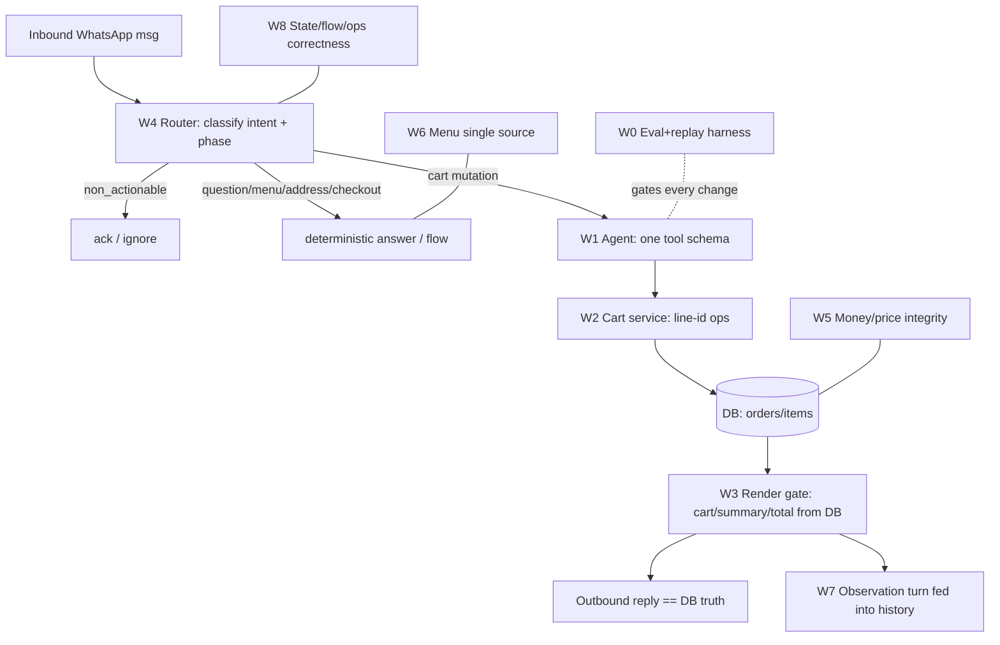

        # WhatsApp Ordering Remediation — Design (9 Workstreams)

**Date:** 2026-06-30
**Status:** Design — approved for implementation planning
**Source of findings:** `docs/superpowers/specs/2026-06-30-biryani-correction-flow-root-cause.md` (2529 lines, fully read; all section headers ticked ✅). ~140 findings across IDs R-001–R-084, R-DB-01–30, RA-1–10, F19–F116, DB-H1–15, TX-01–54, R-I-001–012.
**Scope:** All 9 workstreams (W0–W8). **Method:** strict TDD; the W0 eval/replay harness is built first and every subsequent fix is failing-test-first and gated by it.
**Constraint (non-negotiable):** Multi-tenant, multi-language SaaS. No hardcoded English phrase tables on live paths. LLM never authors money, menu, totals, or order numbers. Honors all spec business rules (COD, 10 km radius, fee tiers, 40/30/10 SLA, dish numbers, etc.).

---

## 0. Why these 9 workstreams

The ~140 findings are symptoms of **9 root mechanisms**. Fixing the mechanism closes its whole cluster. This design is the architecture; the implementation plan (separate file via writing-plans) is the phased task list.

The architecture follows the root-cause doc's own Session 6 verdict (Anthropic agent/tool/eval guidance):
- **Routing** at the top replaces the pile of pre-LLM interceptors.
- **One hardened tool schema (ACI)** with cart-line identity and absolute-qty semantics, identical across providers.
- **Deterministic render gate** after every mutation — the LLM never authors ground truth.
- **An eval suite** seeded from the two real transcripts gates every change (capability → regression).



---

## W0 — Eval + transcript-replay harness, deploy unblock, dev/CI data

**Goal:** Make correctness measurable and the tree deployable before touching behavior.
**Closes:** F19 (HEAD broken), F68 (no local data), R-044/R-055 (no replay gate), R-043 (no parse tests), R-077-prereq.

**Deliverables**
1. **Deploy unblock:** commit pending `set_item_note` in `ordering/service.py` + `tests/conversation/test_engine_draft_lifecycle.py` in one coherent commit; CI import-smoke `python -c "import app.conversation.engine, app.ordering.service"`.
2. **Dev/CI data:** `alembic upgrade head` wired into dev bootstrap + CI; optional chat seed; document `restaurant_test` recreation.
3. **Transcript-replay harness** `tests/harness/replay.py`: `drive_turns(turns) -> TranscriptResult`. Each turn = (conversation state + inbound payload) → drives `handle_inbound`/catalog path → captures every outbound, DB cart rows, subtotal/total, phase, `conv.state`. Clean DB per trial (isolation).
4. **Outcome graders** (code): DB cart == expected; `order.total == shown == confirmed`; no duplicate unintended line; last outbound == DB render; no mutation on question/reaction turn; menu reply ⊆ DB menu. **LLM-judge graders** (calibrated, "Unknown" escape): in-language, refuses invented dishes, answers the question asked. Metric: **pass^k** (every trial correct — this is money).
5. **First 20-task suite** seeded verbatim from the two transcripts (the 20 listed in root-cause §6.3). Each incident transcript becomes a **capability eval**; once green it **graduates to the regression suite** (must stay ~100%).

**Interfaces:** `TranscriptResult{outbounds[], cart_rows[], totals, phase, state}`; grader protocol `grade(result) -> {passed, reason}`.

---

## W1 — One hardened tool/action schema (provider parity)

**Goal:** The action surface is identical, strict, and poka-yoke across Claude/DeepSeek/Fake.
**Closes:** R-003, R-062, F20-B, F52, F53, F54, RA-6, R-069, R-070, R-078, F67/F69/F83-dead-builder, R-045.

**Design**
- Single `ConversationActionPort` schema (the one tool surface). Actions namespaced: `cart_add`, `cart_set_qty`, `cart_set_note`, `cart_remove`, `cart_clear`, `checkout_proceed`, `address_save`, `confirm_order`, `cancel_order`, `menu_show`, `info_answer`, `complaint_explain`, `no_action`.
- **Qty semantics explicit:** `cart_add.add_qty` (delta), `cart_set_qty.new_total` (absolute). Per-item ops in `items[]`: `{op: set_total|add_delta|remove_delta, ...}`. Never one overloaded `qty`.
- **Required-field validation** before dispatch: `cart_set_qty` without `line_ref`+`new_total` → no mutation, deterministic clarification (R-069).
- **Claude reaches parity** with DeepSeek (full enum + `items[]` + `special_note` + phase blocks) OR is removed from `get_conversation_agent()` until it passes.
- **Contract test** asserts DeepSeek, Claude, Fake expose identical action names + required fields per phase; `Fake` is schema-faithful (no substring heuristics, R-045/F33).
- `reply` becomes a non-authoritative tone hint (R-078); factual text comes from W3.

**Tests:** provider-parity contract test; required-field-missing → no mutation; `only 1` → `cart_set_qty new_total=1` not add.

---

## W2 — Cart line identity + line-level cart service

**Goal:** Every cart line is addressable; notes/variants survive edits.
**Closes:** F64, R-006, R-009, R-020, R-025, RA-7, F47, F81, F100, F107, TX-20, TX-31, TX-44, R-002.

**Design**
- Stable `cart_item_id` (OrderItem.id) surfaced in the structured cart context and accepted as `line_ref` in the schema (W1).
- **Line model decision:** one line per `(dish_id, variant_name)`; notes accumulate on that line (no plain+noted duplicate). `cart_add` with a note on an in-cart dish → updates the line, never a 2nd paid line (R-002).
- `set_item_qty` / `set_item_note` / `remove_item` / `modify_order` **preserve `notes` + `variant_name` + price snapshot** through collapse (RA-7, R-006, R-009, R-025).
- One `CartService` owns add/set/remove/clear/merge; conversation + catalogue both call it (no scattered mutation).
- `cart_clear` is structural and explicit; never inferred from "only X" (F82) — that routes to remove-others.

**Tests:** dup-line never created; qty change keeps note; modify keeps variant+note; "only mandi" removes others, keeps mandi.

---

## W3 — Deterministic post-mutation render gate

**Goal:** After any state change, the customer-visible text is rendered from committed DB, not LLM prose.
**Closes:** RA-1, RA-2, RA-3, RA-4, RA-9, R-013, R-040, R-056–R-068, R-021, R-059, F76, F96-partial, F104, F66, TX-17, TX-19, TX-27, TX-34, TX-37.

**Design**
- One `render_cart_state(order, phase, locale)`: ordering → cart tail; `awaiting_confirmation` → full order summary (items, subtotal, fee, **coupon, wallet credit, COD due** — W5), payment, ETA, deliver-to. CONCISE/DETAILED verbosity by phase.
- **Every mutating branch ends by calling it.** LLM `reply` may lead with tone only; all item/qty/price/total/order#/address claims come from the renderer.
- **Confirmation is engine-only:** `confirm_order` finalizes from DB; the LLM may never print a total or order number (F104, F76, TX-17/37). Shown == confirmed == charged.
- **Observation turn:** after mutation, record a compact DB-derived "cart now: …" turn so next-turn history carries truth (F66, W7).
- Pre-send factual validator (R-067): strip/replace any LLM claim that disagrees with DB.

**Tests:** inject wrong-total LLM reply → outbound replaced by DB summary; single-add reply has DB cart tail; confirm uses DB total.

---

## W4 — Top-level multilingual router (replace pre-LLM interceptors)

**Goal:** Classify intent + honor phase BEFORE any cart mutation; questions/reactions never mutate.
**Closes:** R-001, R-004, R-017, R-018, F49, F20-A, RA-5, RA-8, R-061, R-071, R-075, F82, F103, TX-04, TX-07, TX-28, TX-32, TX-36, TX-38, TX-39, F108/F87.

**Design**
- A multilingual classifier (LLM enum output, no English phrase tables) is the first step: `mutation | question | complaint | menu | catalogue | checkout | address | cancel | clear | show_cart | greeting | non_actionable(reaction/system) | unknown`.
- `_try_catalog_typed_order` and `parse_qty_and_text` are **demoted to a fast-path** behind the router, **phase-gated to `ordering` only**, and never run on questions/complaints/closings.
- **Correction-before-completion:** a message naming an in-cart dish/qty or a complaint ("why did you add 2") classifies as correction/explain, not checkout, not add (R-071, RA-5, R-075).
- Global intents (`show_cart`, `menu`, `cancel`, `clear`, `help`) work in **every** phase including modify/confirm sub-flows (F103, TX-28/39).
- `clear_cart`/`fresh start` require explicit intent; never from "only X" (F82, TX-36).
- Greeting is cart-aware: active draft → resume/status, not cold menu wall (F108, TX-08).

**Tests:** "why did you add 2" → no mutation; closing ×1 → proceed not loop; menu/cart/cancel inside modify work; non-Latin greeting → resume.

---

## W5 — Money & catalogue price integrity

**Goal:** One money path; displayed price == charged price; wallet/coupon math truthful.
**Closes:** R-019, R-049, R-051, R-050, F26, F41, F73, F75, F97-price, F98-price, F112, RA-3, TX-31, TX-33; plus geo R-008-fee, F92, F31.

**Design**
- Catalogue basket snapshots the **tapped Meta `item_price`** onto `OrderItem.price_aed` (or blocks on drift + resync) — never silently charge a different `Dish.price_aed` (R-051, R-019, F73).
- One `recompute_order_total(order)` used by coupon redeem, modify, and confirm — re-applies coupon + wallet hold every time (F26, F41, R-006-totals).
- Confirmation summary shows gross total, coupon discount, wallet credit applied (`min(balance,total)`), and **COD due** = total − applied (R-049, RA-3). Summary math == confirm math == door cash.
- Catalogue max-qty guard parity (R-050); one `QuantityPolicy` (also W8).
- Deterministic distance→fee per saved address; one geo path for pin and saved address; persist `distance_source`; flag haversine fallback (F112, TX-33, F31, F92).

**Tests:** card price≠dish price → no silent charge; coupon+wallet modify → totals consistent; same saved address → same fee.

---

## W6 — Menu / availability single source of truth

**Goal:** The menu the customer sees, can order, and is charged for is one consistent projection. LLM never lists the menu.
**Closes:** F96, F97, F98, F99, F74, R-026, R-028, R-052-menu, TX-06, TX-26, TX-27, TX-45, TX-48, TX-49, R-023.

**Design**
- `menu_show` routes **only** to `_render_menu`/`send_catalog` from DB/catalogue — the LLM may never emit menu text (F96, TX-27/49).
- Anti-hallucination: any model reply containing a dish-list/prices is replaced by the DB menu, validated by **dish-name cross-check against the tenant catalogue** (not just shape) (R-026, F96).
- **Orderable set == displayed catalogue set** (F98); off-catalogue dish → honest "available by phone", no fake mini-menu (TX-06).
- Block slug-named dishes (`chicken_biryani`) at activation; enforce human display name (F74, F97).
- `customer_visible` flag; `Test`/internal SKUs never render or order (TX-45).
- Multilingual catalogue intent (`catalog/catalogue/catlog/…` + native) → `send_catalog` deterministically (F109, R-028, TX-25).

**Tests:** "show full menu" reply ⊆ DB menu; one-item menu can't name another item; slug dish blocked; `Test` not orderable.

---

## W7 — History / DB faithfulness for the LLM

**Goal:** What the model reads matches what happened; the basket and cart state are visible and trustworthy.
**Closes:** R-029, R-030, R-060, R-072, R-073, R-074, R-076, R-077–R-084, R-DB-01–30, F55, F56, F57, F62, F63, F65, F66, DB-H1–DB-H15, F71.

**Design**
- ORDER (catalogue) turns render in history as a **readable basket** (resolved dish names + qty), not `[order]`; persist `display_text` + `cart_snapshot` at record time (R-077, R-082, F63, DB-H8).
- **Structured cart state** passed to the interpreter (array of `{cart_item_id, dish, variant, note, qty, price}`), not only a natural-language string (R-072); DB cart is the precedence rule over history prose (R-074).
- Single `_build_history`; delete dead `_fetch_conversation_history` (F67/F69/R-083); branch for every `Message.type` (`list_reply`, `buttons` with ids/titles — F56, DB-H12/13); merge consecutive same-role (R-079); configurable window (R-080/F55).
- Record all customer-facing outbounds (catalog cards, STT-fail, error apology) in `messages` (DB-H3/4/5); normalize stored body to delivered body (DB-H2); backfill `wa_message_id` from outbox (DB-H1); couple `messages`↔`outbox` delivery status (DB-H15).
- Normalize phone in catalogue handler → single conversation thread (F71, R-027).
- Per-turn AI decision + state snapshot persistence for support replay (DB-H9/10/11, R-037).

**Tests:** history after basket contains dish names; structured cart drives correction; DB precedence over stale prose; all outbound types recorded.

---

## W8 — State / flow correctness & ops hardening

**Goal:** Flows are deterministic, idempotent, ordered; ops are observable.
**Closes:** R-008, R-011, R-016, R-021, R-033, R-037, R-038, F22, F23, F24, F25, F32, F108–F115, TX-02, TX-13, TX-14, TX-22, TX-46, TX-51, TX-52, TX-54, R-053/054, F79/F102 (qty), F83 (reactions).

**Design**
- **Buttons deterministic:** `confirm_order`/`cancel_order` taps route to `_execute_confirm_order`/`_execute_cancel_order` without LLM round-trip (F23); remove dead `_handle_order_confirmation`.
- **Resume restores `draft_order_id`** into state before next turn; resume→continue→"that's all" → location, not empty cart (TX-02, R-DB-15).
- **Out-of-range pin retains cart** (R-008).
- **Unique per-tenant order numbers** (DB constraint, no reset) (TX-13/F114); greeting/status never advances delivery state (TX-14).
- **Per-conversation serialization** (advisory lock / queue by provider ts+id) for concurrent/simultaneous messages (TX-22, TX-46, F94/F115).
- **One `QuantityPolicy`** for add/update/catalog/modify; Indian number-words (lakh/crore) + multilingual → escalation, never silent 1 (F79, F102, TX-23/24).
- **Reactions/system events** ignored or acked, never error-replied or raw-JSON'd (F83, TX-05, R-048).
- Manual-takeover single ack (TX-52); catalogue ORDER respects takeover (R-011).
- LLM-failure + webhook-exception → localized apology + manager alert + dead-letter (R-031/053/054, F32).
- `awaiting_bundle`/`awaiting_size` survive a greeting; carry deferred sibling updates (TX-51, TX-43).
- Contact-preference + do-not-call intent persisted (TX-35); confirm-step questions answered then summary (F111, TX-16).

**Tests:** confirm button without LLM; resume→done not empty; order# unique across restarts; reaction → no error; lakh → escalate; takeover → one ack.

---

## Sequencing & gating

```
W0  (harness + unblock + data)        ← build FIRST
└─> W1 (tool schema parity)
    └─> W2 (cart line identity)
        └─> W3 (render gate)
            └─> W4 (router)
                ├─> W5 (money/price)   ┐
                ├─> W6 (menu SoT)      ├ parallel after W4
                └─> W7 (history)       ┘
                    └─> W8 (state/ops/idempotency)
```

**Gating rule (strict TDD):** the W0 suite runs on every workstream. A finding's task is "done" only when its capability eval is green AND it has graduated into the regression suite (stays green for all later workstreams). Per CLAUDE.md after each workstream: full test matrix (unit/integration/system/E2E/regression/smoke/sanity + the mandated list), `ruff`, `/graphify . --update`, append `understanding.txt`.

## Success criteria (rollup from root-cause doc)
- Cart state always == last customer-visible summary; corrections set totals (never add on top); notes survive qty/modify; catalogue price == charged.
- LLM free text never contains unvalidated item/qty/price/discount/ETA/address/payment/menu/order# claims.
- Provider parity enforced by contract test before a provider is allowed in prod.
- Every inbound gets one substantive, localized reply (or explicit takeover ack); no silent drops; idempotent on `wa_message_id`.
- Both incident transcripts pass as regression evals (pass^k).

## Out of scope (this remediation)
RBAC/staff roles (F39), rate limiting (F42), rider-track PII (F38), SLA coupon config (F37), dispatch ETA buffer (F30) — tracked in root-cause doc, scheduled separately as platform hardening unless promoted.
