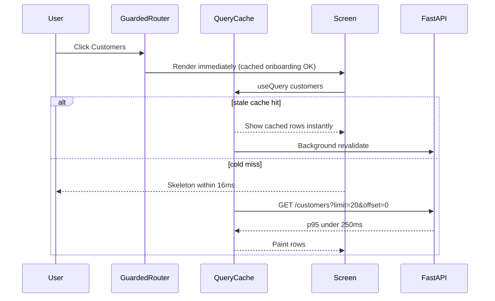

# Dashboard Data Latency Design

**Date:** 2026-07-01  
**Status:** Approved constraints — implementation in progress (not committed)  
**Goal:** Manager dashboard list and detail views (Customers, Orders, Riders, and similar DB-backed screens) display meaningful data within **400 ms** from click/navigation.

---

## 1. Problem

Clicking sidebar items (Customers, Orders, Riders, Complaints, etc.) or opening a row/detail drawer feels slow — often multiple seconds before data appears. The user wants **≤ 400 ms** to first meaningful paint of fetched data.

This is a **perceived + measured** latency problem spanning:

- Route-level blocking before any screen renders
- Expensive backend work on list/detail endpoints
- Redundant network round-trips on the frontend
- No client-side cache — every navigation is a cold fetch

---

## 2. Success Criteria

| Metric | Target | How measured |
|--------|--------|--------------|
| **Time to first data paint (TTFP)** | ≤ 400 ms p95 | Browser Performance API: navigation/click → first non-skeleton row/card visible |
| **API p95 (list endpoints)** | ≤ 250 ms | Server-side timing middleware on `/api/v1/orders`, `/api/v1/ordering/customers`, `/api/v1/riders` |
| **API p95 (detail drawer)** | ≤ 300 ms for overview tab | `GET /api/v1/orders/{id}/detail?include=overview` |
| **No regression** | Existing filters, polling, batch labels still correct | Regression tests + manual smoke on Live Ops |

**Scope:** Manager React dashboard (`frontend/`) against FastAPI backend (`src/app/`).  
**Out of scope (phase 1):** WhatsApp webhook latency, rider-app, marketing broadcast sends.

---

## 3. Root Cause Analysis

Investigation of the current stack identified these bottlenecks, ordered by impact:

### 3.1 Route gate blocks every navigation (frontend)

[`frontend/src/App.tsx`](../../frontend/src/App.tsx) `Guarded` re-fetches `/api/v1/onboarding/status` on **every** `pathname` change and returns `null` (blank screen) until it resolves:

```tsx
useEffect(() => {
  fetchOnboardingStatus().then((s) => setOnboardingOk(s.complete))...
}, [loc.pathname]);

if (onboardingOk === null) return null;
```

**Impact:** Adds one full HTTP round-trip before the target screen even mounts or shows its skeleton.

### 3.2 Orders list runs batch planner on every fetch (backend)

[`src/app/ordering/router.py`](../../src/app/ordering/router.py) `list_orders` defaults `preview_batch=true`, which calls `preview_batch_groups()` → `dry_plan_batches()` (OR-Tools / geo) on **every** list request.

[`frontend/src/screens/OrdersScreen.tsx`](../../frontend/src/screens/OrdersScreen.tsx) calls `fetchOrders()` **without** `previewBatch: false`.

Contrast: [`frontend/src/screens/LiveOpsScreen.tsx`](../../frontend/src/screens/LiveOpsScreen.tsx) already passes `previewBatch: false` and is likely faster.

**Impact:** List endpoint can take seconds when unassigned orders exist.

### 3.3 Order detail drawer duplicates work (frontend + backend)

[`frontend/src/screens/OrderDetailDrawer.tsx`](../../frontend/src/screens/OrderDetailDrawer.tsx) on row click:

```tsx
Promise.all([fetchOrderDetail(orderId), fetchOrder(orderId)])
```

- Two HTTP requests for overlapping data
- `get_order_detail` ([`src/app/ordering/service.py`](../../src/app/ordering/service.py)) runs **10+ sequential DB queries** plus `preview_batch_groups()` again for unassigned orders
- Loads **full** chat history, audit timeline, and GPS route on every open — even when the Overview tab is shown first

### 3.4 Customer profile computes stats live (backend)

[`src/app/ordering/customer_router.py`](../../src/app/ordering/customer_router.py) `get_customer_profile` calls `compute_usual_order_time()`, which loads **all** order timestamps for the customer via `_order_hours_dubai()` — O(n) in order count, no limit.

Frontend then fires **3 more** requests (wallet balance, wallet entries, coupons) in separate `useEffect` hooks.

### 3.5 No client-side data cache (frontend)

No TanStack Query / SWR. Every navigation refetches from scratch. Returning to Orders after visiting Customers waits again.

### 3.6 List endpoints fetch more than the UI shows (both sides)

- Orders: backend returns up to 50 fully enriched orders; frontend filters/paginates client-side (20 per page)
- Customers: default `limit=50`, client-side search/filter on fetched set only
- Acceptable at small scale; becomes slow as payload grows

### 3.7 Secondary factors

- Remote API (Render) adds 50–200 ms RTT if `VITE_API_PROXY` points off localhost
- `NavSidebar` polls open tickets every 30 s (background, not click-path)
- Composite index `ix_orders_restaurant_status` exists; no `(restaurant_id, created_at DESC)` index for default sort

---

## 4. Architecture Overview (Target State)



**Principles:**

1. **Never block navigation** on non-critical checks
2. **Never run dispatch planner** on hot list paths unless explicitly requested
3. **One request per interaction** — detail endpoints are self-sufficient
4. **Progressive detail** — heavy sections (chat, GPS route) load lazily
5. **Cache with TTL** — server for expensive compute; client for repeat visits

---

## 5. Approaches Considered

### Approach A — Quick wins only (frontend + flags)

Disable batch preview on Orders list, fix Guarded gate, remove duplicate order fetch, show stale cache informally via module-level Map.

| Pros | Cons |
|------|------|
| Small diff, shippable in hours | No server-side fix for detail slowness; cache is ad-hoc |
| Likely 2–5× improvement on Orders | Won't reliably hit 400 ms on detail/customer profile |

### Approach B — Backend-first (indexes, caching, lazy detail)

Redis/in-memory cache for `preview_batch_groups`, split order detail into `?include=`, denormalize `usual_order_time`, add DB indexes, server-side pagination.

| Pros | Cons |
|------|------|
| Fixes root CPU/DB cost | Larger backend change; needs perf tests |
| Scales with data volume | Doesn't help repeat-navigation feel without frontend cache |

### Approach C — Full stack (recommended)

Phase 0 quick wins + Phase 1 backend slimming + Phase 2 TanStack Query with prefetch and stale-while-revalidate.

| Pros | Cons |
|------|------|
| Meets 400 ms target reliably | Moderate scope (~3–5 PRs) |
| Matches enterprise patterns | Adds `@tanstack/react-query` dependency |

**Recommendation: Approach C**, delivered in three phases so each phase is independently verifiable.

---

## 6. Detailed Design

### Phase 0 — Immediate path fixes (no new dependencies)

**6.0.1 Fix Guarded onboarding gate**

- Fetch onboarding status **once** after login (or on first guarded mount), store in React context or `sessionStorage`
- On route change: if already known `complete === true`, render children immediately
- Re-check only after explicit onboarding completion or 401 logout

**Files:** [`frontend/src/App.tsx`](../../frontend/src/App.tsx), new `frontend/src/lib/OnboardingContext.tsx` (or extend auth module)

**6.0.2 Orders list — skip batch preview**

- [`frontend/src/screens/OrdersScreen.tsx`](../../frontend/src/screens/OrdersScreen.tsx): `fetchOrders({ previewBatch: false })` for initial load and polling
- Add optional UI toggle or lazy-load batch labels: second request `fetchOrders({ previewBatch: true })` only when user opens batch filter dropdown (or after first paint via `requestIdleCallback`)

**6.0.3 Order detail — single fetch**

- Drawer opens with `fetchOrderDetail(id)` only
- Map `OrderDetailOut` → local `OrderOut` shape for actions (advance, cancel, reassign) — detail schema already has status, items, rider, SLA fields
- Remove parallel `fetchOrder(id)` call

**6.0.4 Customer list — server-driven pagination**

- Pass `limit=20&offset=(page-1)*20` from [`frontend/src/lib/customerApi.ts`](../../frontend/src/lib/customerApi.ts)
- Move search `q` to API (already supported) with 300 ms debounce
- Remove client-side filter for fields the API can handle first (search); keep marketing/activity filters client-side until Phase 1 adds query params

**Expected Phase 0 outcome:** Orders and sidebar navigation improve dramatically; detail drawer roughly 2× faster.

---

### Phase 1 — Backend slimming + caching

**6.1.1 Order detail progressive loading**

Extend `GET /api/v1/orders/{id}/detail` with optional query param:

```
?include=overview,timeline,chat,route,dispatch
```

Default (omitted or `include=overview`): order, items, customer, address, rider, totals, SLA fields, `batch_preview_label` **without** calling `preview_batch_groups` — use precomputed label from list cache or omit.

Heavy sections loaded only when user switches tab (frontend fires second request with `include=timeline,chat` etc.).

**Files:** [`src/app/ordering/router.py`](../../src/app/ordering/router.py), [`src/app/ordering/service.py`](../../src/app/ordering/service.py) `get_order_detail`, [`frontend/src/screens/OrderDetailDrawer.tsx`](../../frontend/src/screens/OrderDetailDrawer.tsx)

**6.1.2 Cache `preview_batch_groups` per restaurant**

- Key: `batch_preview:{restaurant_id}:{candidate_fingerprint}`
- TTL: 30 s (aligns with polling interval)
- Store in Redis if available, else in-process LRU with TTL (same pattern as other caches in codebase)
- Invalidate on order status transition to/from `ready` / rider assignment

**Files:** [`src/app/dispatch/service.py`](../../src/app/dispatch/service.py), new `src/app/dispatch/preview_cache.py`

**6.1.3 Customer profile — denormalize usual order time**

- Add `usual_order_time` column on `customers` (nullable string), maintained by `recompute_customer_stats()`
- `get_customer_profile` reads column instead of scanning all orders
- Backfill migration for existing customers (batch job in migration or lazy on read)

**Files:** [`src/app/ordering/models.py`](../../src/app/ordering/models.py), alembic migration, [`src/app/ordering/service.py`](../../src/app/ordering/service.py)

**6.1.4 DB index for order list sort**

```sql
CREATE INDEX ix_orders_restaurant_created_at
  ON orders (restaurant_id, created_at DESC);
```

**Files:** new alembic revision

**6.1.5 Orders list — server-side filters (optional in Phase 1)**

Add query params: `from_date`, `to_date`, `status`, `q`, `offset`, `limit` (already has status/limit). Frontend stops downloading full history for date filtering.

**6.1.6 API timing middleware**

Log `X-Response-Time-Ms` header + structured log when duration > 400 ms — enables ongoing regression detection.

**Files:** [`src/app/main.py`](../../src/app/main.py) middleware

---

### Phase 2 — Client cache layer (TanStack Query)

**6.2.1 Add `@tanstack/react-query`**

- Wrap app in `QueryClientProvider`
- Default `staleTime: 30_000`, `gcTime: 300_000`
- `placeholderData: keepPreviousData` on list queries

**6.2.2 Query keys**

| Key | Endpoint | staleTime |
|-----|----------|-----------|
| `['orders', filters]` | `GET /orders?...` | 12 s (match poll) |
| `['customers', page, q]` | `GET /ordering/customers?...` | 30 s |
| `['riders']` | `GET /riders` | 12 s |
| `['order', id, include]` | `GET /orders/{id}/detail?...` | 10 s |

**6.2.3 Prefetch on sidebar hover**

[`frontend/src/components/NavSidebar.tsx`](../../frontend/src/components/NavSidebar.tsx): `onMouseEnter` → `queryClient.prefetchQuery` for likely next screen.

**6.2.4 Polling integration**

Replace raw `usePollingRefresh` + `useEffect` fetches with `refetchInterval` on active queries (respect `document.visibilityState`).

**Files:** all `frontend/src/screens/*Screen.tsx`, new `frontend/src/lib/queries/*.ts`

---

## 7. Error Handling

- Cache miss or API failure: keep showing skeleton (first load) or stale data with inline "Couldn't refresh" banner (subsequent)
- Batch preview cache failure: fall back to empty preview labels — list still loads
- Detail `include` partial failure: return 200 with available sections; missing sections marked `null` with `errors` array in response (or 424 — pick 200 partial for UX)
- Onboarding check failure: treat as `complete=true` (current behavior) but **do not block render**

---

## 8. Testing Plan

### 8.1 Automated

| Layer | Tests |
|-------|-------|
| Backend unit | `preview_batch_groups` cache hit/miss/TTL; `get_order_detail` include flags; customer profile without full order scan |
| Backend integration | `tests/ordering/test_list_orders_perf.py` — assert list_orders p95 < 250 ms with 50 seeded orders (no real OR-Tools sleep — mock `dry_plan_batches`) |
| Frontend unit | OrderDetailDrawer single-fetch mock; Guarded renders child without awaiting onboarding on second nav |
| E2E (Playwright) | Navigate Customers → Orders → Riders; assert table visible < 400 ms (use `page.waitForSelector` with timeout) |

### 8.2 Manual verification checklist

- [ ] Click Orders: table rows visible < 400 ms (local backend, warm DB)
- [ ] Click customer row → profile loads name/phone/stats < 400 ms
- [ ] Open order drawer → overview tab < 400 ms; timeline tab loads within 400 ms of tab click
- [ ] Batch filter labels still appear (lazy path)
- [ ] Live Ops polling unchanged
- [ ] Repeat navigation to same screen shows instant cached data

### 8.3 Perf instrumentation (dev-only)

Add `frontend/src/lib/perf.ts` wrapper that logs `console.debug('[perf]', label, ms)` when `import.meta.env.DEV` — wrap each screen's first paint callback.

---

## 9. Rollout Plan

| Phase | PR | Risk | Rollback |
|-------|-----|------|----------|
| 0 | `perf: dashboard phase-0 quick wins` | Low | Revert frontend commits |
| 1 | `perf: slim order detail + preview cache` | Medium | Feature flags: `APP_DETAIL_INCLUDES=1`, `APP_PREVIEW_CACHE=1` |
| 2 | `perf: react-query cache layer` | Low | Remove provider, restore useEffect fetches |

Deploy order: backend Phase 1 first (backward compatible — new query params optional), then frontend Phase 0+2.

---

## 10. Implementation Todos (for writing-plans)

1. **perf-guarded-gate** — Cache onboarding status; stop blocking navigation
2. **perf-orders-preview** — `previewBatch: false` on Orders list; lazy batch labels
3. **perf-order-drawer-dedup** — Single detail fetch; map to action state
4. **perf-customers-pagination** — Server limit/offset + debounced search
5. **perf-detail-includes** — Backend `?include=` + lazy tab loading
6. **perf-preview-cache** — Redis/in-process TTL cache for batch preview
7. **perf-usual-order-time** — Denormalize column + backfill
8. **perf-orders-index** — `(restaurant_id, created_at DESC)` migration
9. **perf-react-query** — Query client, hooks, prefetch, polling migration
10. **perf-tests** — Integration perf test + Playwright latency spec

---

## 11. Confirmed Constraints (2026-07-01)

| Constraint | Decision | Design impact |
|------------|----------|-----------------|
| **Hosting** | Render database + API (remote) | Budget ~100–200 ms network RTT; backend list p95 target tightened to **≤150 ms**; TanStack Query stale-while-revalidate mandatory; sidebar prefetch on hover |
| **Latency budget** | **Everything ≤400 ms** including batch labels | No lazy batch-label pass; `preview_batch_groups` **must** hit Redis/in-process cache (30 s TTL, tenant-scoped invalidation) |
| **Data scale** | Unknown per tenant | Server-side pagination (20 rows), indexed list queries, no full-table client downloads; filters that can't run server-side apply to current page only |
| **Multi-tenant SaaS** | Required | All caches keyed by `restaurant_id`; JWT tenant isolation unchanged; no cross-tenant cache keys |
| **Multi-lingual** | Platform serves many languages | Dashboard strings stay static/bundled (no blocking locale fetch); API returns locale-neutral data (AED, UTC/Dubai times); WhatsApp i18n remains in conversation module |

---

## 12. Approval

Once this spec is approved, next step is invoking **writing-plans** to produce the phased implementation plan (`docs/superpowers/plans/2026-07-01-dashboard-data-latency.md`).

**Do not commit or implement until the user explicitly approves.**