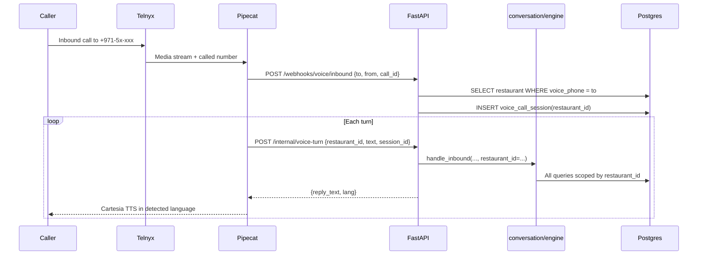

# Phone Voice Ordering — Platform Reference

**Status:** Design / pre-implementation reference  
**Date:** 2026-07-04  
**Audience:** Engineering, ops, partner integrations, chain HQ  
**Related:** [Platform design spec](superpowers/specs/2026-06-06-whatsapp-restaurant-platform-design.md), [Architecture](architecture.md), [Cratis partner requirements](partners/cratis-integration-requirements.md)

This document consolidates everything discussed for adding **multilingual phone voice ordering** to the existing **multi-tenant WhatsApp restaurant platform** — including the recommended cheap/low-latency stack, multi-tenant + chain/branch handling, required APIs/services, costs, and onboarding checklists.

---

## Table of contents

1. [Executive summary](#1-executive-summary)
2. [Multilingual capability (today vs voice)](#2-multilingual-capability-today-vs-voice)
3. [Recommended voice stack](#3-recommended-voice-stack)
4. [Cost model](#4-cost-model)
5. [Latency architecture](#5-latency-architecture)
6. [Multi-tenant model](#6-multi-tenant-model)
7. [Chain & branch patterns](#7-chain--branch-patterns)
8. [Data model extensions](#8-data-model-extensions)
9. [Request flow & tenant isolation](#9-request-flow--tenant-isolation)
10. [Full API & services inventory](#10-full-api--services-inventory)
11. [Environment variables](#11-environment-variables)
12. [Per-party requirements](#12-per-party-requirements)
13. [Onboarding checklists](#13-onboarding-checklists)
14. [Documents to produce](#14-documents-to-produce)
15. [What NOT to use](#15-what-not-to-use)
16. [Implementation hooks (codebase)](#16-implementation-hooks-codebase)
17. [Open gaps](#17-open-gaps)

---

## 1. Executive summary

| Question | Answer |
|----------|--------|
| Is the platform multilingual? | **Yes** — WhatsApp ordering is built as multi-tenant multilingual SaaS. Voice reuses the same ordering brain. |
| Cheapest stack with low latency + good voice? | **Telnyx + Deepgram Nova-3 + Cartesia Sonic + DeepSeek V4-Flash + Pipecat** (~$0.10–0.13 per 3-min order call). |
| How do multiple restaurants / chains work? | **`restaurant_id` = one branch** (operational tenant). Chains add **`organization_id`** for grouping/billing — not a shared DB row. |
| Voice routing key? | **Called phone number** → `restaurant_id` (same pattern as WhatsApp `Restaurant.phone`). |
| What’s new vs today? | **5 additions:** Telnyx (SIP), Deepgram phone STT, Cartesia TTS, Pipecat orchestrator, voice webhooks. Everything else already exists. |

**Core principle:** Phone is another inbound channel into `handle_inbound` — never a separate ordering logic path. All queries stay scoped by `restaurant_id`.

---

## 2. Multilingual capability (today vs voice)

### 2.1 WhatsApp ordering (live today)

| Layer | Multilingual? | Implementation |
|-------|---------------|----------------|
| Conversation agent | Yes | `src/app/llm/conversation_prompts.py` — detect language, reply in same language |
| Intent router | Yes | LLM-driven, no English phrase tables on live path |
| Menu / dish matching | Partial | `pg_trgm` + OKF/LLM grounding across scripts |
| Voice notes (WhatsApp) | Yes | ElevenLabs Scribe auto-detect (`src/app/speech/elevenlabs.py`) |
| Menu-request keywords | Yes | EN, Hindi/Urdu, Arabic, Telugu in `engine.py` `_MENU_KEYWORDS` |

**Primary languages in system prompt:**

- English
- Arabic (عربي)
- Urdu / Hindi (اردو / हिंदी)
- Turkish
- Russian
- Filipino (Tagalog)
- Malayalam (മലയാളം)
- Plus: “all languages worldwide”; code-switching (e.g. Hinglish) supported

### 2.2 Phone voice (to build)

| Layer | Multilingual? | Notes |
|-------|---------------|-------|
| STT | Yes | Deepgram **Nova-3** with auto-detect / `multi` — includes `ar-AE`, `hi`, `ur`, `tl`, `ml` |
| LLM | Yes | Same DeepSeek conversation agent + tools as WhatsApp |
| TTS | Per-provider | **Cartesia Sonic** — Emirati Arabic, Hindi, English, etc. Use **per-language voice IDs** |
| Code-switching in one reply | Hard for TTS | LLM can mix; TTS should pick **dominant language of the turn** |

### 2.3 Practical limits (all channels)

| Limitation | Impact |
|------------|--------|
| Menu DB names often English | Arabic/Hindi dish names may need extra OKF grounding |
| Address in non-Latin scripts | STT/geocoding weaker on phone; SMS/WhatsApp follow-up for location pin |
| Manager dashboard UI | Mostly English; customer-facing chat/voice is multilingual |
| Marketing templates | WhatsApp templates are per-language Meta objects |
| Flux STT | **No Arabic** in `flux-general-multi` — use **Nova-3** for UAE |

---

## 3. Recommended voice stack

### 3.1 Primary recommendation (best $ / latency / quality / multilingual)

```
Caller → Telnyx (SIP + Media WebSocket) → Pipecat orchestrator → FastAPI ordering engine
                                              ↓
                                    Deepgram Nova-3 STT (streaming)
                                    DeepSeek V4-Flash LLM (tools)
                                    Cartesia Sonic TTS (streaming, per-lang voice)
```

| Layer | Provider | Product / API | Why |
|-------|----------|---------------|-----|
| Telephony | **Telnyx** | Voice API + Elastic SIP + Media Streaming | Cheapest programmable PSTN; avoid Conversation Relay ($0.05/min) |
| STT | **Deepgram** | Nova-3 streaming WebSocket | Arabic `ar-AE`, Hindi, Urdu, 45+ langs; ~$0.005/min |
| TTS | **Cartesia** | Sonic WebSocket | Low TTFB (~90ms), Emirati AR + HI + EN; $5/mo Pro tier |
| LLM | **DeepSeek** | V4-Flash non-thinking + tool calls | Reuse existing ordering agent; ~$0.001/call |
| Orchestrator | **Pipecat** | Self-hosted | Streams STT → LLM → TTS; plugs into custom HTTP handler |
| Ordering | **This platform** | `handle_inbound` | Same brain as WhatsApp |

### 3.2 Cheaper TTS variant (~$0.04/call savings)

Swap Cartesia → **Telnyx Inworld Mini TTS** ($0.0000055/char). Test Arabic/Hindi quality before committing.

### 3.3 Ultra-cheap floor (NOT recommended for UAE multilingual)

Self-hosted Whisper + Piper — understands well, sounds mostly English, higher turn latency. Fails “good quality voice” goal.

### 3.4 Why not single-vendor Deepgram for TTS?

Deepgram **Aura** TTS has no Arabic or Hindi (EN, ES, DE, FR, NL, IT, JA only). Wrong for UAE customer replies.

### 3.5 Why not Groq Whisper for phone?

Groq Whisper is **batch** STT ($0.04/hour — very cheap) but not streaming. Adds 500ms–2s+ per turn. Fine for offline; bad for live phone.

### 3.6 Why not bundled “Voice Agent” APIs?

| Product | Price | Problem |
|---------|-------|---------|
| Deepgram Voice Agent API | ~$0.05–0.08/min | Bundled LLM; can’t reuse your ordering engine |
| Telnyx Conversation Relay | $0.05/min | Orchestration tax |
| Cartesia Line (full agent) | $0.06/min + telephony | Bundled agent; you want DIY + your DeepSeek |

---

## 4. Cost model

### 4.1 Per ~3-minute order call (primary stack)

| Component | Calculation | Est. cost |
|-----------|-------------|-----------|
| Telnyx SIP + voice + media | (~$0.0032 + $0.002 + $0.0035)/min × 3 | ~$0.03 |
| Deepgram Nova-3 STT | ~$0.005/min × 3 | ~$0.015 |
| Cartesia TTS | ~1.5–2 min agent speech | ~$0.05–0.08 |
| DeepSeek LLM | Short replies + tools | ~$0.001 |
| Number amortized | UAE DID | ~$0.01 |
| **Total** | | **~$0.10–0.13 / call** |

**Scale:** 1,000 calls/month → ~$100–130 AI + telephony (excluding VPS).

### 4.2 Free credits to use first

- Deepgram: $200 free credit on signup
- Cartesia: 20K credits/month free tier; Pro $5/mo = 100K credits

### 4.3 Reference pricing (2026, verify before contract)

| Provider | Item | Rate |
|----------|------|------|
| Telnyx | Inbound local SIP | from ~$0.0032/min |
| Telnyx | Voice API | $0.002/min |
| Telnyx | Media streaming | $0.0035/min |
| Telnyx | Deepgram Nova-3 (resold) | $0.0074/min |
| Telnyx | Inworld Mini TTS | $0.0000055/char |
| Telnyx | Neural Polly TTS | $0.000024/char |
| Telnyx | Conversation Relay | $0.05/min — **avoid** |
| Deepgram | Nova-3 streaming | ~$0.0048–0.0065/min (promo varies) |
| Deepgram | Aura TTS | $0.015/1k chars |
| Deepgram | Voice Agent API | $0.05–0.075/min — **avoid** |
| Cartesia | Pro plan | $5/mo, ~133 TTS min included |
| Cartesia | Line agent | $0.06/min + $0.014/min telephony |
| DeepSeek | V4-Flash input (cache miss) | $0.14 / 1M tokens |
| DeepSeek | V4-Flash output | $0.28 / 1M tokens |
| Groq | Whisper large v3 turbo | $0.04/hour (batch only) |

---

## 5. Latency architecture

**Target:** ~400–800ms from end-of-speech to first spoken byte.

| Technique | Detail |
|-----------|--------|
| Streaming STT | Partial transcripts; don’t wait for full utterance |
| End-of-turn | Nova-3 + Pipecat Silero VAD (Flux turn-detection lacks Arabic) |
| Sentence-chunk TTS | Stream LLM tokens → speak first sentence immediately |
| Short replies | 1–2 sentences max on voice (already in WhatsApp prompts) |
| Non-thinking LLM | DeepSeek V4-Flash without reasoning mode — thinking adds 1–3s |
| Region | Deploy orchestrator EU (Frankfurt/Amsterdam) — reasonable to UAE |
| Pre-warm | Keep Cartesia TTS websocket warm per active call |

### Multilingual TTS rule

```
STT detects lang → pick voice_id from restaurant.settings.voice.tts_voices[lang]
→ one language per TTS utterance
```

---

## 6. Multi-tenant model

### 6.1 Today (WhatsApp)

- **Tenant unit:** `restaurants` row = one manager account = one operational branch
- **Inbound routing:** `Restaurant.phone` == WhatsApp display number
- **Isolation:** every tenant table has `restaurant_id`; JWT resolves tenant via `identity/deps.py:current_restaurant`
- **No chain table yet:** each branch is a separate `restaurant` row

```python
# src/app/webhook/router.py — existing pattern
restaurant = await session.scalar(
    select(Restaurant).where(Restaurant.phone == inbound.restaurant_phone)
)
await handle_inbound(session, inbound, restaurant_id=restaurant.id)
```

### 6.2 With voice (same pattern)

| Layer | Tenant key | Owns |
|-------|------------|------|
| **Branch** (operational) | `restaurant_id` | Menu, riders, dispatch, orders, customers, voice + WhatsApp config |
| **Chain** (commercial/admin) | `organization_id` *(new)* | Branding, billing, shared voice pack, rollout |
| **Platform** (CatalystIQ) | — | Telnyx trunk, STT/TTS API keys, orchestrator, compliance |

**Rule:** Never derive `restaurant_id` from LLM or caller input — only from **called number** (or server-side IVR selection).

### 6.3 Shared vs isolated

| Shared (one deployment) | Per branch (`restaurant_id`) |
|----------------------|------------------------------|
| Telnyx account | Phone number (`voice_phone`) |
| Deepgram API key | Voice greeting, TTS voices |
| Cartesia API key | Menu, riders, dispatch pool |
| DeepSeek API key | Meta WhatsApp token + phone_number_id |
| Pipecat pool | Customers, orders, SLA |
| Postgres, Redis, Celery | Settings JSONB (fees, radius, etc.) |

---

## 7. Chain & branch patterns

### Pattern A — One number per branch (recommended default)

```
Customer calls +971-5x-BRANCH-A  →  restaurant_id=101  →  JBR kitchen
Customer calls +971-5x-BRANCH-B  →  restaurant_id=102  →  Marina kitchen
```

- Mirrors WhatsApp routing
- Correct dispatch (riders per branch)
- Correct menu/prices per location

### Pattern B — One central number + location picker

```
Customer calls 800-BRAND  →  IVR or LLM: "Which branch?"
                          →  voice_session.restaurant_id set server-side
                          →  then ordering proceeds
```

- One marketing number
- Must lock `restaurant_id` **before** cart mutations
- Harder to implement correctly

### Pattern C — Partner POS owns branches (Cratis-style)

```
Cratis store_id "DXB-JBR-01"  ↔  restaurant_id=101
```

See [Cratis integration requirements](partners/cratis-integration-requirements.md).

### Chain-wide voice pack (optional JSON propagated to all branches in org)

```json
{
  "default_languages": ["en", "ar", "hi"],
  "tts_voices": {
    "en": "cartesia-voice-id-en",
    "ar": "cartesia-voice-id-emirati-ar",
    "hi": "cartesia-voice-id-hi"
  },
  "greeting": {
    "en": "Welcome to {restaurant_name}. Say a dish name or number to order.",
    "ar": "مرحباً بكم في {restaurant_name}. قولوا اسم الطبق أو رقمه للطلب.",
    "hi": "{restaurant_name} में आपका स्वागत है। डिश का नाम या नंबर बोलिए।"
  }
}
```

`{restaurant_name}` substituted per branch at runtime.

---

## 8. Data model extensions

### 8.1 Existing (`restaurants`)

| Field | Purpose |
|-------|---------|
| `id` | `restaurant_id` — primary tenant key |
| `name` | Brand + branch name in prompts |
| `phone` | WhatsApp inbound routing key |
| `email` | Manager login |
| `lat`, `lng` | Delivery radius, dispatch |
| `settings` JSONB | Fees, radius, catalog, loyalty, etc. |

### 8.2 Proposed additions

```
organizations
  id, name, billing_email, settings JSONB

restaurants  (ADD)
  organization_id FK nullable
  branch_code              # e.g. "DXB-JBR"
  voice_phone              # inbound DID (unique, like phone for WA)
  voice_enabled            bool

restaurant.settings.voice  (JSONB block)
  stt_language_hint        # auto | ar-AE | multi
  tts_voices               # { "en": "...", "ar": "...", "hi": "..." }
  greeting                 # { "en": "...", "ar": "..." }
  human_handoff_phone      # branch manager line
  recording_enabled        bool
  business_hours           JSONB

voice_call_sessions
  id, restaurant_id, caller_phone, channel='voice'
  stt_lang_detected, telnyx_call_control_id
  started_at, ended_at

phone_number_registry  (platform)
  e164, restaurant_id, provider, status, purchased_at
```

---

## 9. Request flow & tenant isolation



### Proposed HTTP endpoints (new)

| Endpoint | Purpose |
|----------|---------|
| `POST /webhooks/voice/inbound` | Telnyx call initiated — resolve tenant, create session |
| `POST /webhooks/voice/status` | Ringing, answered, hangup |
| `POST /internal/voice-turn` | Text turn → ordering engine → short reply (internal, auth required) |
| `POST /api/v1/voice/config` | Manager PATCH voice settings (JWT, tenant-scoped) |

---

## 10. Full API & services inventory

### 10.1 Voice channel only (NEW)

| Service | API / product | Account | Codebase status |
|---------|---------------|---------|-----------------|
| SIP / PSTN | Telnyx Voice API + Elastic SIP | Platform | **New** `voice/` port |
| Media streaming | Telnyx Media WebSocket | Platform | **New** |
| Call control | Telnyx Call Control API | Platform | **New** |
| STT (phone) | Deepgram Nova-3 streaming | Platform | **New** (WA uses ElevenLabs) |
| TTS (phone) | Cartesia Sonic streaming | Platform | **New** |
| Orchestrator | Pipecat (self-hosted) | Your infra | **New** deployable |
| Voice webhooks | Your FastAPI routes | Your app | **New** |

### 10.2 Ordering brain (REUSE — exists today)

| Service | Provider | Env / config | Port module |
|---------|----------|--------------|-------------|
| LLM conversation | DeepSeek (prod) | `APP_LLM_PROVIDER=deepseek` | `llm/deepseek.py` |
| LLM router | DeepSeek | same key | `llm/router_*` |
| LLM menu extract | Claude (auto) | `APP_ANTHROPIC_API_KEY` | `llm/claude.py` |
| Database | PostgreSQL + PostGIS | `APP_DATABASE_URL` | — |
| Queue / cache | Redis | `APP_REDIS_URL` | — |
| Workers | Celery | same Redis | `apps/workers/` |
| API | FastAPI | — | `app.main` |

### 10.3 WhatsApp channel (per branch)

| Service | Provider | Per branch? | Config |
|---------|----------|-------------|--------|
| Messaging | Meta WhatsApp Cloud API | **Yes** | `wa_phone_number_id`, token in `restaurant.settings` |
| Templates | Meta Graph API | **Yes** | WABA per branch |
| Catalog (optional) | Meta Commerce | **Yes** | `catalog_id` in settings |
| Embedded Signup | Meta ES | Per onboarding | `APP_WA_ES_CONFIG_ID` |
| STT voice notes | ElevenLabs Scribe | Platform key | `APP_STT_PROVIDER=elevenlabs` |

### 10.4 Delivery & ops (per branch)

| Service | Provider | Config |
|---------|----------|--------|
| Maps / routing | Google Maps Platform | `APP_GEO_PROVIDER=google_maps` |
| Geo fallback | Built-in haversine | `APP_GEO_CITY_SPEED_KMH` |
| Weather | Weather port | `weather/port.py` |
| Rider push | Expo Push | `APP_PUSH_PROVIDER=expo` |
| POS (optional) | Cratis / partner | `APP_POS_PROVIDER`, `APP_PARTNERS_JSON` |

### 10.5 Marketing & ML (optional)

| Service | Provider | Config |
|---------|----------|--------|
| Promo images | OpenAI DALL·E | `APP_MARKETING_IMAGE_PROVIDER` |
| Demand forecast | LightGBM / rolling | `APP_FORECAST_PROVIDER` |
| Observability | Sentry | `APP_SENTRY_DSN` |

### 10.6 Infrastructure you run (not external SaaS)

| Component | Role |
|-----------|------|
| FastAPI | Webhooks, `/api/v1/*`, partner API |
| Celery + Beat | Dispatch, SLA, outbox, marketing, ML |
| PostgreSQL | All tenant data |
| Redis | Broker, cache, rider GEO, rate limits |
| Blob storage | Menu uploads (`APP_UPLOAD_DIR`) |
| React dashboard | Manager UI |
| Pipecat service | Real-time voice pipeline (**new**) |
| TLS + domain | `APP_PUBLIC_BASE_URL` |

### 10.7 Architecture diagram (full stack)

```
                         CUSTOMER
                    ┌────────┴────────┐
                    │                 │
               Phone call          WhatsApp
                    │                 │
                    ▼                 ▼
            ┌──────────────┐   ┌──────────────┐
            │   TELNYX     │   │  META CLOUD  │
            │ SIP + Media  │   │  WhatsApp API│
            └──────┬───────┘   └──────┬───────┘
                   │                  │
                   ▼                  ▼
            ┌──────────────┐   POST /webhooks/whatsapp
            │   PIPECAT    │          │
            └──────┬───────┘          │
                   │                  ▼
            ┌─────────────────────────────────┐
            │         YOUR FASTAPI APP         │
            │  voice webhook │ handle_inbound  │
            │  (restaurant_id scoped)          │
            └──────────┬──────────────────────┘
                       │
       ┌───────────────┼───────────────┬──────────────┐
       ▼               ▼               ▼              ▼
  DEEPGRAM STT    DEEPSEEK LLM    CARTESIA TTS   ELEVENLABS STT
  (phone)         (ordering)      (phone)        (WA voice notes)
                       │
       ┌───────────────┼───────────────┬──────────────┐
       ▼               ▼               ▼              ▼
  POSTGRES+POSTGIS   REDIS         CELERY        GOOGLE MAPS
                       │
                       ▼
              CRATIS / POS (optional per branch)
```

### 10.8 API keys — who holds what

| Credential | Holder | Scope |
|------------|--------|-------|
| Telnyx API key | Platform | All branches |
| Deepgram API key | Platform | All STT |
| Cartesia API key | Platform | All TTS; per-branch voice IDs in settings |
| DeepSeek API key | Platform | All LLM |
| Anthropic API key | Platform | Menu extraction |
| ElevenLabs API key | Platform | WA voice notes |
| Google Maps API key | Platform | Geocode + routes |
| Meta app + verify token | Platform | Webhook verify |
| Meta access token + phone_number_id | **Per branch** | `restaurant.settings` |
| Partner API key | **Per branch** | POS mapping |
| JWT secret | Platform | Manager + rider auth |

### 10.9 Minimum to go live

#### Voice + WhatsApp (single branch)

1. Telnyx (SIP + number + media)
2. Deepgram (phone STT)
3. Cartesia (TTS)
4. DeepSeek (LLM)
5. Postgres + Redis + Celery + FastAPI
6. Google Maps
7. Meta WhatsApp (branch number)
8. Pipecat orchestrator

#### WhatsApp only (today)

Skip Telnyx, Deepgram phone, Cartesia, Pipecat.

#### Chain (N branches)

- N × UAE DIDs (or 1 central + IVR)
- N × `restaurant_id` rows
- N × Meta WABA (usually one per branch)
- 1 × platform API keys
- N × partner `store_id` mappings (if POS)

---

## 11. Environment variables

### 11.1 Existing (from `src/app/config.py`)

```bash
# Core
APP_DATABASE_URL=postgresql+asyncpg://...
APP_REDIS_URL=redis://...
APP_PUBLIC_BASE_URL=https://api.example.com
APP_JWT_SECRET=...

# LLM
APP_LLM_PROVIDER=deepseek
APP_DEEPSEEK_API_KEY=...
APP_DEEPSEEK_MODEL=deepseek-chat
APP_ANTHROPIC_API_KEY=...          # menu extraction

# WhatsApp
APP_WHATSAPP_PROVIDER=cloud
APP_WA_VERIFY_TOKEN=...
APP_WA_APP_SECRET=...
APP_WA_ES_CONFIG_ID=...            # embedded signup

# STT (WhatsApp voice notes only today)
APP_STT_PROVIDER=elevenlabs
APP_ELEVENLABS_API_KEY=...

# Geo
APP_GEO_PROVIDER=google_maps
APP_GOOGLE_MAPS_API_KEY=...

# POS / partners
APP_POS_PROVIDER=cratis
APP_PARTNERS_JSON={"cratis":{...}}

# Observability
APP_SENTRY_DSN=...
```

### 11.2 Proposed (voice — new)

```bash
# Voice telephony
APP_VOICE_PROVIDER=telnyx           # telnyx | fake
APP_TELNYX_API_KEY=...
APP_TELNYX_CONNECTION_ID=...        # SIP connection
APP_VOICE_WEBHOOK_SECRET=...

# Phone STT / TTS (separate from WA ElevenLabs)
APP_VOICE_STT_PROVIDER=deepgram     # deepgram | fake
APP_DEEPGRAM_API_KEY=...

APP_VOICE_TTS_PROVIDER=cartesia     # cartesia | fake
APP_CARTESIA_API_KEY=...

# Orchestrator
APP_VOICE_ORCHESTRATOR_URL=ws://pipecat:8765
```

### 11.3 Per-branch (`restaurant.settings.voice`)

```json
{
  "enabled": true,
  "voice_phone": "+9715xxxxxxxx",
  "languages": ["en", "ar", "hi"],
  "tts_voices": {
    "en": "sonic-voice-id-en",
    "ar": "sonic-voice-id-emirati-ar",
    "hi": "sonic-voice-id-hi"
  },
  "greeting": {
    "en": "Welcome to {restaurant_name}. Say a dish name or number.",
    "ar": "..."
  },
  "human_handoff_phone": "+9715xxxxxxxx",
  "recording_enabled": false,
  "business_hours": {
    "timezone": "Asia/Dubai",
    "weekly": { "mon": ["10:00", "23:00"] }
  }
}
```

---

## 12. Per-party requirements

### 12.1 Platform (CatalystIQ)

| Category | Required |
|----------|----------|
| Telnyx account, SIP trunk, UAE DID pool | Yes |
| Deepgram, Cartesia, DeepSeek API keys | Yes |
| Pipecat deployment (VPS/K8s) | Yes |
| FastAPI voice webhooks + `voice/` module | Yes |
| Call recording policy + UAE compliance docs | Yes |
| Per-branch metering (minutes, STT, TTS, LLM) | Yes |

### 12.2 Chain HQ

| Item | Purpose |
|------|---------|
| Brand book | Tone, greetings |
| Branch list | Legal name, trade name, address, lat/lng, branch code |
| Routing policy | Per-branch numbers vs central IVR |
| Menu policy | Shared vs per-branch prices |
| Language policy | EN / EN+AR / full 7 languages |
| Hours per branch | After-hours behavior |
| Escalation matrix | Manager phone per branch |
| Active-store list | Which branches are live (billing) |

### 12.3 Each branch (restaurant tenant)

**Existing (WhatsApp ops — spec §4.1):**

- Signup: name, email, password, lat/lng
- Menu upload → confirm → activate (dish numbers mandatory)
- Riders registered
- Meta WhatsApp connected
- Delivery fee tiers / settings
- `onboarding_complete = true`

**Voice add-ons:**

- Voice phone number assigned
- Greeting per language (short)
- TTS voice IDs per language
- Human handoff phone (complaints, refunds)
- Business hours + closed message
- Recording on/off + caller notice

### 12.4 Partner POS (if applicable)

| Item | Maps to |
|------|---------|
| `store_id` / `branch_id` | `restaurant_id` |
| Menu sync | Per-branch menu |
| Order intake | Per-branch orders |
| Kitchen status webhook | Dispatch trigger |
| Active-store flag | Enable/disable voice + WhatsApp |

---

## 13. Onboarding checklists

### Phase 1 — Ops (same as WhatsApp)

1. Create `restaurant` row (or partner API provision)
2. Set lat/lng, fee tiers, max radius 10 km
3. Menu upload → manager confirm → activate
4. Register riders
5. Connect Meta WhatsApp
6. Set `onboarding_complete = true`

### Phase 2 — Voice

7. Assign UAE DID → `voice_phone`
8. Configure `settings.voice` (languages, TTS, greeting, handoff)
9. Test calls: EN / AR / HI sample orders
10. Test human handoff + after-hours
11. Set `voice_enabled = true`
12. Verify audit logs tagged `restaurant_id`

### Phase 3 — Chain rollout

13. Link `organization_id`
14. Apply chain voice pack to all branches
15. Partner `store_id` mapping
16. Grant chain admin dashboard access (when `manager_users` ships)

---

## 14. Documents to produce

| Document | Owner | Audience |
|----------|-------|----------|
| This reference | Engineering | Internal |
| Voice tenant config schema | Engineering | Internal |
| Branch voice onboarding SOP | Ops | Restaurants |
| Chain rollout guide | Ops | Franchise HQ |
| Partner branch-mapping spec | Engineering | Cratis / POS |
| Caller privacy & recording notice | Legal | UAE compliance |
| SLA matrix (voice vs WhatsApp) | Product | Customers |
| Cost allocation per branch | Finance | Chain billing |
| `.env.example` voice section | Engineering | DevOps |

---

## 15. What NOT to use

| Option | Why skip |
|--------|----------|
| Deepgram Voice Agent API | Expensive; bundled LLM |
| Telnyx Conversation Relay | $0.05/min tax |
| ElevenLabs TTS on every phone turn | Cost at volume |
| Twilio | Usually pricier than Telnyx |
| Flux STT for UAE Arabic | No Arabic in flux-general-multi |
| Deepgram Aura TTS for AR/HI | No Arabic/Hindi voices |
| Groq Whisper on live phone | Batch only; high latency |
| Self-hosted Piper only | Robotic; weak multilingual speak |
| Separate ordering logic for voice | Breaks tenant/audit parity |

---

## 16. Implementation hooks (codebase)

| Area | Path | Notes |
|------|------|-------|
| WhatsApp tenant routing | `src/app/webhook/router.py` | Mirror for `voice_phone` |
| Ordering engine | `src/app/conversation/engine.py` | `handle_inbound` — channel-agnostic |
| Multilingual prompts | `src/app/llm/conversation_prompts.py` | Reuse for voice text turns |
| STT port (WA today) | `src/app/speech/port.py`, `elevenlabs.py` | Add Deepgram for phone |
| LLM port | `src/app/llm/port.py`, `deepseek.py` | No change for voice |
| Tenant model | `src/app/identity/models.py` | Add `voice_phone`, `organization_id` |
| Meta per branch | `src/app/identity/meta_config.py` | Pattern for voice config |
| Partner mapping | `docs/partners/cratis-integration-requirements.md` | `store_id` ↔ `restaurant_id` |
| Config | `src/app/config.py` | Add `APP_VOICE_*` settings |
| Spec business rules | `docs/superpowers/specs/2026-06-06-whatsapp-restaurant-platform-design.md` | COD, 10 km, 40 min SLA, dish numbers |

### Voice-specific product rules

- Don’t read full menu aloud — “say dish **name or number**”
- Address on phone: collect building text; optional WhatsApp SMS for location pin
- Complaints/refunds → handoff to `human_handoff_phone` (spec escalation rule)
- Order confirmations / rider updates still via **WhatsApp** (if customer has WA) or SMS later

---

## 17. Open gaps

| Gap | Priority | Notes |
|-----|----------|-------|
| `organization_id` + chain admin roles | Medium | Spec mentions `manager_users`; not fully built |
| `voice/` module + webhooks | High | Greenfield |
| Pipecat service deployment | High | New infra component |
| `voice_call_sessions` table + migration | High | |
| Dashboard voice settings UI | Medium | |
| Per-branch call metrics / billing | Medium | |
| UAE telecom / recording compliance review | High | Before production |
| Address capture on phone without WA pin | Medium | Hybrid voice + WA follow-up |
| Central-number IVR (Pattern B) | Low | Only if chain demands one number |

---

## Quick lookup — “SIP trunk, LLM, …”

| You need | Use |
|----------|-----|
| SIP trunk | Telnyx Elastic SIP |
| Phone number | Telnyx UAE DID |
| Speech-to-text (phone) | Deepgram Nova-3 |
| Speech-to-text (WA voice notes) | ElevenLabs Scribe |
| Text-to-speech (phone) | Cartesia Sonic |
| LLM ordering | DeepSeek V4-Flash |
| LLM menu PDF | Claude |
| WhatsApp | Meta Cloud API |
| Maps | Google Maps Platform |
| POS | Cratis / partner API |
| Voice glue | Pipecat |
| DB / queue | PostgreSQL + Redis |
| Background jobs | Celery |

---

*Last updated: 2026-07-04. Pricing links: [Telnyx](https://telnyx.com/pricing/voice-api), [Deepgram](https://deepgram.com/pricing), [Cartesia](https://www.cartesia.ai/pricing), [DeepSeek](https://api-docs.deepseek.com/quick_start/pricing).*